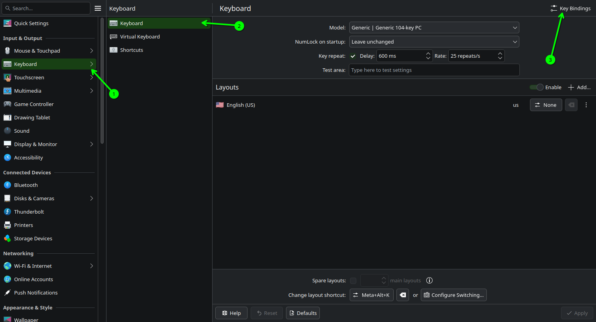
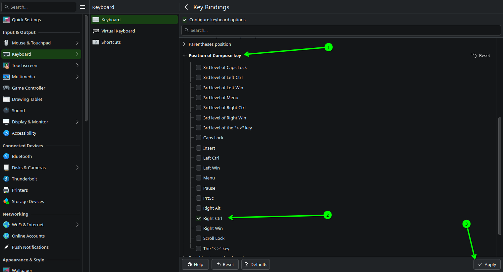
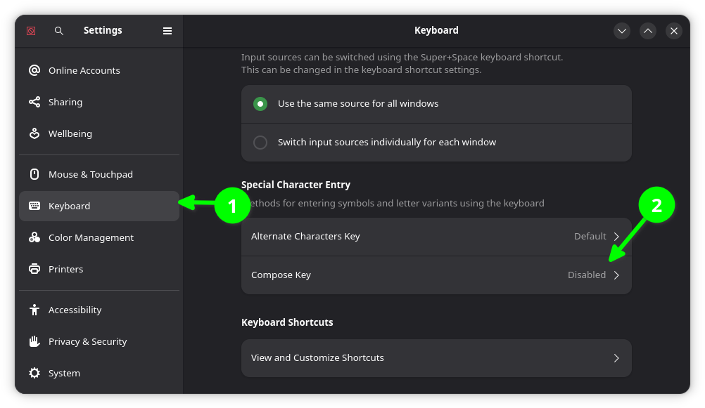
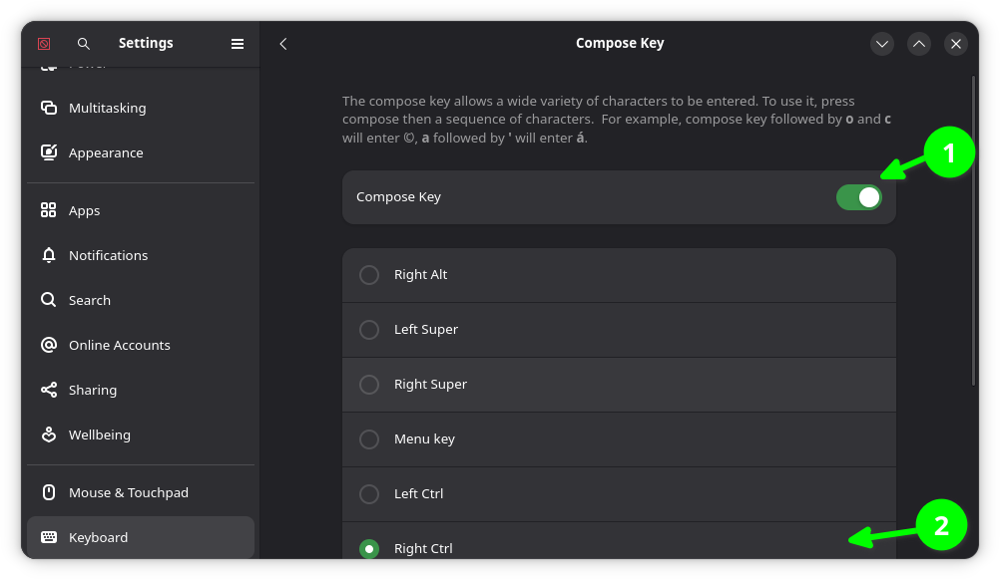
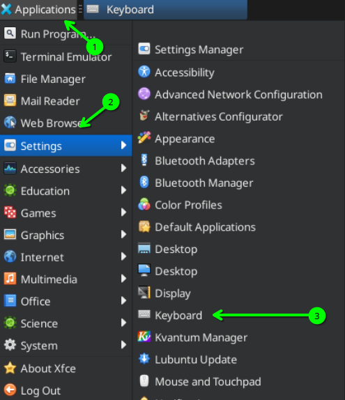
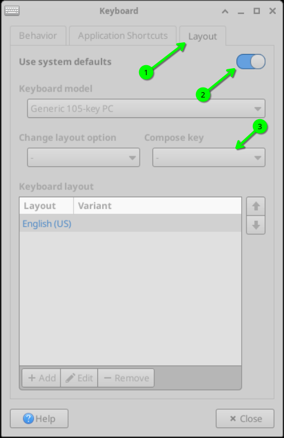
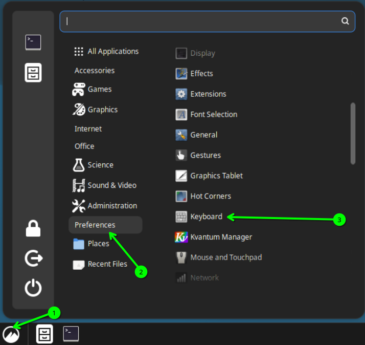
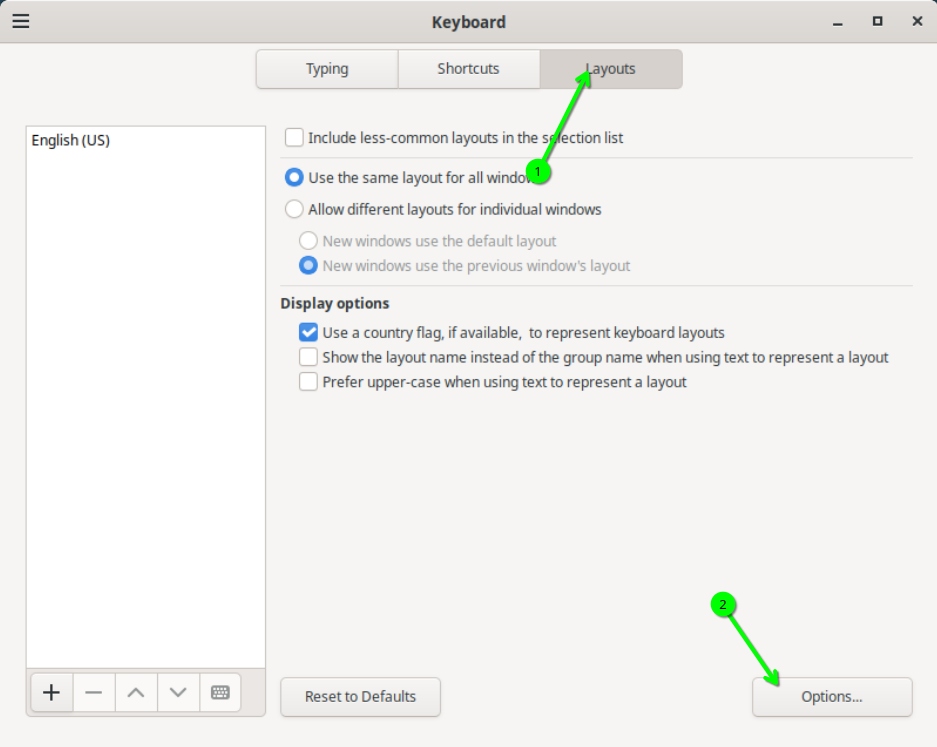
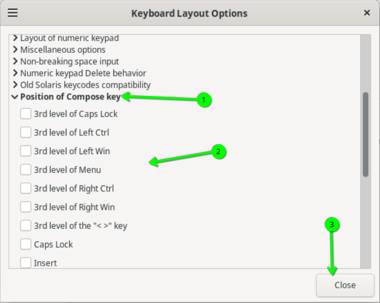

# Living With Linux V: The Compose Key
On other operating systems, there is generally some well documented method to type special characters. Windows has the character map, or directly typing in the Unicode character number (the latter of which is available on Linux). MacOS took an easier route, having you hold down a key and pressing a corresponding number. 

On Linux, however, methods aren't very obvious, and not much discussion is made about how special characters can be typed. In this workshop, we will discuss the Compose Key system, an underrated feature of most Linux desktops.
## A Quick History Lesson
The compose key was introduced to the keyboards of termainls in 1982 by Digital Equipment Corporation, for use with their VT220 terminal (using the LK201 keyboard). It had a dedicated compose key to the left of the spacebar, which worked similarly to how we will demonstrate it today.

Sun Microsystems found the idea so good, that when they dropped their first Unix workstation in 1987 (specifically the Sun4), they just had to put it on the keyboard. Their design placed an LED in the keycap to indicate that you were inserting special characters. 

Nowadays, the only platform that supports it by default is Linux, through the Xorg window manager. In the day and age of Wayland, it still exists, as many desktops still have the setting implemented, and it still works the same as on Xorg.

Source: [Wikipedia](https://en.wikipedia.org/wiki/Compose_key)
## Enabling It
You can enable the Compose key by doing the following in your desktop. Not all desktops have it, but the most popular ones are listed.
### KDE Plasma (Kubuntu, SteamOS, Bazzite)
In System Settings, go to `Keyboard`→`Keyboard` and click on `Key bindings`.


Select `Position of Compose Key` and choose one of the keys from the list. For example, I chose `Right Ctrl`. Then click `Apply`.

### Gnome (Ubuntu, ChimeraOS)
In Settings, go to `Keyboard` and click on `Compose Key`.


Then enable the Compose Key, and select the key you wish to bind it to

### XFCE
In your Applications menu, go to `Settings`→`Keyboard`.



In the window, go to the `Layout` tab. Then disable the default settings and choose which key to bind it to from the dropdown.

### Cinnamon (Mint)
In your Applications menu, go to `Preferences`→`Keyboard`.



In the window, go to the `Layout` tab. Select `Options…`


In the options window, select `Position of Compose Key` and choose one of the keys from the list. Click close when done.

## Usage
Enter any app where you may need to type something (such as a text editor) and press the key you set to be your Compose key. Then type the key sequence that corresponds to the character you are trying to type.

We created a cheatsheet to go with this workshop that contains a list of combinations you can use to see what you can type, and how you can type it. You can access it [here](cheatsheet.md).
## Memorization tips
Unlike other alternative typing methods on Linux, the Compose key can be easily memorized. Here are some tips that make life easier when using this system.
### Tip 1: Smash Letters Together
For many characters, you can take apart the character you are trying to type, and see what characters are on your keyboard make the character. For example, `é` can be broken down into two parts: `e` and `'`. Thus, pressing Compose, then typing the two aforementioned characters will lead to `é` being typed.
### Tip 2: Know The Context and Usage of Characters
In many cases, some characters use a sequence based on how they are used in their respective language or the name of the character. For example, in German, `ß` is often pronounced as a long `s`. Thus, pressing Compose and then typing `s` twice, gives you `ß`. 
Another example is `µ`. In Greek, the character is called `mu`, and under the Compose key, you can simply type `mu` to get a `µ`.
### Tip 3: Straight Up Guessing
This largely goes hand in hand with the first tip. Many of these key sequences are chosen to be easily guessed. If you can't figure it out, it can probably be guessed.
## Advanced configuration
To create your own configurations, you will need to create a file in your Home folder called `.XCompose`. Open it in a text editor and add the following line to it:
```conf
include "/usr/share/X11/locale/en_US.UTF-8/Compose"
```
This line includes your system-wide configuration file, since this will override it. Afterwards, you can add your custom configurations. To add a custom character, add a line in the following format:
```conf
<MULTI_KEY> <keystroke_1> <keystroke_2> : "your custom character here"
```

where `keystroke_1` and `keystroke_2` are the keystrokes needed to create your character.

>[!NOTE]
>You can have as many keystrokes as you would like, simply add something that looks like the `<keystroke_1>` blocks in the above example, replaced with the key you want to bind it to.

>[!TIP]
>With custom configurations, you aren't limited to having it type one character, you can configure it to type whole strings of text. Simply place it between the two quotation marks and it will type it.

>[!IMPORTANT]
>Characters on the keyboard that aren't a letter or number should be called by the first word of their name, rather then using their symbol when defining keystrokes. For example, `<` should be written as `less` instead.

You can also define a symbol by its Unicode code point. Here, for example, we'll add the angle symbol, `∠`, whose Unicode code point is `U+2220`. You may still need to have the typed character in the quotation marks.

```conf
<MULTI_KEY> <slash> <underscore> : "∠" U2220
```

When you're done writing your config file, save it and log out of your desktop. Log back in again, and then your new config should work.