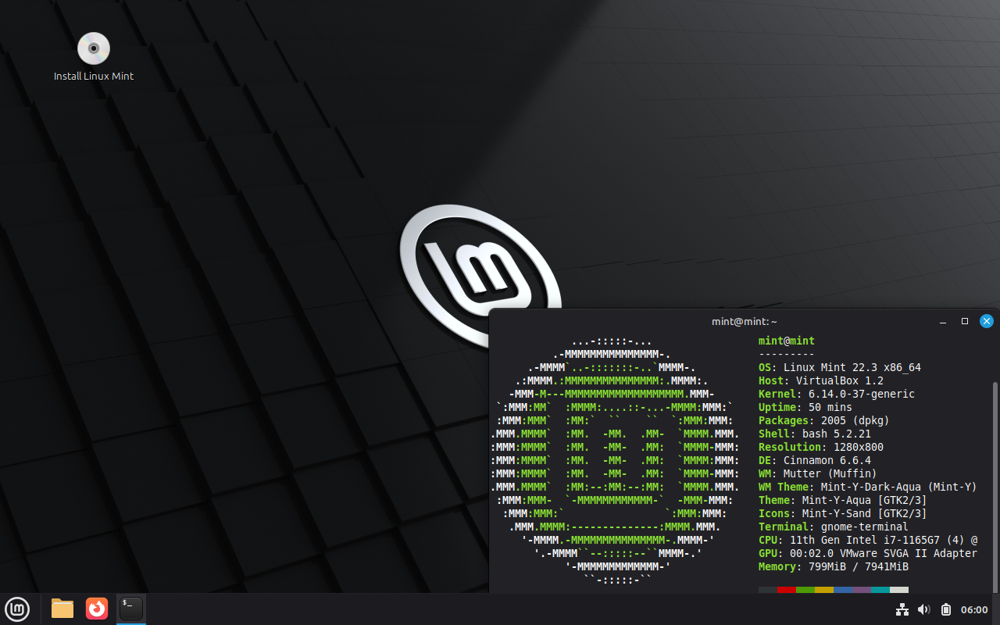
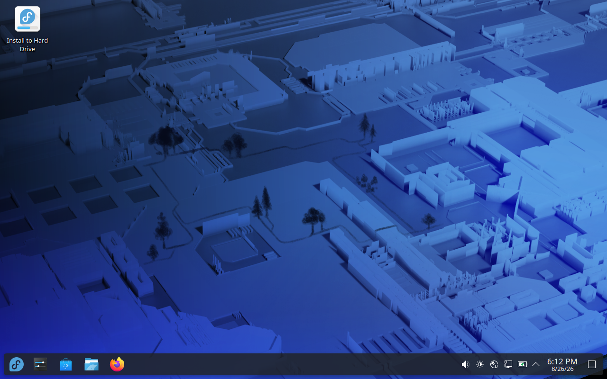
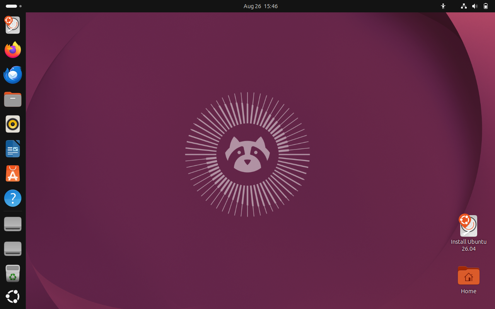
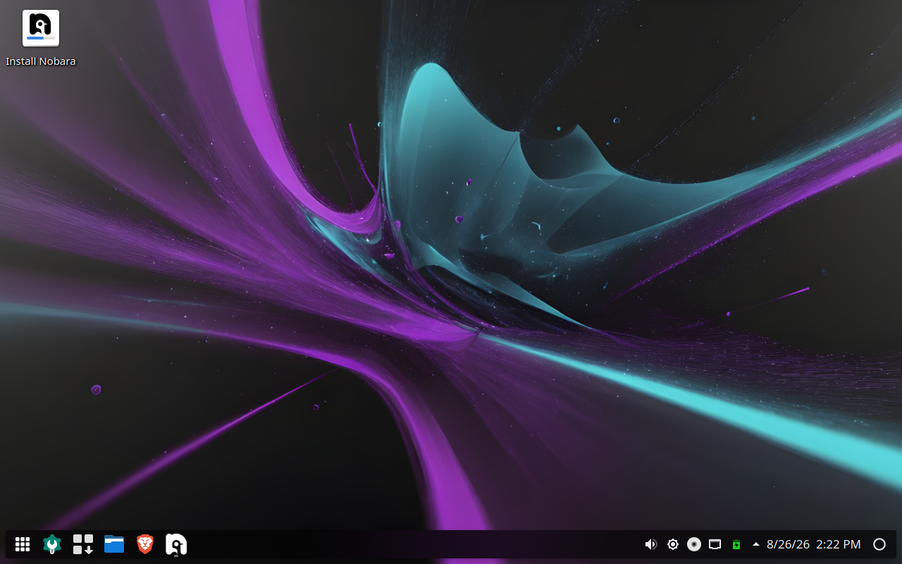
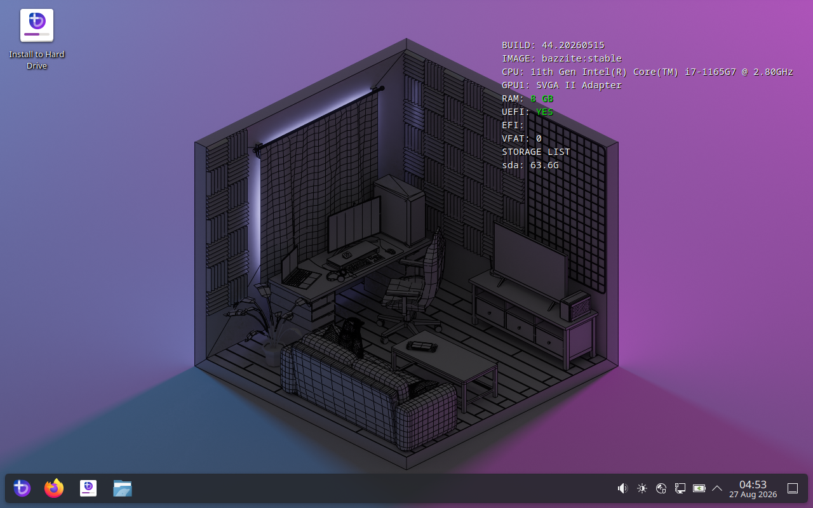
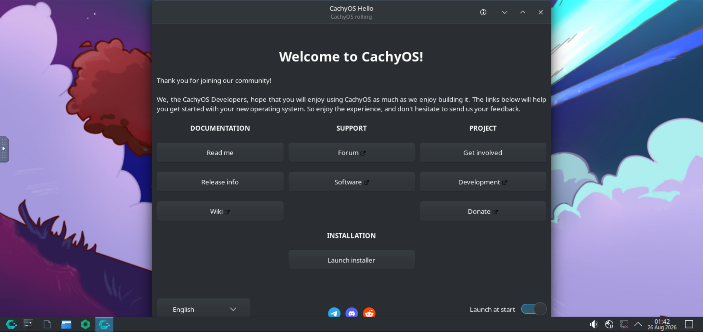
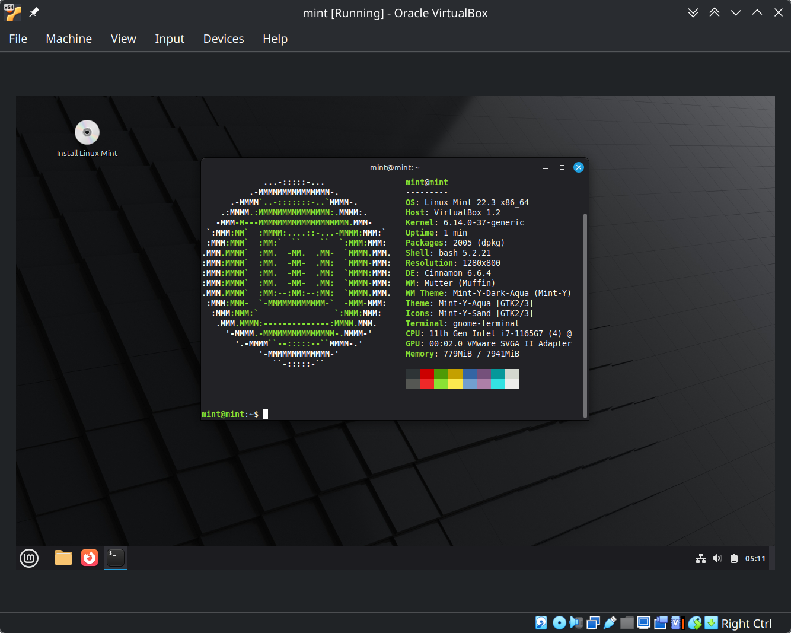
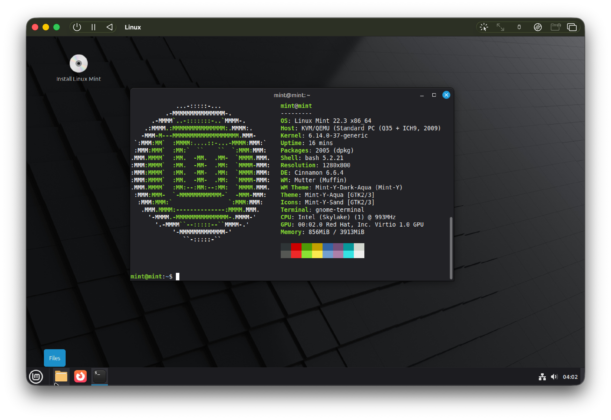

# Living With Linux 0: First Boot (Before The Lab)
Welcome to PLUG and welcome to Living With Linux. This series aims to introduce you to the Linux operating system, and will hopefully prepare you for more advanced uses of Linux. We hope that by the end of this series, you will be able to use Linux like you would Windows or MacOS. But we can't exactly do that until we try it out first, so in this week's workshop we will show you how to try Linux out using virtual machines and, depending on your situation, dual-booting.
## Choosing The Right Distro
If you've looked into trying Linux in the past, you may have come to the realization that there are thousands of Linux-based operating systems (called distros or distributions), each with their own characteristics, history, and most importantly, use cases. To make matters worse, nobody can agree on a single distro to recommend, especially for new users. To make it easy, we narrowed it down to a few recommendations which you'll be able to try out during the workshop. Please choose one of the below distros and have its `.iso` file downloaded on your computer before the workshop if you can. We'll provide these files on a flash drive for those who need it during the event.
### Linux Mint
A Linux distribution famous for it's stability, package accesibiity, and familiar layout to Windows. A great distro to try if you're using Linux for the first time.

You can get Linux Mint [here](https://www.linuxmint.com/download.php).
### Fedora KDE
A Linux destribution released by RedHat, LLC, a major contributor to the Linux community. This distribution uses KDE Plasma, another desktop similar to Windows but with a higher amount of customizability. Another good distro for new users, but gives you more options with making the OS your own.

You can get more details and downloads for Fedora [here](https://fedoraproject.org/kde/).
### Ubuntu
The most popular Linux distro released by Canonical, Inc. Ubuntu uses the GNOME desktop, which is different to Windows but still has a wide amount of interesting features. Try this distro if you want a more unique experience. 

You can get Ubuntu [here](https://ubuntu.com/download).
### Nobara and Bazzite
These distros are gaming-focused distros that come with programs like Steam, OBS (on Nobara) and other Linux game launchers already set up. Both distros are based on Fedora KDE, with Nobara including a custom theme on the Official version. Bazzite, on the other hand is more optimized for more specific hardware and ships builds for specific devices, such as the Framework Laptop or handhelds like the Lenovo Legion. Additionally, Bazzite's download page asks you about your preferences and hardware configuration in order to somewhat tailor your Linux experience.

You can learn more about and download Nobara [here](https://nobaraproject.org/).

You can learn more about and download Bazzite [here](https://bazzite.gg/).
### Trying before buying with DistroSea
If the above descriptions or recommendations weren't enough to sway you towards a certain Linux distro, then you may find it useful to try out a distro before you download anything. [distrosea.com](https://distrosea.com) gives you access to a virtual machine from the comfort of your own web browser. It also gives you more options than we presented here, so if you did not like any of our recommendations, you can also pick one from their list and see what it's like before downloading anything.

>[!NOTE]
>These virtual machines only give you access to a "live" build of the OS, which is what you will get from the `.iso` file you will be downloading. Additionally, if you need Internet access on your VM, you will need to sign up/sign in first.
## Other software you'll need
If you're going to test things out in a virtual machine, you'll need virtualization software. Ensure you have either of the following apps on your system:
### VirtualBox
During the workshop, we'll be demonstrating Linux in VirtualBox. This software allows you to run a virtual machine (i.e. run a computer inside your computer). We'll be demonstrating how you can set up Linux using VirtualBox, so please have it installed on your laptop before the event.

You can get VirtualBox [here](https://www.virtualbox.org/).
### UTM (for MacOS only)
While VirtualBox is readily available for MacOS, including systems running on Apple Silicon, support for PC-based Linux distros may be limited. UTM presents an alternative based on QEMU that allows you to virtualize most CPU architectures. 

>[!WARNING]
>Please keep in mind that UTM is **emulating** a typical PC to run the distros we are recommending (if no `arm64` versions of your distro are available). On many lower-end MacBooks, such as the MacBook Neo used to get the above screenshot, your experience may be incredibly slow (several-minute boot times and notable input lag). We recommend you bring in a PC-based laptop for best performance or follow along in VirtualBox on one of the lab computers.

>[!TIP]
>If your chosen distro has an `arm64` downloads available (often also called `aarch64`), we recommend downloading those so UTM can truly virtualize rather than emulate. This will give the best performance possible.

You can get UTM [here](https://mac.getutm.app).

## Information for trying on real hardware
Finally, we have some important notes for those who wish to try Linux on actual hardware:
### Have a flash drive and `.iso` writer
Please bring an empty flash drive. You will using it to install your distro. Additionally, make sure you have either of the following programs downloaded:
- [Rufus](https://rufus.ie/en/) *(For Windows only)*
- [Balena Etcher](https://etcher.balena.io/) *(For all platforms)*
### Make Backups
If you are able, please make backups of your important files or ensure that they have been backed up somewhere. Both dual-booting and making the switch involve wiping portions of or wiping everything respectively. No matter how you're switching to Linux, this will make your move much easier.