# Living With Linux VI: Gaming Pt. II
Previously, we covered quite a lot about gaming on Linux. There is still quite a bit more on this topic, so in this workshop, we will cover how to set up some game launchers.
## Previously, on Living With Linux…
In Part 1, we went over the basics of how you can set up Linux for use with gaming. The readme, more information and installation instructions are available [here](https://github.com/PhoenixLinuxUserGroup/PLUG-Resources/blob/main/workshops/linuxgaming/linuxgaming.md). Here are some highlights:
### Steam, Proton & Protontricks
Steam is readily available on Linux, and includes Proton by default. Proton is a special version of Wine created by Valve that allows you to run most Windows games on Linux.

Many games do not run on Linux, and Steam is generally able to tell you if a game works, by way of the Steam Deck compatibility score. For information that applies to regular Linux distros, use [Protondb](https://www.protondb.com). It contains crowdsourced compatibility reports for games that include actions that can be taken for games that don't work.

If games don't work, Protontricks can allow you to fix some issues that might be stopping you. It's built on Winetricks and works the same way as Winetricks. 
### Lutris
Lutris is a game launcher that lets you use Proton in conjunction with games bought on other game stores. It features community-driven installers for games. It can also be integrated with many tools that allow you to check system performance.

### MangoHud
MangoHud allows you to overlay your current game's framerate onto the game. It also includes other performance metrics and can be configured based on your needs.

### Flatpak
Flatpak is an app distribution system that places each app into its own container, keeping apps isolated from the rest of your system. Apps distributed on Flatpak work on all supported distros. Many gaming apps are distributed via Flatpak, and we will be using Flatpak later on in this workshop.

## Heroic Launcher
Now that the preface is taken care of, let's discuss more gaming stuff. The Heroic Launcher is a game launcher for games bought on the Epic Games Store, GOG, and Amazon. It allows you to run these games under Proton-GE, which makes further improvements on top of regular Proton.

What makes this better than simply using the Epic Games store through Lutris, is that it is much more lightweight. Lutris downloads the whole Epic Games Store app, which takes up about 1 GB, while Heroic uses Legendary to handle downloads and authentication, making it take less than half of that.

### Installation
Heroic is available exclusively through Flatpak. Find it in your package manager or run the following in the terminal:
```bash
$ flatpak install heroic
```

### Usage
To use Heroic, simply launch it. If it's the first time using Heroic on your Linux install, it will ask you about sending anonymous usage. Choose whatever you feel most comfortable doing, and you should see an empty library. Click on the login button or the link in the `Your library is empty` message to access your games library.

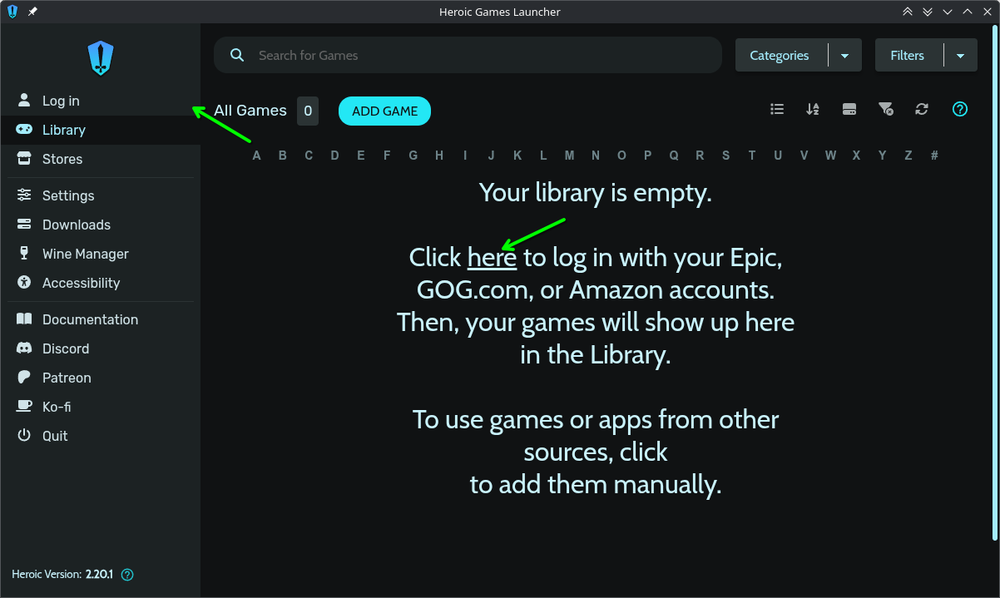

Then log into one of the supported game stores.

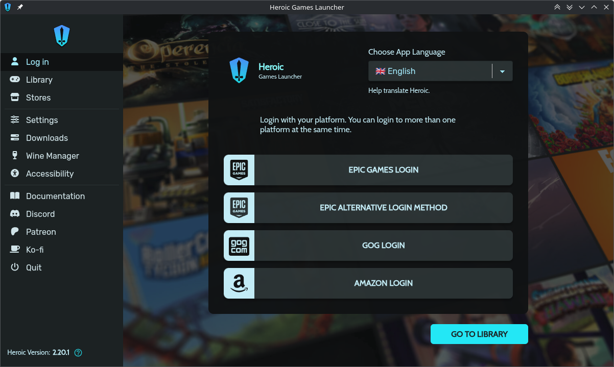

Go through your games store's login page as you normally would, and when done, it will bring you back to the login screen (now known the Manage Accounts screen), with your username filled in. You can repeat this process for the other supported game stores.

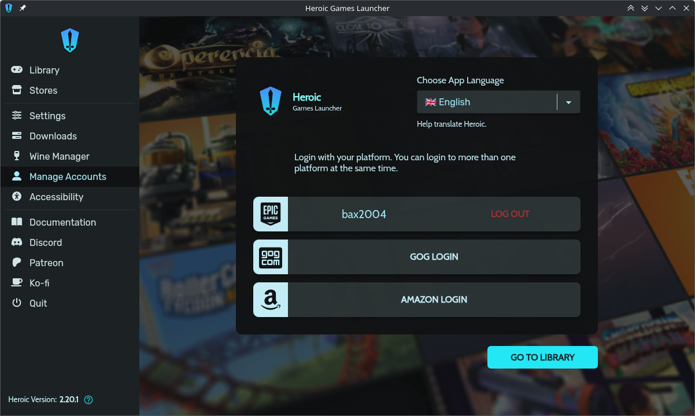

>[!TIP]
>You do not have to login to anything to add games and software manually. Click the `Add Game` button in your library and fill out the dialog it gives you. It will install and put the game in your library for you.

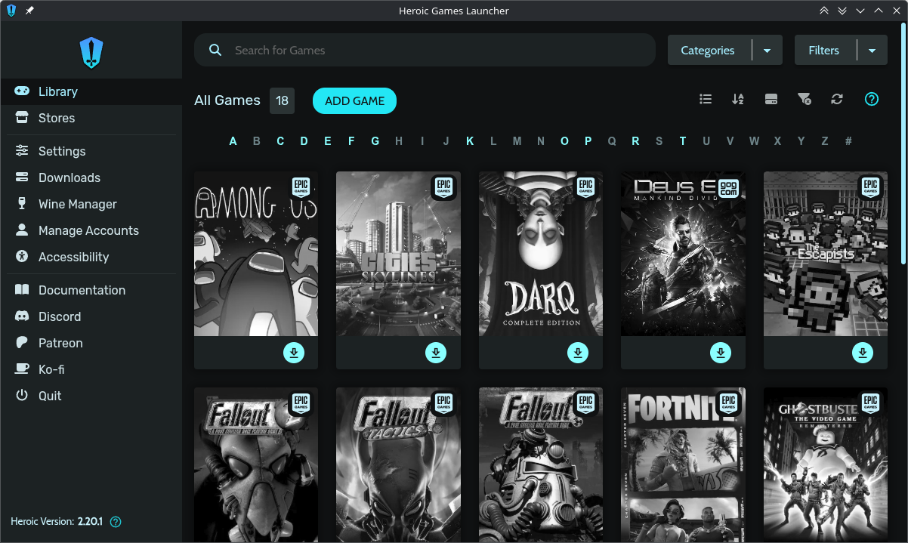

You will then find that your games have shown up in your library, but the cover art is greyed out. This indicates that the game isn't installed yet, so let's install some games! Click on the install button for the game you want to install.You can choose where to install the game as well as your Wine settings, and when it looks good click Install.

>[!TIP]
>If a game has a native Linux version, make sure you use that version, as the Wine version may not work properly and may not be optimized. GOG typically carries these builds. If native versions are available to you, Heroic will give you the ability to select the native build from the Platform dropdown.

>[!NOTE]
>If you already have the game installed, but just want it to show up in your library, choose `Import game`. It will ask you to find the install directory, and will link it to your library.

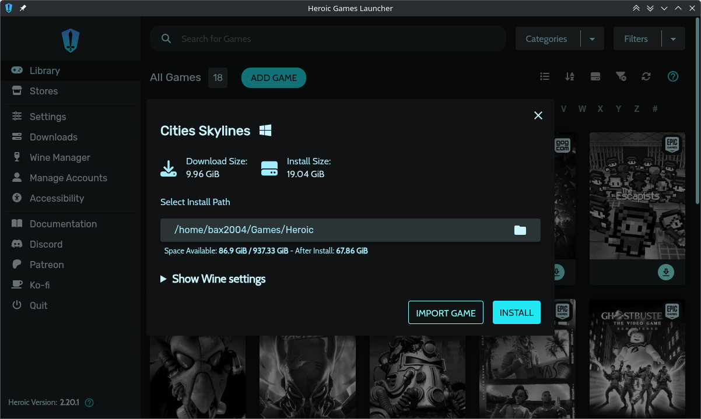

Now it's just a matter of waiting for it to install. While you wait, you can check on your download's progress using the `Downloads` screen.

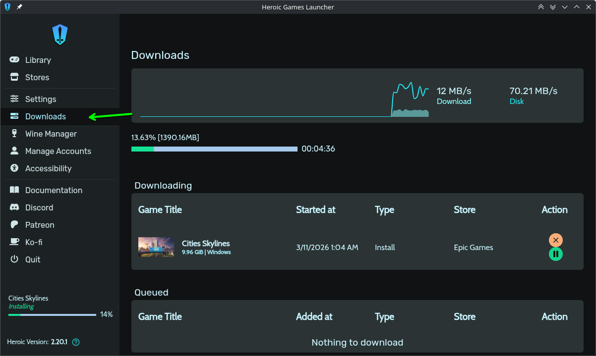

It will notify when it's done, and you can then click the play button for the game that just installed to play it. If you want more info about any of your games, you can also click on the cover art to get more info.

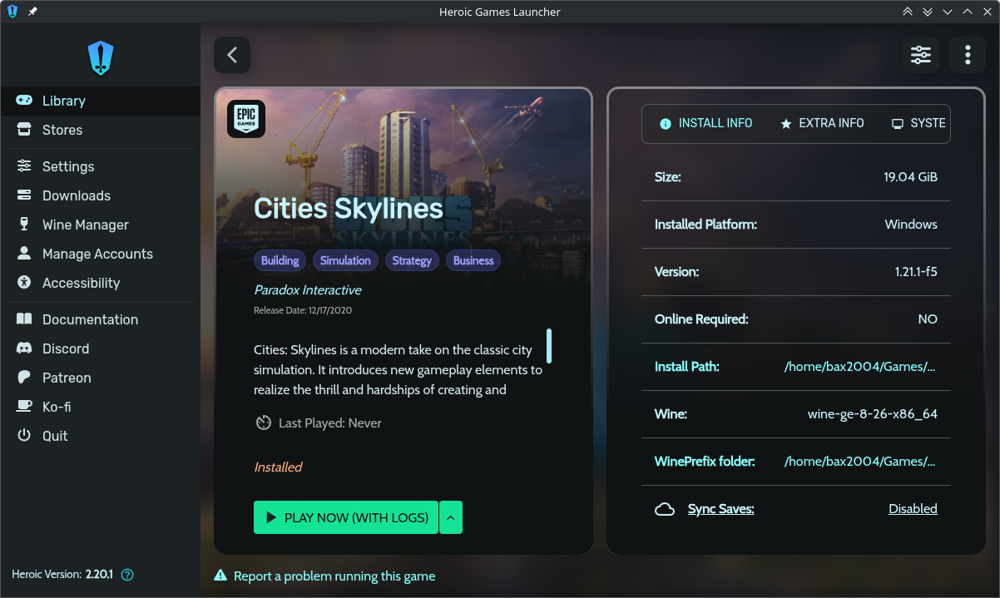

On first run, it may take a while, as Proton creates it prefix and starts the game. Afterwards, you should be able to access the game as you would on Windows, provided it is compatible with Linux.

### Fixing Compatibility issues
If your game is not working, there are asome steps you can take to fix it.
>[!TIP]
>For fix instructions, you can access ProtonDB listings for the game you are trying to fix from the info screen. Click on `Proton Compatibility Tier` on the game info screen, and it will show you the ProtonDB entry for your game.
#### Choosing different Wine builds
First, you may need to try different Wine versions. To do this, go to the `Wine Manager` and select the download button for the version you want. In this example, we will select `GE-Proton-Latest`

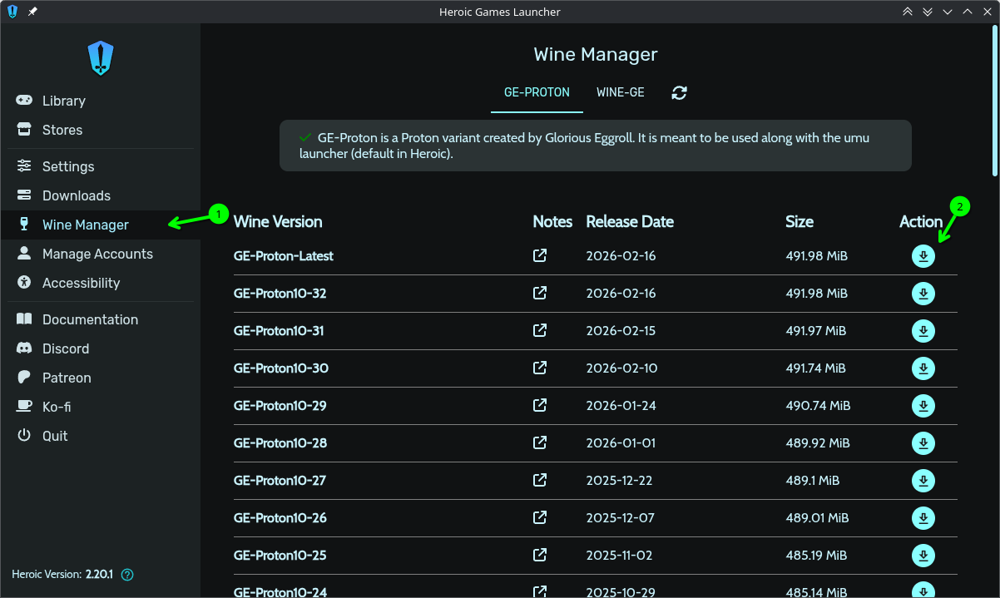

Give it a few seconds to install, and then go back to the game giving you compatibility issues. Go into its settings, and under `Wine Version`, select your newly installed build. Close when done.

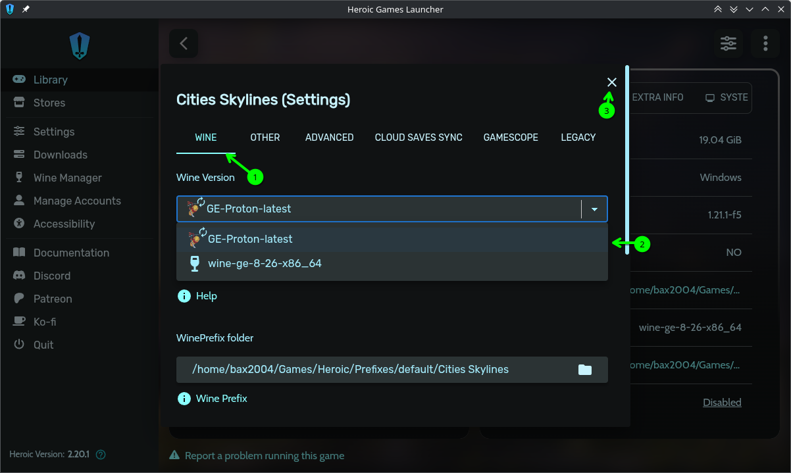
#### Editing variables & wrapper commands
In your game settings, you can edit wrapper commands and environment variables. To do so, go to your Advanced settings. Fill out the two boxes, and click the add button. For wrapper commands (programs that run the program for you, and do something with it, for example, MangoHud), the first box is the name of the command, and the second box is any arguments (eg. `-o`). For variables, the first box is the variable name, and the second box is its value.

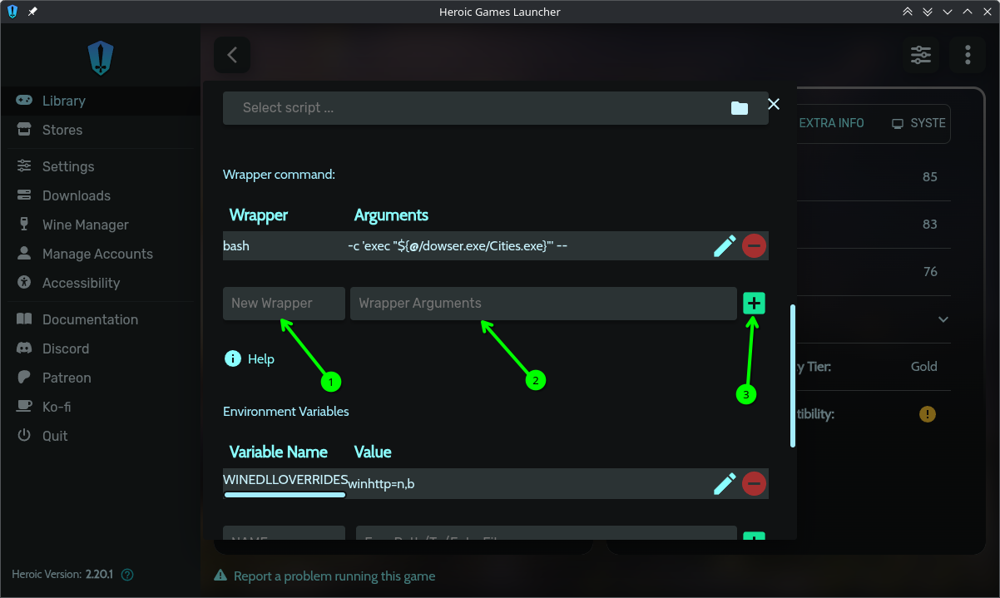

### Integrating MangoHud
Similar to Lutris, if you have MangoHud on your system, you can enable MangoHud for a certain game or all games in your library. In your game's settings, go to `Other` and check `Enable MangoHud`. Close settings when done, and press play to see if it worked.

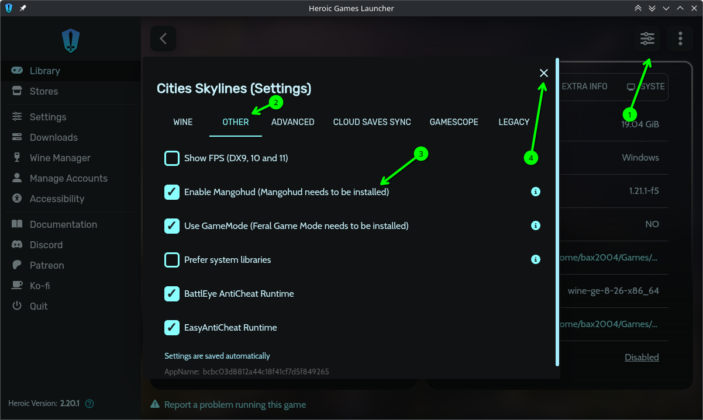

>[!CAUTION]
>You will need the Flatpak version of MangoHud on your system, or else you will get the following error:
>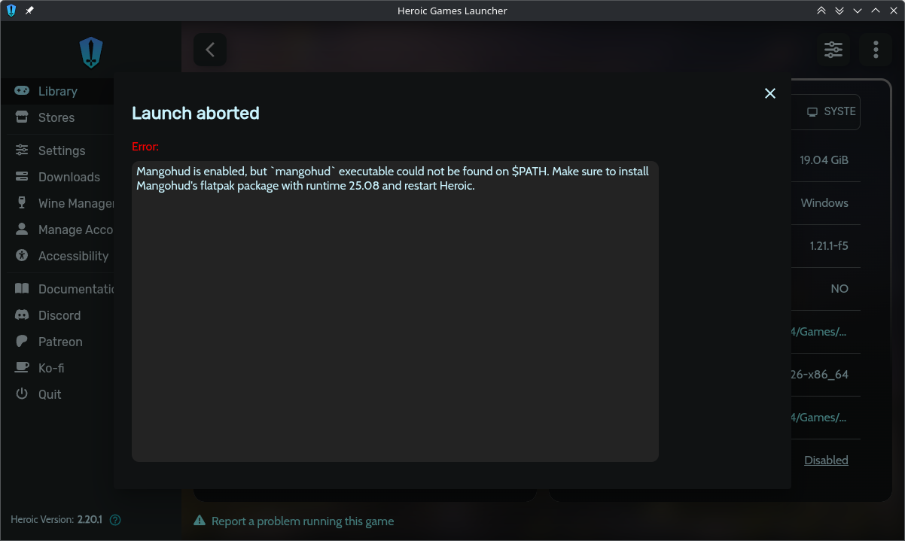
>Run the following command in a terminal:
>```bash
>$ flatpak install mangohud
>```
>When asked about `similar refs`, type 7 to select the `25.08` runtime, similar to the following image:
>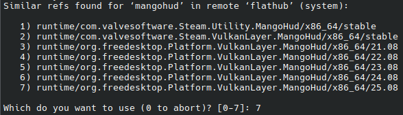
>
>Proceed with the installation. After installing, restart Heroic and try launching your game again.

>[!NOTE]
>To enable MangoHud for all games, go to `Settings`→`Game Defaults`, and follow the above instructions.

With MangoHud enabled, it will look like this:

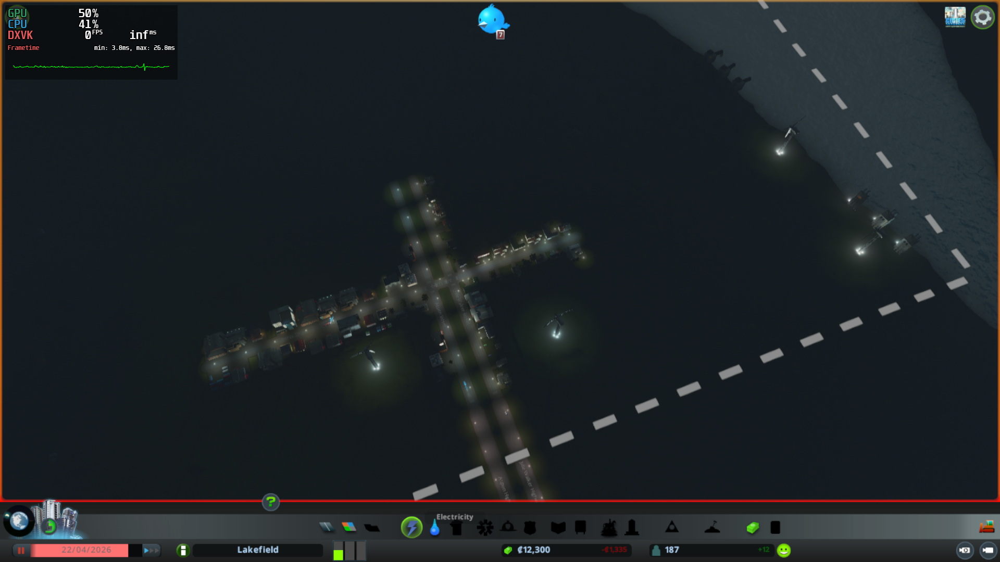

## Minecraft Java Launchers
Since Minecraft Java edition is a Java app, it can run on nearly anything, including Linux. Java edition is the only officially supported edition of Minecraft available to Linux. On most distros, installing Minecraft is about as simple as installing it on Windows.

### Installation
Installation generally starts at the official Minecraft website. Linux versions are found under the `Other versions & Platforms` section.
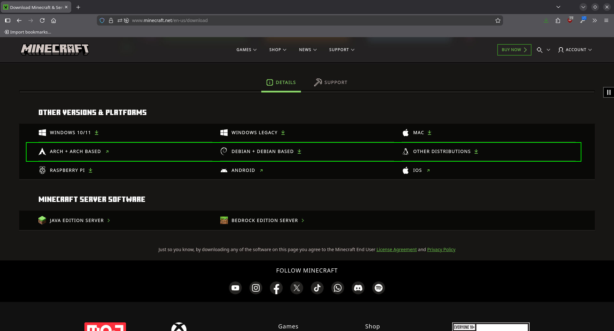
#### Debian
Download the Debian version from the website. Open the .deb file in your favorite pacakge manager and install it. Once installed it will appear on your deaktop’s app launcher
#### Other distros
Download the tarball from the website and unzip it. Go to where it unzipped and run the executable. It is already preconfigured with the executable bit pre-enabled, so no need to set permissions.

>[!NOTE]
>If you use Arch or anything built on Arch (e.g. SteamOS, Manjaro, and CachyOS), you can get it off the AUR. If you have the AUR setup, look for `minecraft-launcher`.

#### Flatpak
There is an unofficial package on Flatpak that you can download. To install it, either find it in your pacakge manager or run the following command:
```bash
$ flatpak install flathub com.mojang.Minecraft
```
>[!WARNING]
>Since you are on Flatpak, your game will not install at `~/.minecraft` as per usual. You may need to find your install location when modding.
## Usage
Once installed, you can use it just like you would on Windows. Log in with your Microsoft account and download a copy of the game to play.
## Modding
Modding is also possible on Linux. We're going to assume you use the Forge client, and would like to set that up.
>[!NOTE]
>If you use CurseForge to manage your mods, it is available for Linux, and recently gained support for Minecraft on Linux. It is available for Debian or as an AppImage. You can find a download [here](https://www.curseforge.com/download/app).

### Installation
First, download a version of the Forge installer from [the official website](https://files.minecraftforge.net/net/minecraftforge/forge/)

Once downloaded, open a terminal where you downloaded the installer. Run the following, replacing the versions with your Minecraft version number and Forge version:
```bash
$ java -jar forge-<Minecraft Version>-<Forge Version>-installer.jar
```
The installer will show up, go through its steps.

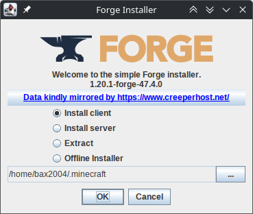

When done you can then go to the launcher and select the modded version.

To install your mods, download them and copy them to your `~/.minecraft/mods` directory.

Now, when you play your modded copy of Minecraft, the mods should just work. Here, for example is a modded server that I run.

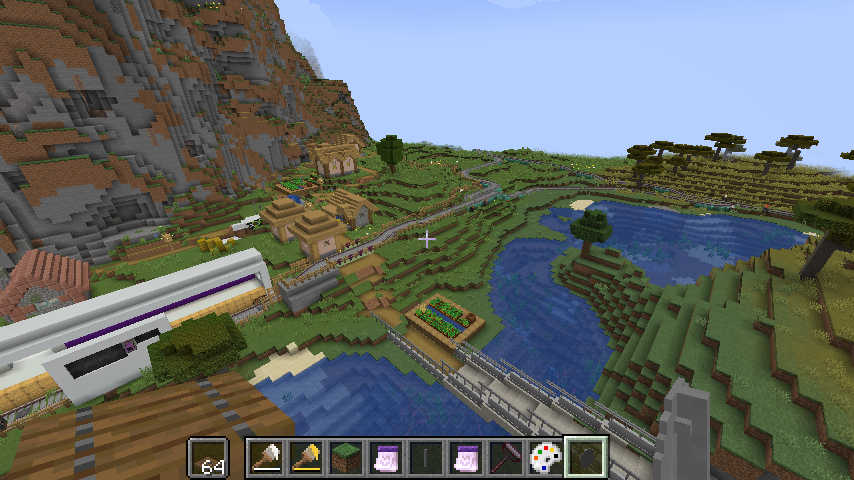