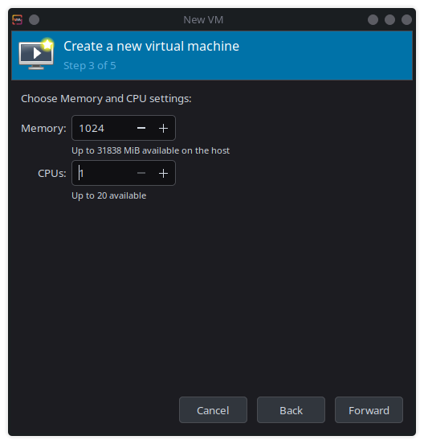

# Compiling the Kernel from Source

One of the greatest freedoms that Linux provides an unmatched ability to customize your operating system. For example, do you have a device that isn't compatiable with your distro? Code the driver yourself! The caveat is that these changes usually involve compiling the Linux kernel from source and using it to run your distrobution. 

## What is a Kernel?
The kernel is the core program behind any operating system. It is the intermediary between the various physical parts of the computer, including the CPU, memory, and peripheral devices. The Linux Kernel is the foundation of all Linux distros, and can be freely changed or modified for any particular use. You can also compile more recent or unstable releases of the kernel to gain access to more recent software or drivers only available on those versions. 

## How do you obtain a kernel image?
The Linux Kernel's official website is at https://www.kernel.org/. You can obtain the kernel images as zipped tarballs, or clone the archive through git. For our workshop, we'll be cloning the archive to give you experience working with the git command line (you're gonna use it a lot more in the future).

# Step 1: Initial Setup and Configuration
This workshop will not only walk you through compiling the Linux kernel from source, but also running that kernel in a minimized virtual environment called QEMU. These initial steps will setup a place for us to work. 

```bash
### We'll assume we're in our home directory in a folder called 'Projects' or some similar place to work
$ mkdir qemu-kernel-boot
$ mkdir git-modules
```

Next, we'll need to install ALL these dependencies
```bash
### On Fedora/RHEL/CentOS
$ sudo yum install bc bison dwarves flex git ncurses-devel.x86_64 rpm-build rsync wget -y
$ sudo yum groupinstall "Development Tools" -y

### On Ubuntu/Debian
$ sudo apt install -y build-essential libncurses-dev bison flex libssl-dev libelf-dev bc wget git fakeroot rsync dwarves flex
```

# Step 2: Install and Compile the Kernel Image
To begin, we'll start with cloning the current stable version of the Linux kernel from kernel.org. This is contained in Linus Torvald's repo.
```bash
$ cd git-modules
$ git clone --depth=1 https://git.kernel.org/pub/scm/linux/kernel/git/torvalds/linux.git/
$ cd linux
```
Now that we're in the kernel's repo, we need to do the following:
* Create a default config file. The linux repo should be able to detect what system you are running and provide the appropriate configuration
* Edit the config using the `menuconfig` option to enable Kernel Tracing. We'll use this in a future lab. 

```bash
$ make defconfig
$ make menuconfig
```


You can find the function to enable kernel tracing under `Kernel Hacking -> Tracers --> Kernel Function Tracer`

From here, we can compile the kernel image for our system
```bash
$ make -j$(nproc)
...
...
...
Kernel: arch/x86/boot/bzImage is ready  (#1)
```
Copy this file into our `qemu-kernel-boot` directory.


# Step 3: Create a Root Filesystem with BusyBox
With our kernel image, we could use the `make install` script to integrate this updated kernel use it from there. However, we can use this kernel to create our own distrobution! There are a few ways to accomplish this, but this workshop will use a package called BusyBox to create a minimal root filesystem to use our kernel image. 

To start, RHEL/Fedora/CentOS users will need to download some additional dependencies:
```bash
$ sudo yum install glibc-devel glibc-static
```

We'll then need to download BusyBox itself. 
```bash
$ git clone https://git.busybox.net/busybox/ && cd busybox
$ git checkout origin/1_37_stable
```
Using `make menuconfig`, we'll enable static binaries for the filesystem so it doesn't rely on our current OS for a particular library. We'll also have to disable the `tc` network package. Due to a change in modern kernels, BusyBox won't build if this package is enabled. 


**If you can't use `make menuconfig`**, there's a known error in some distributions when trying to detect one of your dependencies. You can edit the script that checks this dependency to fix the error manually.

```bash
$ cd scripts/kconfig/lxdialog
$ sudo vim check-lxdialog.sh 
```


Add `int` to the beginning of the main function, as shown above.

Once we've edited our configuration, we can create our install image and install it. 
```bash
$ make -j$(nproc)
$ make install
$ cd _install
```

Inside our install directory, we'll need to create an `init` file to help mount some of our volumes during boot. 
```bash
$ mkdir dev proc sys
$ sudo vim init

#!/bin/sh
mount -t devtmpfs none /dev
mount -t proc none /proc
mount -t sysfs none /sys
mount -t tracefs nodev /sys/kernel/tracing
sleep 2
echo "Welcome to Linux"
uname -a
exec /bin/sh
```

Ensure you can execute the script with `sudo chmod +x init`

Finally, we'll need to use this directory to create `initramfs` for our image. 
```bash
$ find . -print0 | cpio --null -ov --format=newc | gzip -9 > <path-to>/Projects/qemu-kernel-boot/initramfs.cpio.gz
```

# Step 4: Run Your Kernel in QEMU
**For Debian users**, the final step is simple. Install `qemu-system` and run the following command from your `qemu-kernel-boot` folder:
```bash
$ qemu-system-x86_64 -kernel bzImage -nographic -append "root=/dev/hda console=ttyS0" -initrd initramfs.cpio.gz
```


However, RHEL/CentOS/Fedora users will need to use `virt-manager` to run the instance. 

## Configuring `virt-manager`
First, make sure your working directory has search permissions so `virt-manager` can access the system image. 
```bash
$ chmod a+x /path/to/qemu-kernel-boot/*
```

If you haven't already, instal `virt-manager` and it's supporting packages
```bash
$ sudo yum install virt-install libvirt-python virt-manager virt-install libvirt-client
```

Start by creating a new, manual install


In the OS box, search for "Generic Linux 2024"


We can reduce the number of cores and memory assigned to our machine since our install is so small.


In the next dialog box, disable storage for the VM


You can name the machine or leave it with a default value. Make sure to enable "Customize configuration before install"


Finally, we can configure our boot. Set your kernel path and initrd path to the `bzImage` and `initramfs.cpio.gz` files respectively. You'll also want to set your root to mount to `/dev/hda` or `/dev/sda` so your drives mount properly.


