# Living With Linux I: Gaming
One issue that many people run into when moving to Linux is compatibility with their favorite games and software. Luckily, tools exist which allow people facing this issue to rectify it. In this workshop, we will be going over these tools to work around these problems.
>[!WARNING]
>This workshop is written under the assumption that you are running Linux on physical hardware or have passed a graphics card through to your VM. Games running under virtual machines may not perform well, since virtual machines generally use software-based rendering to handle graphics. If you are testing games in a VM, we recomment you choose lighter/older games for optimal performance.
## Steam and Proton
We will first start with the elephant in the room, running games bought on Steam. Over the years, Valve has made efforts to increase Linux compatibility, including improvements to Wine and other Linux projects at the center of their hardware. The Steam store is available on Linux, with downloads available from the steam website, or via various packages that install Steam. 
Of particular interest to us is Proton, a tool based on Wine (we will feature this seperately in a future lab). Proton allows Linux users to install and play compatible games that are only available on Windows, which allows for better game compatibility on Linux.
### Installation 
To install Steam on your system, do the following:
#### Debian/Ubuntu/Mint
Run this in a terminal
```bash
sudo apt install steam
```
Alternatively, you can find this in the App Center, or your flavor's equivalent (such as Discover or Synaptic), if you prefer to set it up that way.
#### Fedora
See [Fedora Installation Instructions](https://docs.fedoraproject.org/en-US/gaming/proton/) for more, as well as an easier, GUI based approach.
##### Enable nonfree packages
This needs to be done, as steam is a "nonfree package" - it is not FOSS compliant. If "Third Party Software" was chosen during install, this step can be skipped.
```bash
sudo dnf install https://mirrors.rpmfusion.org/free/fedora/rpmfusion-free-release-$(rpm -E %fedora).noarch.rpm https://mirrors.rpmfusion.org/nonfree/fedora/rpmfusion-nonfree-release-$(rpm -E %fedora).noarch.rpm -y``
sudo dnf config-manager setopt fedora-cisco-openh264.enabled=1
```
##### Install Steam
```bash
sudo dnf install steam -y
```
#### Arch
See the [official Arch Wiki article](https://wiki.archlinux.org/title/Steam) on the topic for more complete install instructions.
##### Enable multilib if you haven't already
In your favorite text editor, open `/etc/pacman.conf`
Uncomment the following section or add it if it doesn't exist:
```conf
[multilib]
Include = /etc/pacman.d/mirrorlist
```
##### Install Steam
Run this in the terminal:
```bash
$ sudo pacman -Syu steam
```
#### Other distros
Check your distro's package manager for `steam` or `steam-installer`. If you are using a gaming focused distro, such as Bazzite or ChimeraOS, you likely already have steam installed and configured. If Steam isn't available, go to the [Steam Download page](https://store.steampowered.com/about/download).

### Configuring Steam
Now that Steam is installed, find it in your desktop's app launcher. Just like on other OSes, it will ask you to log in. Do this as you would for any OS. Once logged in, Proton should be enabled by default, set to run under Proton Experimental.
>[!NOTE]
>Up until recently, Proton was an opt-in system. It is possible that it may be disabled on your system. To check it, go to `Steam`>`Settings`>`Compatibility`. If it says `Steam Play is enabled for all titles`, you're good to go! To enable it, follow the steps [in this guide](https://www.educba.com/steam-ubuntu/)
### Game compatibility and testing out Proton
#### Using Steam Deck Compatibility indicators
To test out Proton and Steam, go to your Library and find a game you want to try on Linux. A general indicator of Linux support is the Steam Deck support section on the store page of the game. Below is an example of a Windows game with excellent Linux support (Warframe). Steam deck compatiblity indicators are highlited with green arrows.
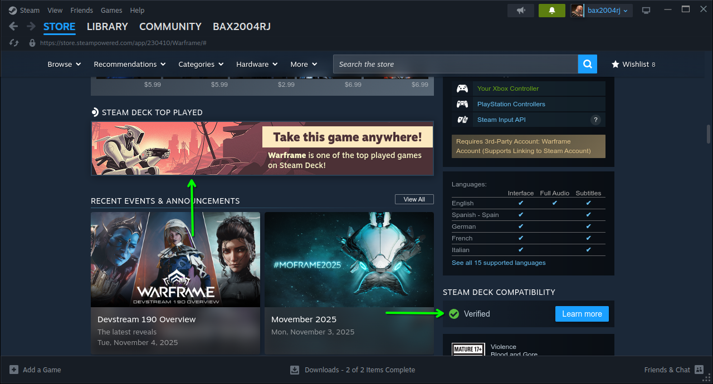
See [Steam's official Steam Deck compatiblity page](https://www.steamdeck.com/en/verified) to read more on the meaning of compatiblity categories and testing methodology
#### ProtonDB
Sometimes Valve's internal testing may only truly apply to the Steam Deck, but not to other Linux distros. Furthermore, Steam Deck compatiblity indicators don't tell you everything you need to know to make it work. This is where ProtonDB comes in. ProtonDB contains crowdsourced game support information. You can access ProtonDB [here](https://www.protondb.com/), and search for the game you want to try, and it will give you a compatiblity report for that game.
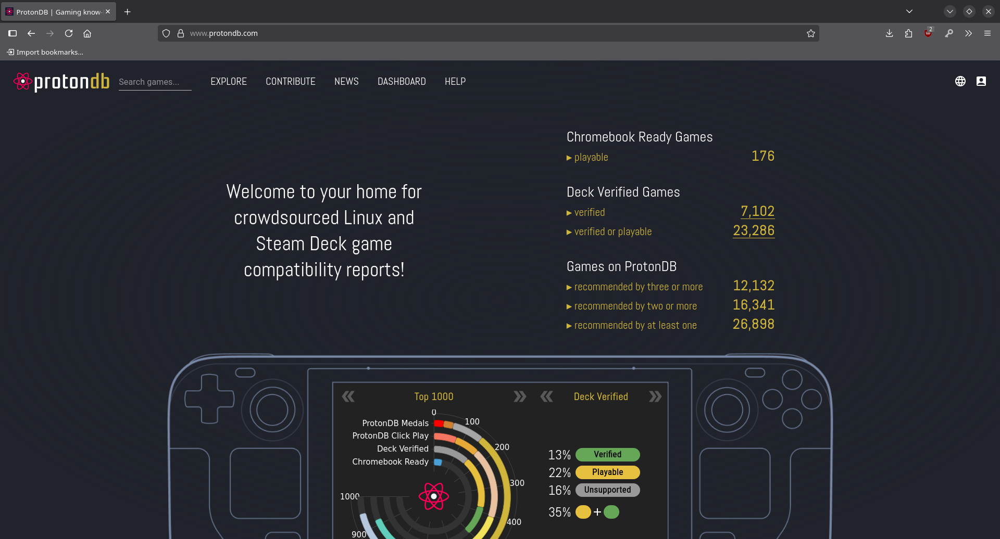
Games on ProtonDB are classified by 5 possible ratings. Below is a table for each rating type:
|Rating|Meaning|
|------|-------|
|Native|Has a native Linux build. No Proton is needed!|
|Platinum|Runs just as it would on Windows, no tweaks required|
|Gold|Runs just like Windows, but you may need to tweak it a bit first|
|Silver|It runs, but there are some problems|
|Bronze|It runs, but expect crashes often|
|Borked|Cannot be played at all, or if it is, it is likely a horrible experience|

Additionally, there's a "click play" score, which rates how well a game will run when you just click play based on a 1-5 scale, where 5 is the worst, and 1 is the best. This system is still being fine tuned.

For example, here's Warframe's ProtonDB page:
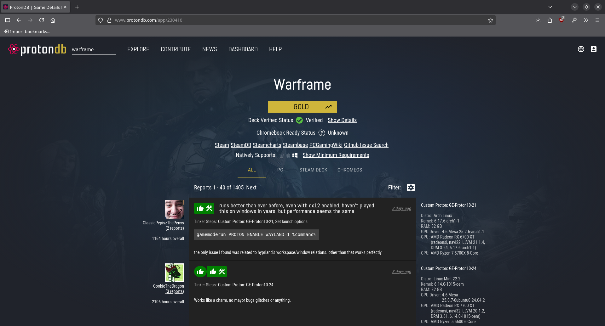
As shown here, Warframe is gold rated, indicating excellent Linux support, but some may need to tweak it first based on their system.
#### General Rules of Thumb
In addition to the compatibility scores, some rules of thumb can also be applied. These include:
- Is the game an online game, using a Kernel Level Anti-Cheat system? If so, don't expect it to work.
- Is the game known for having good Linux support? If so, you should be good to go.
- Is there not a native Linux build for this game? If so, make sure to look over ProtonDB and go from there.
If all of this checks out, go ahead and install the game from your library. The Steam client will install Proton for you.
## Protontricks
If you need to apply some tweaks to your game as directed by ProtonDB, you might be asked to go use Protontricks. Protontricks is a special build of Winetricks, developed specifically for the Steam client.
### Installation
```bash
# Ubuntu / Debian / Related Distros
$ sudo apt install protontricks
# Fedora
$ dnf install protontricks
```
#### Arch installation
Make sure you can install packages off the [AUR](https://wiki.archlinux.org/title/Arch_User_Repository). This is an AUR package.
```bash
$ yay -S protontricks
```
### Usage
Simply open Protontricks and select the game you want to tweak and click OK.


From here on out, what you need to do next varies based on the tweaks to apply. A common one is installing prerequisites, so we will install stuff as an example. By default, "select the default wineprefix" is selected, so click OK.
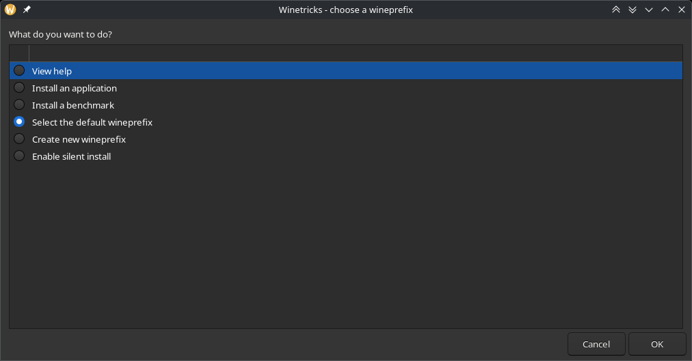
Since we are installing prerequisites, we will select the top option and click OK.
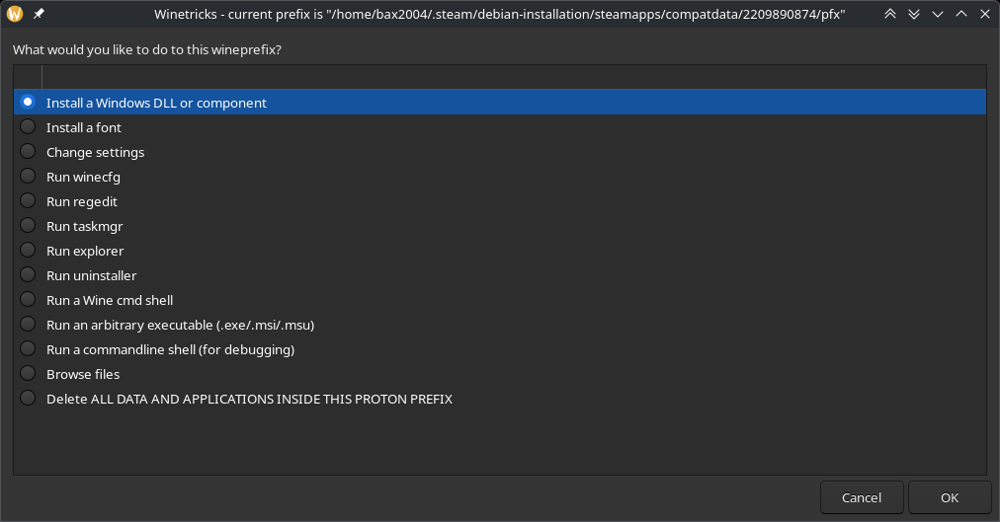
We can then scroll through the list and check off what we need. In this scenario, I need dotnet 4.8, so I'll get that. Clicking OK begins installation.
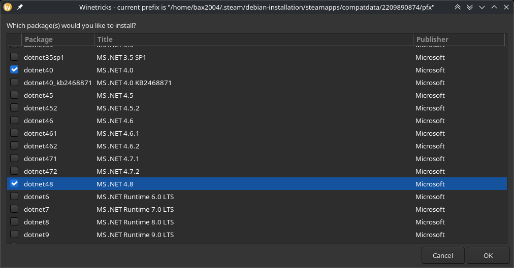
When done, you are returned to the main options menu. This example barely scratches the surface of what you can do with this.
>[!CAUTION]
>Results aren't guaranteed. Installs can and will fail when working with this software. It is very possible to brick your game install with this. If issues ever arise that are unrecoverable, you may need to reinstall your game.
## Flatpak
One tool you can use to download apps for Linux is Flatpak. Many apps, games, and tools are available, and they are compatible with all distros. Apps on Flatpak run under a container, which isolates them from your main system.
### Installing flatpak
Install Flatpak using the install command for your distro:
```bash
## Ubuntu/Debian
$ sudo apt install flatpak
## Fedora 
$ sudo dnf install flatpak
## Arch
$ sudo pacman -S flatpak
```
If your distro isn't here, check [the official Flatpak setup guide.](https://flatpak.org/setup/)
Once installed, we then need to set it to use the Flathub repo, where all the software is. Run this command to do that:
```bash
flatpak remote-add --if-not-exists flathub https://flathub.org/repo/flathub.flatpakrepo
```
If your package manager doesnt support Flatpak, use Bazaar. It is designed to make Flatpak easy to use. Install it with:
```bash
$ flatpak install flathub io.github.kolunmi.Bazaar
```
>[!NOTE]
>`sudo` is generally not required to install Flatpaks.
### Game clients and emulators available through Flatpak
Below are some programs available on Flatpak that are worth checking out
#### Super Tux Kart
This is a Mario Kart style game, but with characters from all your favorite open source franchises! It has a storymode, singleplayer mode and various multiplayer modes. Our next workshop will be about this game, so check it out!
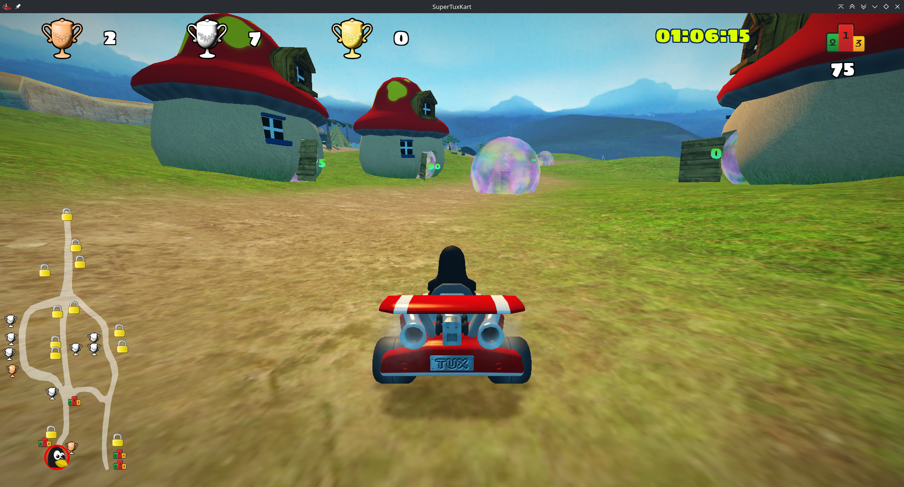
Install it with
```bash
$ flatpak install flathub net.supertuxkart.SuperTuxKart
```
or find it in your package manager.
#### Sober
This is an unofficial client for Roblox. Up until last year, Roblox's client was playable under Proton/Wine, but that is no longer the case. This restores that functionality by using the Android build of Roblox. It sets it up so that the experience is identical to the Windows versions. It is only available on Flatpak.
>[!CAUTION]
>This software is highly experimental, and not fully open source to reduce it being used for hacking the game. It may not work during large events on Roblox, where security is temporarily tightened.


Install it with
```bash
$ flatpak install --user flathub org.vinegarhq.Sober
```
#### RetroArch
RetroArch allows you to run games on various emulators. It allows you to select a ROM (known internally as "content") and an emulator to run it in (known internally as a "core"). It is easy to set up and has an interface that fully supports controllers
>[!IMPORTANT]
>Please use ROMs for games you already own.

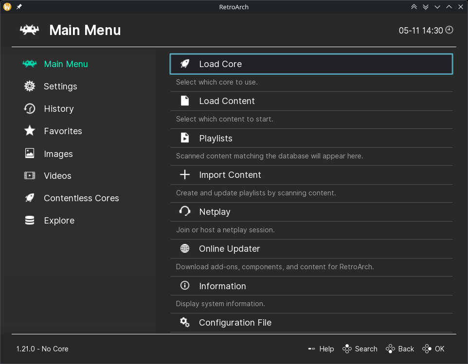
Install it with
```bash
$ flatpak install flathub org.libretro.RetroArch
```
## Lutris
Lutris allows you to apply the same things Steam does for Proton, but for games bought on other stores. It provides an easy to use launcher for all of your games, and allows you to connect it to your library on other stores.
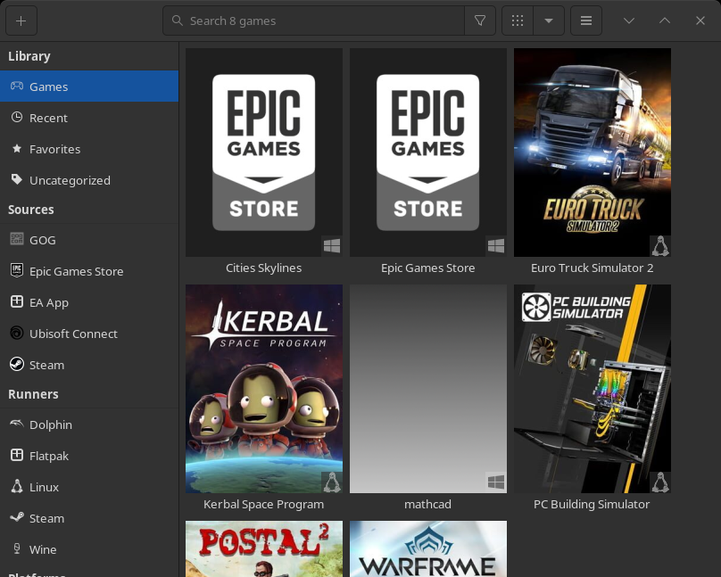
### Installation
It's available via Flatpak, but you can get it from your system's package manager. Install it with the following commands:
```bash
# Ubuntu/Debian
$ sudo apt install lutris
# Fedora
$ sudo dnf install lutris
# Flatpak
$ flatpak install flathub --user -y net.lutris.Lutris
```
For Arch and other distros, follow [this guide](https://lutris.net/downloads).
### Configuration and setting up games
>[!NOTE]
>If you alraedy have Steam set up, that has already been set up and configured in Lutris. Steam games should be visible on your game library.

To set up game stores, click on the store you wish to set up in the sidebar, then click on the user icon. Here, for example, we're setting up EA's app.

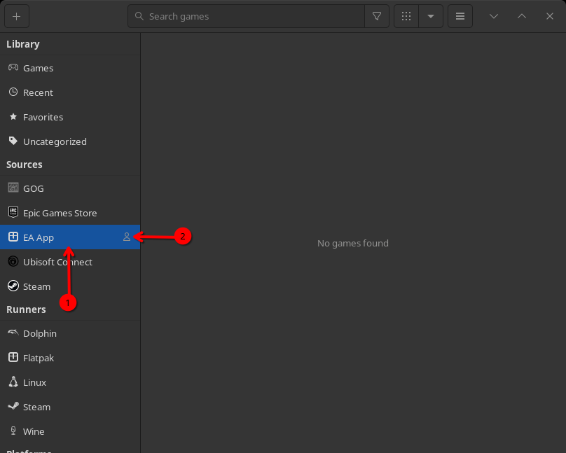
It will ask you to install your chosen client app. Click OK. It will then take you to an install screen. Click the install button for "`wine` standard" to continue.
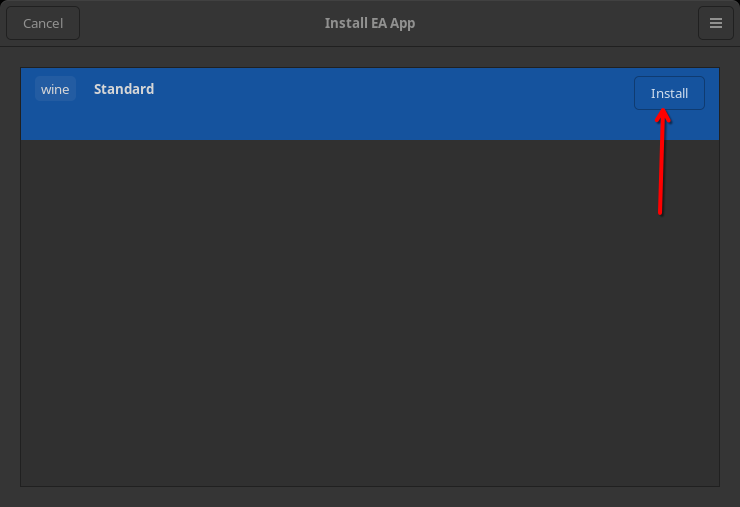
Once it's done installing, you will be prompted to log in. It will then add the games to your library. To install games, click on a game, click install, and follow its instructions. Remember to check its compatibility first.
## Monitoring performance
If you want to know how well a game is running under Linux, use MangoHUD and `htop`. 
### MangoHUD
MangoHUD gives you the ability to see how well a game is performing. To install it, follow [this guide](https://github.com/flightlessmango/MangoHud?tab=readme-ov-file#installation---pre-packaged-binaries). It has instructions for all distros.
To use it, run: 
```bash
$ mangohud <game>
``` 
You can also connect it to Lutris by adding it to the command prefix setting. Click on the up arrow next to the play button, and click configure. Go to the "System Options" tab and click "FPS counter (MangoHud)"
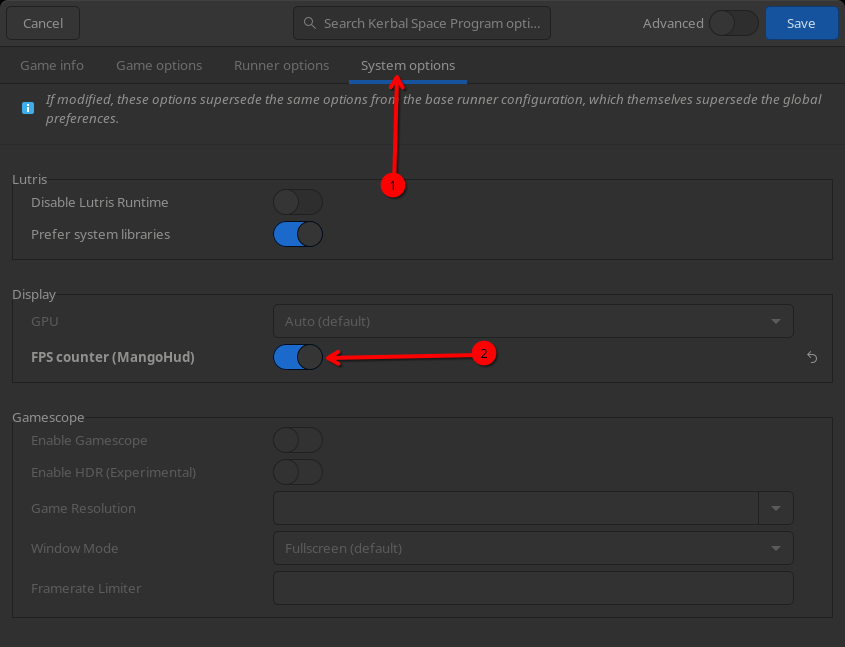
This is what MangoHud looks like when running in a game:
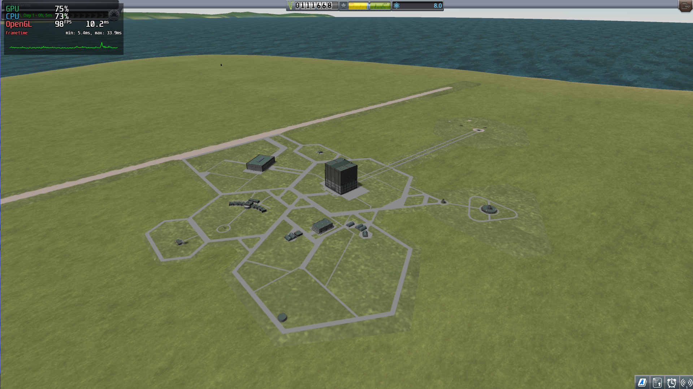
### `htop` and related programs
`htop` allows you to see the usage of system resources and close apps. Launch it by running `htop` in a terminal.
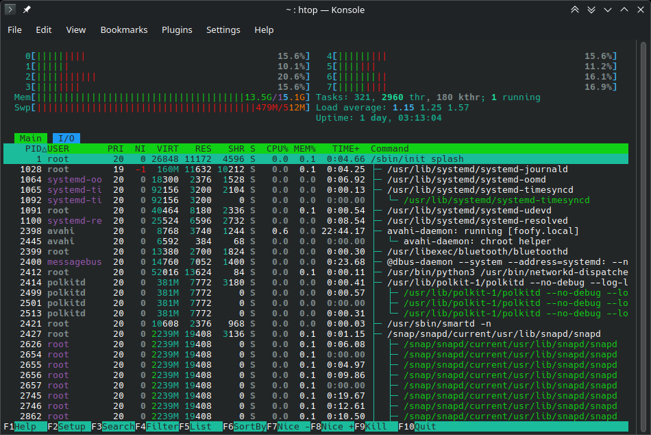

If you don't have it, here are install instructions:
```bash
# Ubuntu/Debian
$ sudo apt install htop
# Fedora
$ sudo dnf install htop
```
## Graphics drivers
### NVIDIA
>[!CAUTION]
>Don't use the drivers directly off the NVIDIA website. They aren't as tailored for your distro as they could be, and installation usually requires that you temporarily run your machine in a text-only mode (no desktop). Instead, use drivers provided by your distro.

To install NVIDIA drivers, do the following:
#### Ubuntu/Mint
>[!TIP]
>The Ubuntu software and drivers tool introduced here later can be used to install and select drivers without needing to run the first two steps. These steps are provided for Ubuntu flavors that don't bundle it.

To find the recommended drivers for Ubuntu, `ubuntu-drivers` can be used. It finds devices on your system that need drivers. Run this tool in the terminal:
```bash
$ sudo ubuntu-drivers devices
```
It will then list devices that need drivers. To set up your graphics card, find the entry with `NVIDIA Corporation` or something similar as its vendor. Under it, should be the recommended drivers. The reccomended driver will typically be the top option, and at the end of the entry, will say `recommended`. The package will be called `nvidia-driver-<version number>`. Copy this package name and install it:
```bash
$ sudo apt install nvidia-driver-<version number>
```
On Ubuntu, to select drivers, use the Software and Updates tool, and go to the `Additional Drivers` tab.
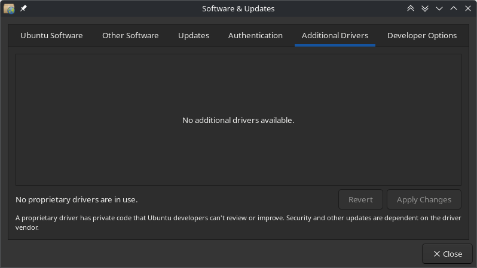

Unfortunately, in this screenshot, no drivers are needed, so it says no driver available. If drivers were available, it would list your GPU, and under it give you a selection of drivers. Select the one you just installed and click Apply Changes. It will take a while, but once done, NVIDIA drivers should be ready. Reboot your system to finish applying changes.

After reboot, check if its working with:
```bash
$ nvidia-smi
```
It should output the driver version installed
#### Debian
Install the `nvidia-detect` package (make sure you can access the [non-free](https://www.debian.org/doc/debian-policy/ch-archive#s-non-free) section. Configure by following [this guide](https://linuxcapable.com/how-to-enable-contrib-and-non-free-repos-on-debian-linux/)):
```bash
$ sudo apt install nvidia-detect
```
It is similar to `ubuntu-drivers` and will tell you what you need. Run it:
```bash
$ nvidia-detect
```
It will then tell you which versions are supported by your card. To find a version available that corresponds with its recommendations, run:
```bash
$ apt search nvidia-driver-
```
Follow [this guide](https://wiki.debian.org/NvidiaGraphicsDrivers) provided by Debian to install your selected driver. It contains more information about what you need to complete installation.
#### Fedora
To install drivers, run these commands:
```bash
$ sudo dnf update
$ sudo dnf install akmod-nvidia
```
If you need CUDA support, install the following:
```bash
$ sudo dnf install xorg-x11-drv-nvidia-cuda
```
Follow [this guide](https://rpmfusion.org/Howto/NVIDIA) for more info.
#### Arch
Refer to [this guide](https://linuxconfig.org/arch-linux-nvidia-drivers-installation) for installation instructions.
### AMD
From personal experience, you rarely need to install drivers for AMD cards, as the Open Source versions often bundled with your distro are good enough for most use cases, including gaming. But in the rare case you do (for exampe you need ROCm/OpenCL support), here is the install guide:
[AMD official Linux Install instructions](https://rocm.docs.amd.com/projects/install-on-linux/en/docs-6.2.4/install/amdgpu-install.html)
[Downloads are available here.](https://www.amd.com/en/support/download/linux-drivers.html)
## Controllers
Most game controllers are compatible with Linux. To make sure your controller works, you can test it in the following ways:
### In Steam settings
If we go back to the settings for Steam, we can use its controller utility. In Settings, find the `Controllers` menu. Then click `Test device inputs`.
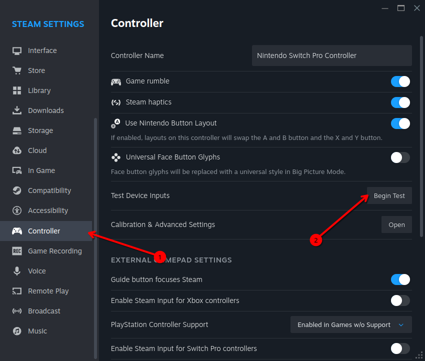
This brings up a tool that replicates what your controller is doing. Mess around with your controller to make sure it works and all the buttons are in the right place. If the layout is incorrect, or you prefer a different layout, click on `Setup device inputs` or `Reset device inputs`, which will let you apply your favorite layout. 
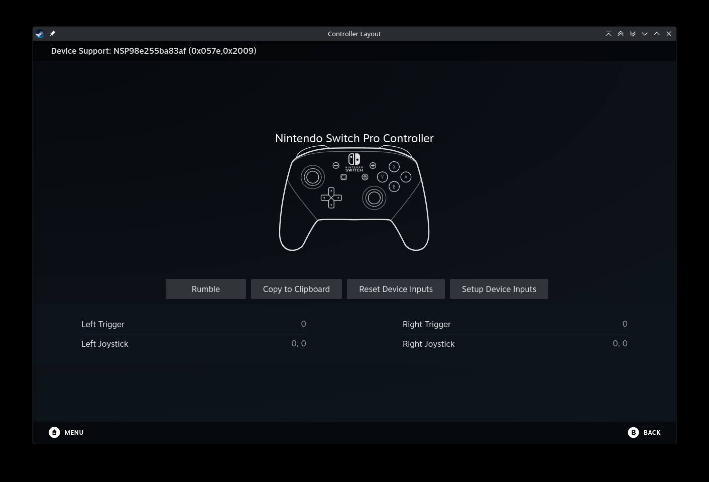
### Using KDE Plasma system settings
>[!NOTE]
>This works best on KDE Plasma sessions, but it can be run on other desktop environments. It will come preinstalled if you have Plasma desktop.

Plasma's system settings have a controller test tool built in, which is decently easy to use. To get started, connect your controller and open `System Settings`. Go to `Game Controllers`, and if your controller is successfully connected, it should look like this:
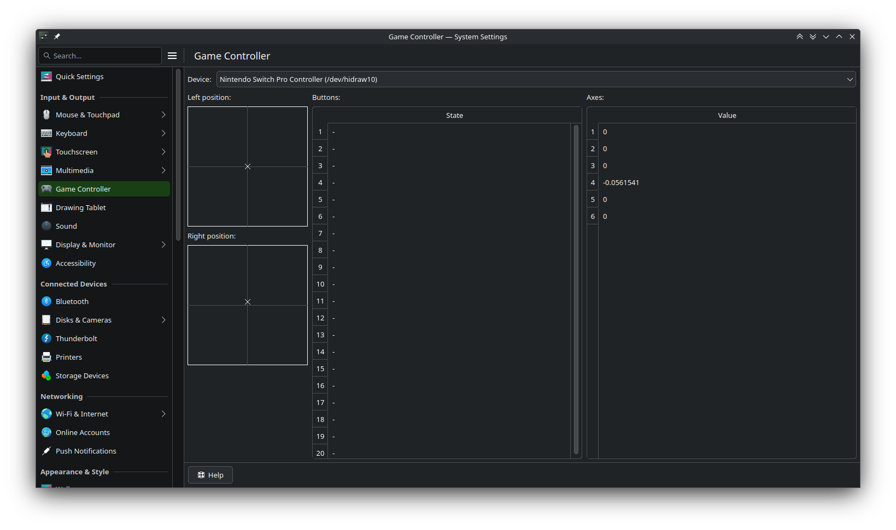
You can then start messing around with your controller and seeing how it responds.
If you have multiple controllers connected, use the Device dropdown to choose your controller.
### Using `jstest`
If you prefer using the terminal or don't have KDE Plasma, `jstest` is a better option. This is done entirely in a terminal.
#### Ubuntu installation
Run `$ sudo apt install joystick` in a terminal
#### Arch installation
Run `$ sudo pacman -Syu joyutils` in a terminal
#### Finding your controller
Make sure your controller is connected. You can check by going into the terminal and running the following:
```bash
## For wired/usb controllers, use lsusb:
$ lsusb
## For bluetooth controllers, use bluetoothctl:
$ bluetoothctl
```
If something that sounds like the make and model of your controller showed up in the list, you're connected! Now we need to find where it went, so run the following:
```bash
$ ls /dev/ | grep hidraw
$ ls /dev/input | grep js
```
This will list all input devices found with names starting with either `hidraw` or are listed within `/dev/input`, with names starting with `js`.
>[!IMPORTANT]
>Not all `hidraw` devices are controllers, as `hid` (Human Interface Devices) represents all input devices. Mess around with jstest until you think you found your controller.

Now that we found our controller, run `jstest`:
```bash
$ jstest /dev/<controller-location-here>
```
In my case, my controller was on `/dev/hidraw10`, and this is what I got.
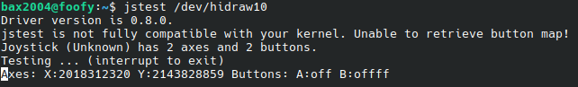
>[!TIP]
>You can also install and use `jstest-gtk` for a more easy-to-use, GUI-based approach.
