# Living With Linux IV: Living With Linux at Florida Poly
Here at Florida Poly, classwork is inevitable. When switching to Linux, it can become a little more difficult, especially when some software is involved. While compatibility has grown by leaps and bounds, it can be hard to gauge whether a program needed for classwork will run on on Linux. In this workshop, we will discuss different methods to access needed software for classwork and go over some examples to demonstrate these methods.
## The Four Ways To Go About It
When seeing if an app can be run on Linux, there are four ways you can make an app work. These methods are presented in the order in which they should be considered.
### Native apps
Many apps are native to Linux, and by far are the easiest to download. About half of the examples presented here can be run natively. Native apps are best as the support is better and can even be more easily optimized to your distro and setup.

To see if a program is available natively, check if it is available in your package manager or see if the app's website offers a Linux download link and install instructions. It's best to look at the website first, and see the install instructions, especially for proprietary programs.
### Wine
Wine is a pretty good option if there isn't a Linux build for your system. Many Windows apps can be run on Linux as if you are running it on Windows. In the last episode of Living With Linux, we covered how you can set up Wine and find compatible apps. You can read the readme for that workshop [here](https://github.com/PhoenixLinuxUserGroup/PLUG-Resources/blob/main/workshops/wine/wine.md).
For brevity's sake, here are some key takeaways from that workshop that are relavant here:
- Wine works by translating Windows API calls to Linux, rather than running a full copy of Windows under a virtual machine.
    - This method improves performance, but limits compatibility for many apps.
    - Install wine using either your package manager or [refer to their official install gude](https://gitlab.winehq.org/wine/wine/-/wikis/Download) to obtain more up-to-date builds.
- Use appdb.winehq.org to find out if your app is compatible with wine.
    - AppDB ratings are crowdsourced, and include more detailed instructions on workarounds to major issues.
    - Platinum and Gold rated apps will work very well with Wine, and should present few issues.
- Winetricks gives you access to utilities and installers to make troubleshooting easier.
    - Install it from your distro's package manager
### Running it in a VM: Amazon AppStream and Winboat
If all else fails, and your app is incompatible with wine, there are options that allow you to run these apps with Linux. These solutions involve running your app in a virtual machine under a real copy of Windows.
#### Amazon AppStream
AppStream is a service that Amazon offers through Amazon Web Services (AWS). Florida Poly has access to this service, and most of the apps available on the school's computers are available through this service. All apps are run in a virtual machine in an AWS datacenter, and streamed back to your computer via your web browser. Additionally, since all of these apps are from Florida Poly's app library, any paywalls or licensing issues have been taken care of for you, so you don't have to deal with any subscriptions or limited trial versions. Since this is not running locally, there are no features to pass through devices other than cameras, microphones, mice and keyboards, so apps used to program hardware such as Atmel/Microchip Studio are unavailable here. Additionally, keep in mind that an internet connection is required at all times when using this service, so if you plan on working without internet or AWS goes down, AppStream will not work.
##### Accessing AppStream
AppStream can be accessed by finding My Apps in MyFloridaPoly, or going to myapps.microsoft.com and logging into your school email. You can then select the app you need to use, and it will take you to AppStream. You may need to select your app again, but once you do, it will start your VM, and ask you to log in to your account. Use the password to your school email to continue, and you will be good to go. We will give more detailed instructions once we get to our examples, including more information on how to use the VM.
>[!NOTE]
>You may have noticed that the website you initially go to for these tools is a Microsoft website. In this case the Microsoft website is providing the shortcuts to these programs, and it also used to log you into the AppStream system.
#### Winboat
If you plan on being offline, or prefer running things locally, Winboat is an excellent choice. Winboat installs a full copy of Windows to a Docker image, and manages it for you so it is seamlessly integrated into your setup. It takes care of all of the Docker work for you, and even can install Windows for you! 
Unfortunately, not every app runs on Winboat. GPU passthrough is not available, so if you plan on working with graphically intensive apps, you may run into poor performance. Additionally, it installs a full copy of Windows, so make sure you have a lot of disk space free to accomodate it, as well as any apps you will be running.
>[!WARNING]
>This software is still in beta. It won't work perfectly.
##### Installation
Installation takes a while (about a couple of hours, depending on your experience with Linux and system configuration) and has many steps. You can find an installation and usage guide that I made [here](https://github.com/PhoenixLinuxUserGroup/PLUG-Resources/blob/main/workshops/livingwithlinuxatfloridapoly/winboat.md).

### Finding Alternatives
If none of these options worked at all or were below your standards, your last resort is to find worthy alternatives. Resarch alternative programs, or find ways to make it work with your system. Make sure you are able to complete your assignments properly with these alternatives. If no viable alternatives can be found, consider dual booting Windows, or using Linux as a second operating system.

## Examples
Now that we are done with all the general theory and preamble, let's run some apps! Below are some apps found on many Poly courses and how you can run them on Linux.

### Example 1: Pycharm and other JetBrains products
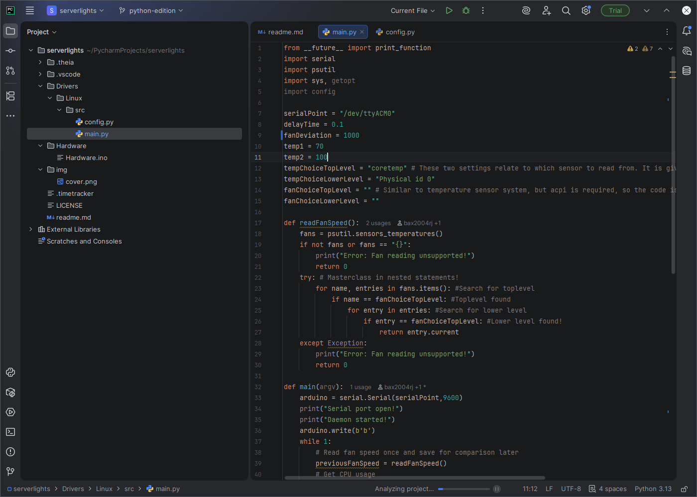

IDEs and development tools made by JetBrains are often seen used with computer science and data science courses here at Poly. They are readily available on Linux. JetBrains have made many of their apps readily available on Canonical's Snap store and Flatpak. If your package manager is configured for it and you're fine with it running in a container, you can get it from there.
#### Installation
For this example, however, we will demonstrate installing PyCharm from the website.
To start, we will get the download from the [download page](https://www.jetbrains.com/pycharm/download/?section=linux).
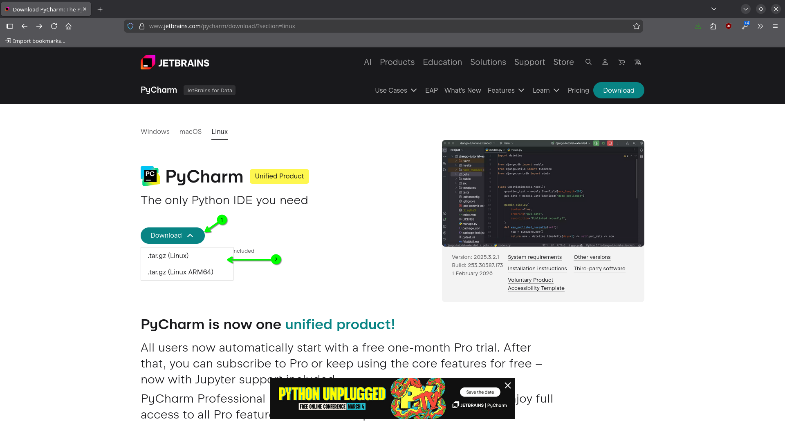

Choose the version that matches your CPU architecture. Save the resulting `.tar.gz` file and unzip it when done. Open a terminal at the unzipped directory's `bin/` directory. Then run `./PyCharm.sh` in the terminal.

>[!NOTE]
>Replace the name of the shell script with the name of the product you are using, following the same formatting.

Afterwards, it will work exactly like the Windows version, with the only difference is that it will not run from a dedicated app install location, and you will have to launch it from a terminal to access it every time.

### Example 2: KiCad
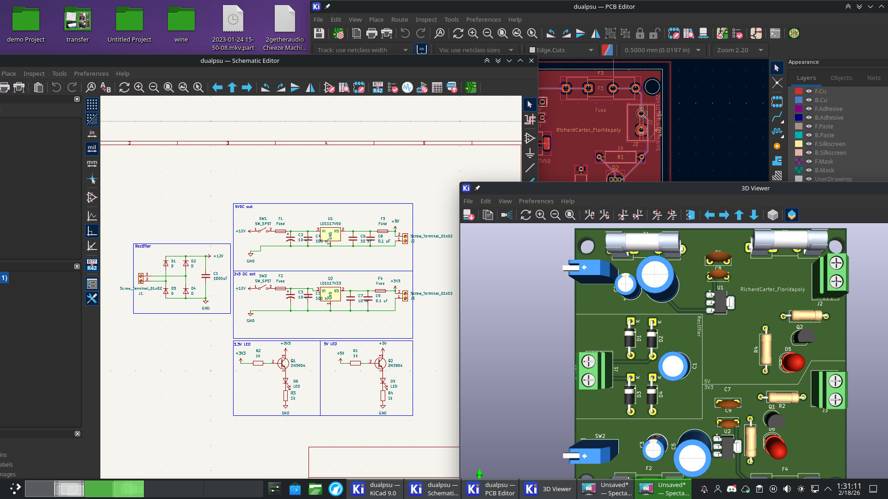

KiCad is a fully featured PCB and schematic editor used in some electrical engineering courses at Poly. It includes a SPICE simulator with the schematic editor, provided by ngspice. It also features a 3D viewer that can output your design for use in other CAD programs. KiCad, due to its open-source nature, works perfectly under Linux.

#### Installation
Native builds are readily available on most package mangaers for Linux, and latest versions can be easily obtained via Flatpak. The Flatpak builds come fully featured, including the 3D parts library (see the Flatpak instructions from our [Gaming workshop](https://github.com/PhoenixLinuxUserGroup/PLUG-Resources/blob/main/workshops/linuxgaming/linuxgaming.md#flatpak) if you don't have Flatpak). The Flatpak builds are generally very stable and consistent and highly recommended. Obtain it from your package manager or through the terminal with the following command
```bash
$ flatpak install org.kicad.KiCad
```
Afterwards, you can just use it like you would on Windows.
### Example 3: Solidworks
Solidworks is a parametric CAD modeling program produced by Dassault Systèmes. It's a key part of mechanical engineering, and all engineering majors at Poly have to interact with it at some point, especially through the Engineering Skills and Design course.
It's also completely unavailable on Linux. It cannot be run on Wine, and being a 3D CAD program, Winboat can't run it, but luckily for us, it is available through AppStream.

>[!WARNING]
>AppStream might not always carry the latest versions of apps. Programs like Solidworks may give you issues if you upload files from a later version into an older build of it.
#### Accessing Solidworks on Linux and How to Use AppStream
We'll start at [My Apps](myapps.microsoft.com). You may need to sign in to your school email first. We will then select Solidworks.
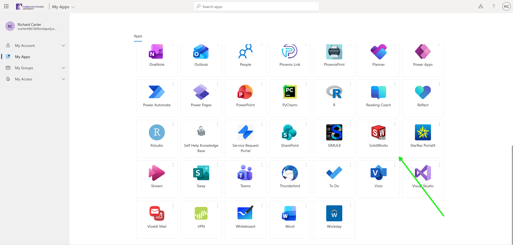

This will log you in to AppStream. Afterwards, it will ask you to select your app again. 
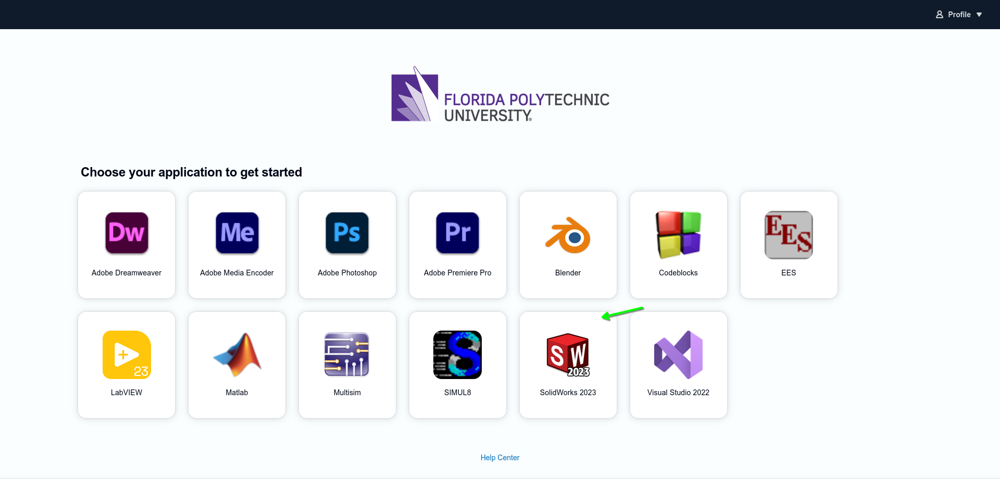

After that, it will reserve your VM. It will take a minute or two, especially for larger programs like Solidworks. Once it's ready, it will ask you to sign in. Sign in with your school email password. Afterwards, it will connect you to the VM and open Solidworks.

>[!TIP]
>If you give AppStream notification permissions, you can put the tab in the background and it will notify you when your VM is ready.

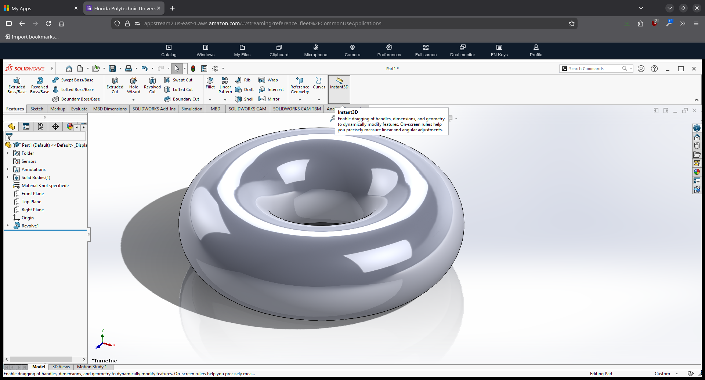

##### Accessing Your Files
Now that we are loaded into Solidworks, it would probably be beneficial to put some files we need to work on, onto our VM. To add files, click on the "My Files" button. You will be presented two ways to get files on the VM:

- Temporary Files
    - You can upload files from your computer to the temporary folder. It will be deleted when you end the session. To upload, select the "Upload Files" button and choose the file you want to work on.
- OneDrive
    - Since you are logged in with your school email, it can easily be connected to your Florida Poly OneDrive account. Simply upload your files to that, and it will allow you to load files from it (you might have to connect it to your account).

Afterwards, the files will be available through regular Windows save/load dialogs.
>[!TIP]
>If you use OneDrive to access your files, you may notice two subfolders, `Files` and `Shared`. Choose `Files` to work with your files.
###### Saving Files To Your Computer
If you use OneDrive, when you save it should be automatically backed up. 
If you use the Temporary Folder, you will need to download the files back to your computer so your work doesn't get deleted. To save your file, save it like you would on Windows, and close out of the app you are using. Windows won't let us access our file while another process is using it, so closing out is essential. Once out of your app, navigate to the Temporary Folder directory in the My Files menu. Select the checkbox next to the files you want to save. Click Actions → Download.

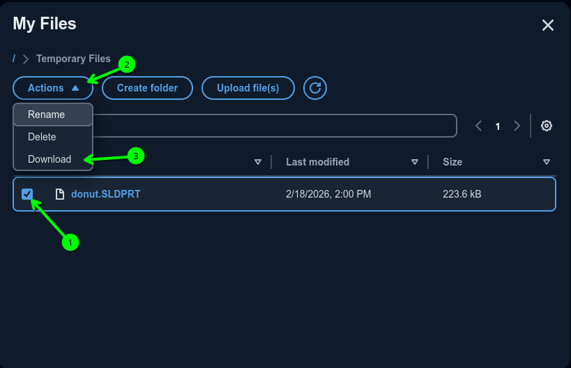

You will get your system's save dialog. Save your file and it will start downloading. Close the My Files Dialog when done.
>[!TIP]
>You can select multiple files, and you can select all by clicking on the checkbox at the very top of the file list. Be ready for a lot of save dialogs!
##### Logging Out
Now that we're done in Solidworks, we can end the session. Click on Profile and then click on End Session.
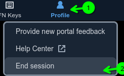

You will then get the following warning to save files if you haven't. 
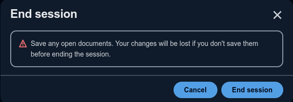

Click End Session if you are sure you saved everything. You will get a Session Ended screen. You can then close the browser tab. 
### Example 4: Mathcad


Mathcad is a program that allows you to type in math equations as if you were writing them on paper, and have the computer solve it for you. It's often used in various electrical engineering courses here at Poly.
While it can be run under Wine (as shown in the above screenshot), it is not easy to install, and it has some bugs that make it a dealbreaker for many. The insttallation procedure for Wine was briefly touched on in the workshop's [Readme](https://github.com/PhoenixLinuxUserGroup/PLUG-Resources/blob/main/workshops/wine/wine.md)
It is available on AppStream, and you can access it similar to how you can access Solidworks
### Example 5: Matlab
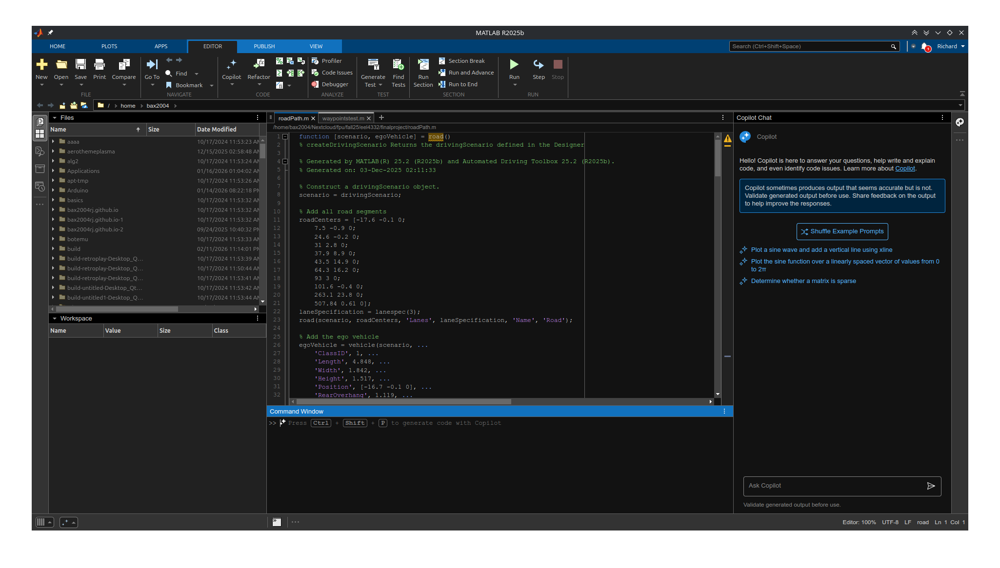

Matlab is a scientific computing program that lets you write scipts to model systems mathematically. It also includes apps and tools that can help with modelling, such as Simulink which allows you to model systems using block diagrams. Many courses here at Poly use it, especially in the engineering departments.
All Matlab apps are readily available natively on Linux. It requires a bit of work to set it up for use, but it's worth it.
#### Installation
To install Matlab, start by going to the [Mathworks website](https://mathworks.com). Click on the Sign in button. If you haven't already, create an account and set it up for academic use. Once you are signed in, Click on the Matlab button.
It will open the landing page for the web version. To install Matlab, click the Install Matlab button. You can select the version you need, and then click the Download For Linux button.

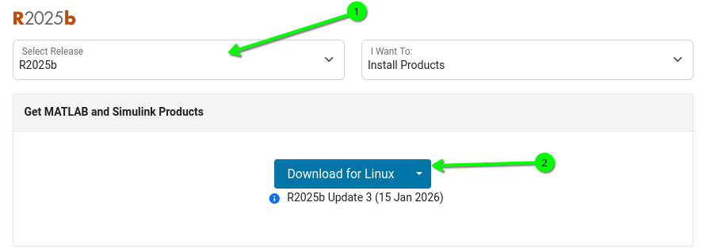

Open a terminal where the zip file downloaded to. We need to unzip it in a special way that preserves file permissions, which can only be achieved in a terminal. To do this, run
```bash
$ unzip matlab_R2025b_Linux.zip -d matlab_R2025b_Linux
```
>[!IMPORTANT]
>Make sure to replace `R2025b` with the version you are using.

Now that we have done that, move into the folder by running
```bash
$ cd matlab_R2025b_Linux
```
Now install Matlab by running
```bash
$ sudo ./install
```
You will then see the installer
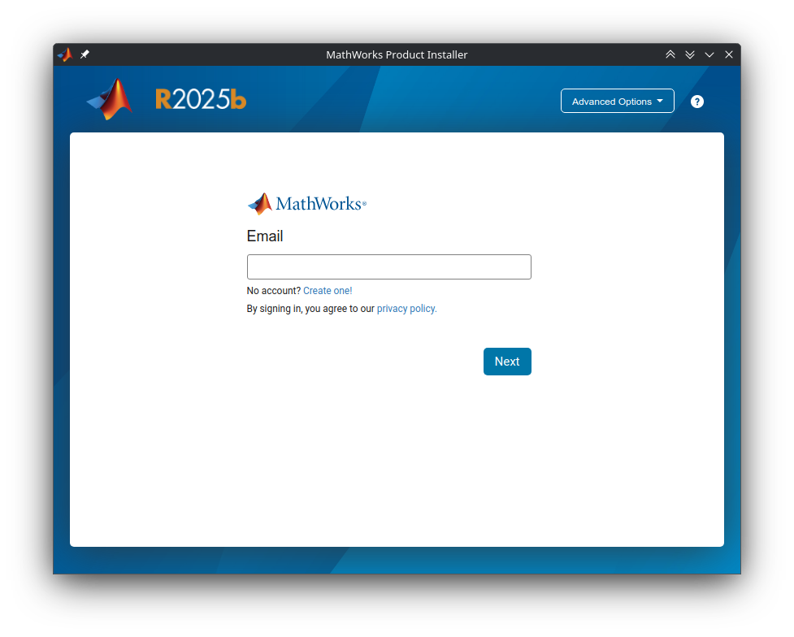
Sign in with the account you downloaded it with and follow its instructions as you would with Windows, choosing the apps you need with Matlab. Copy the install location, you may need it later.
##### Support Packages for Debian Installs
Matlab by itself my have some issues running under Linux, the most notable of which is that it will use software rendering to draw graphs, which is incredibly slow. To make it work better, there is a package you can install on Debian that enables better compatibility with Matlab.

You must install it from a terminal, since it asks some important qurestions that can only be answered from a terminal. Run the following command to install it:
```bash
$ sudo apt install matlab-support
```
It will then ask you where your copy of Matlab is. If you copied the default location form earlier, you can paste it into the dialog with `Ctrl`+`Shift`+`V`. If you didnt copy the install location, your install is most likely in `/usr/local/MATLAB/<version number>`, where version number is the version you just installed (e.g. `R2025b`). 
>[!IMPORTANT]
>If you update your Matlab install, you will have to reinstall `matlab-support` for the optimizations to take effect. To do this, run `sudo apt purge matlab-support`, then go through the installation process again.

>[!TIP]
>If you use KDE Plasma with a dark theme, and use apps like Simulink, you may notice that the UI is completely illegible, due to design oversights made by MathWorks. You can easily fix this by doing the following:
> - Right click on the Matlab entry in your app launcher and click on Edit Application
> - Under Environment variables, add `XDG_CURRENT_DESKTOP=GNOME GTK_THEME=Adwaita:light`
> This will trick your copy of Matlab into thinking it's running under Gnome with a light theme, and should fix the UI.

## Examples That Didn't Quite Work Out
Below are examples of programs that cannot be run on Linux in their full form. Here, we present some alternatives. For these apps, we recommend dual-booting Windows.
### Example 6: Autocad
Autodesk's Autocad is a CAD software specifically designed for use in drafting, and is an industry standard program for use in civil engineering and construction.
Autocad unfortunately cannot be run under Linux, not even under Winboat (due to lack of 3D acceleration). At the time of writing, it isn't on AppStream, and the only builds supported by Wine are obsolete by a few decades.
#### Alternatives
There is a web version of Autocad, which can run on any computer with a web browser. It's pretty limited compared to Autocad, and you will need a subscription to access it. Additionally, all data is stored on the cloud, on Autodesk's servers.
>[!Note]
>If you have an adblocker on your browser, Autocad might not load or create files unless you disable it.

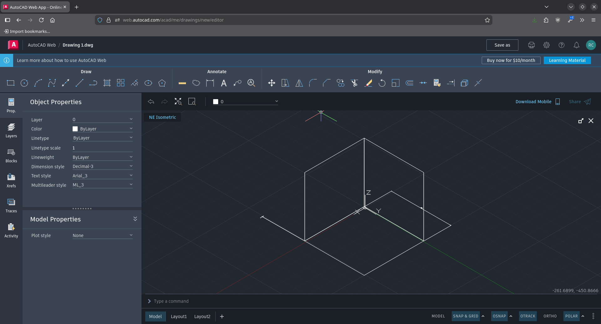
### Example 7: Atmel/Microchip Studio
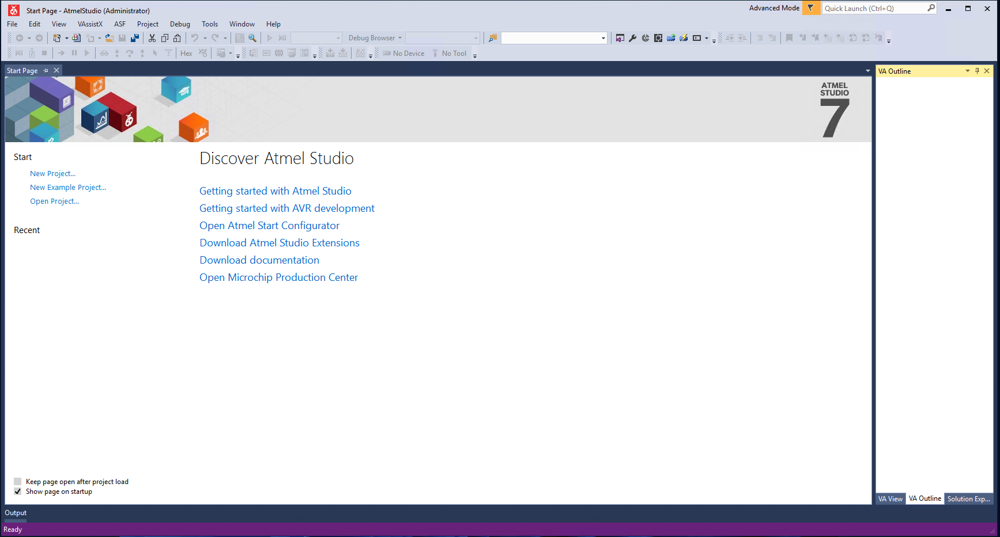
Atmel Studio is an IDE built on Microsoft Visual Studio, puropse built for writing code used on Atmel Microcontrollers with the AVR architecture. It combines the environment of Visual Studio 2015 with custom profiles, tools, and libraries designed for AVR CPUs. It is commonly used with the Microprocessors course here at Poly.
Atmel Studio can run on Linux under Winboat, however, it is not as simple or as convenient as using it under other programs. To use it effectively, you need to configure USB passthrough on Winboat, which is currently an experimental feature.
#### The Alternative Solution
Many features of Atmel Studio can be easily replicated in a standard text editor. In this example, we will configure Kate, a text editor often bundled with KDE desktops. The main functionality we will restore is the ability to compile AVR C source code and upload it to an Arduino board. To do so, we will use a shell script to automate the build and upload process.
- First, get a copy of the Arduino IDE, particularly via your package manager. You'll need this because it comes with two particularly important tools, `avrdude` and `avr-gcc`, as well as the `avr` libraries. These are the same tools Atmel Studio uses to accomplish this task.
- Download the shell script. It is available [here](https://github.com/PhoenixLinuxUserGroup/PLUG-Resources/blob/main/workshops/livingwithlinuxatfloridapoly/atmel-build.sh).
- Open Kate and go to Tools → External Tools → Configure
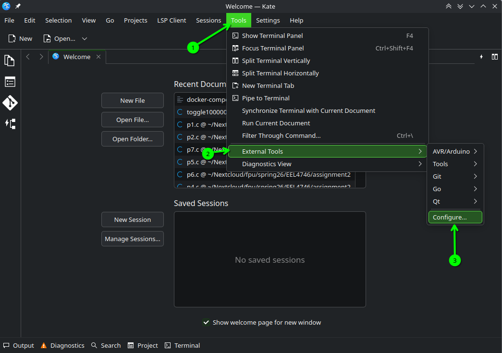

- Then go to Add → Add Category, type a name and hit enter. In this example, there's a category named "AVR/Arduino". 
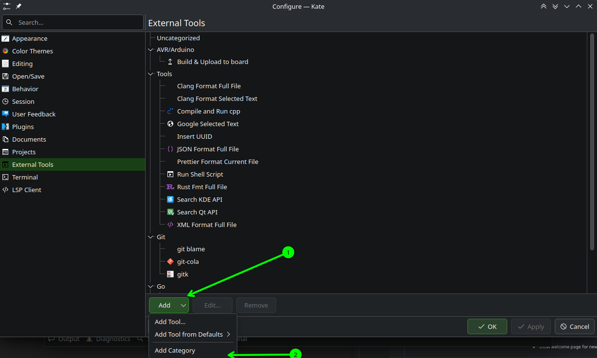

- Now we can add the script. Go back to Add and select "Add Tool…".
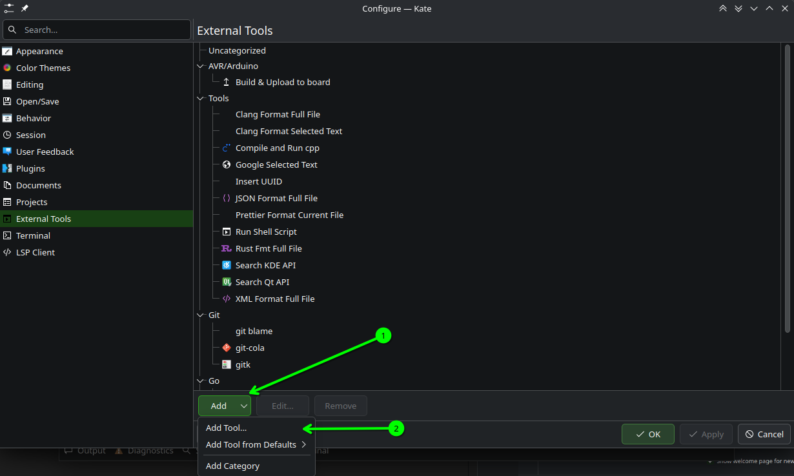

- Fill out the form, when done it should look like this:
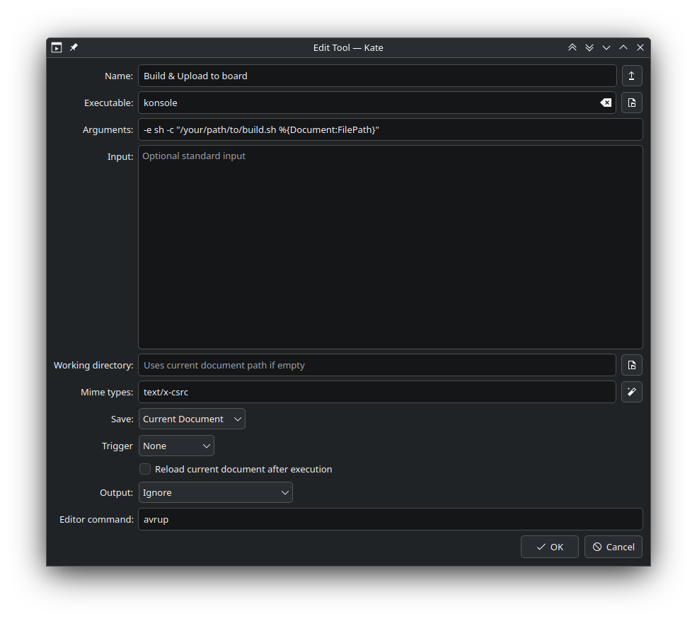

Here are the parameters from the screenshot you can copy from:
Name: `Build & Upload to Board`

Executable: `konsole`

Arguments: `-e sh -c "/your/path/to/atmel-build.sh %{Document:FilePath}"`

Mime types: `text/x-csrc`

Save: `Current Document`

(Optional) Editor command: `avrup`

>[!IMPORTANT]
>You can replace Konsole in the exec line with whatever terminal you use. Make sure you replace the path in the Arguments line with the path you downloaded the script to.

- Click OK when done. Drag the newly created item to your category. Then click OK on the Configure window.

- You should now be able to see `Build & Upload to Board` under your category. 
>[!NOTE] 
>It is supposed to be greyed out until you start working on C source code. This is due to the mime types configuration we made.

When we do open a C source file, your menu should look like this:
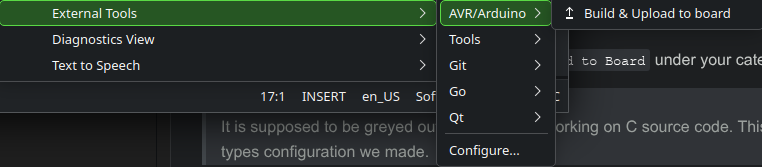

When you run it, it should output to a terminal window, and look roughly like this.

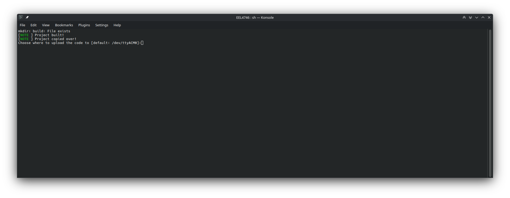

To upload to an Arduino, use the board selector in the Arduino IDE to find the location and type it into the prompt. Close out of Arduino IDE when you found your Arduino, and hit enter.

>[!TIP]
>If your Arduino is at the same location as the default in the prompt (`/dev/ttyACM0`), you can just hit Enter.

It will then upload to your Arduino and close the terminal for you, and you should see your code running.