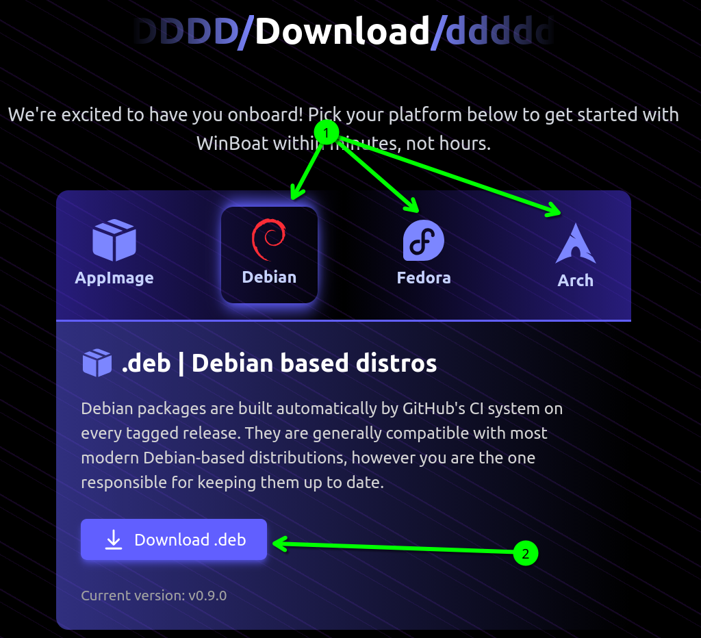
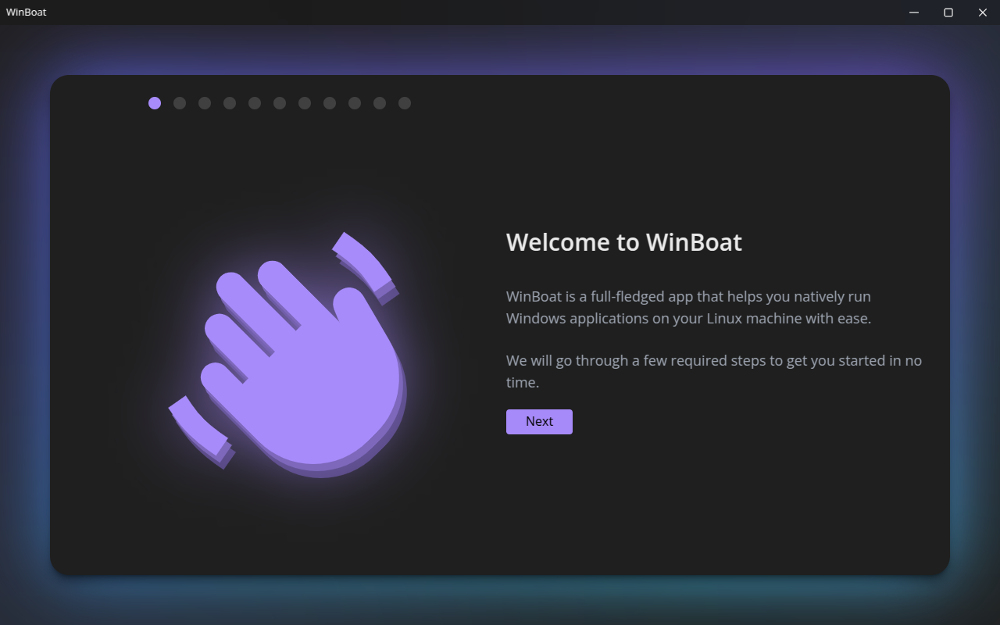
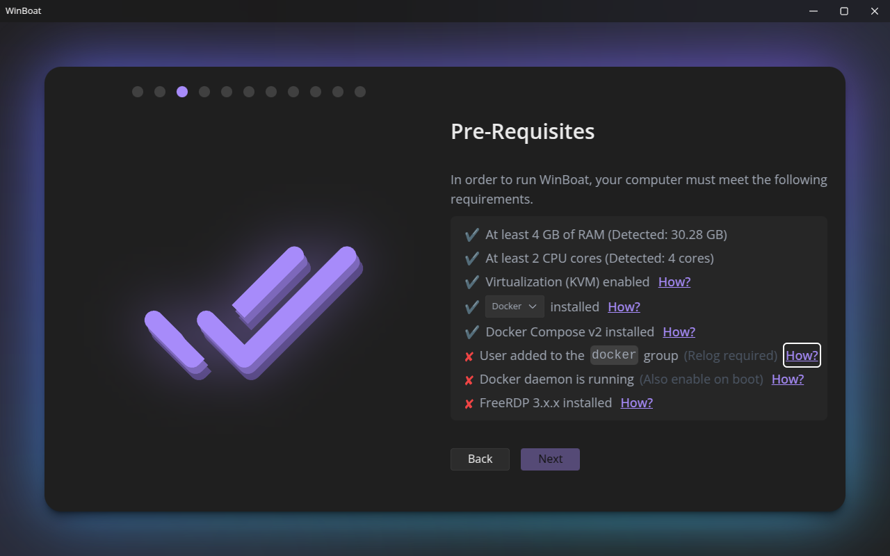
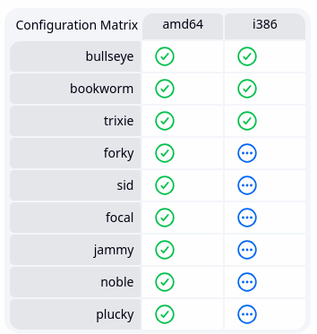

# Living With Linux IV Supplement: Installing Winboat
>[!IMPORTANT]
>Winboat takes a while to install (usually an hour or two between finding prerequisites and installing Windows). We will not be covering the process during the workshop because of this, but here are some install instructions you can run if you would like to try it.

To install Winboat, go to their [website](https://winboat.app/#download) and find the downloads section (Using the provided link will take you straight there). Select the tab with your distro and click Download (In my example, I'm using Ubuntu, which counts as Debian).


Save the file and open it in your package manager. Install the app and run it.


Follow the instructions to install Windows. You might get stuck at the pre-requisites screen. You will need to do it wants you to do before continuing. 


In my example, my PC didn't have Docker set up (unfortunately I took this screenshot after installing Docker), or the copy of FreeRDP installed. Both of these tools are necessary for its function, so here is how you can install it.
We'll start by installing Docker. Find the install instructions that correspond with the distro you are using, using [this link](https://docs.docker.com/engine/install/)
Next, we will create a group for docker and add ourselves to it. Run the following in a terminal:
```bash
$ sudo groupadd docker
$ sudo usermod -aG docker $USER
```
You'll need to log out and log in again so the changes take effect.
>[!WARNING]
>If you are not using a Debian-based distro, you may have to start the Docker daemon. Run this command to start it:
>```bash
>$ sudo systemctl start docker
>```
>If you don't want to go into the terminal and run this everytime your computer starts, follow the instructions [here](https://docs.docker.com/engine/install/linux-postinstall/#configure-docker-to-start-on-boot-with-systemd) to start the daemon on boot.

Finally, we will install FreeRDP, which will allow us to interface with our Windows VM. Find FreeRDP in your package manager. Make sure you are getting version 3 or greater, and avoid the Flatpak build. The flatpak build does not work well on all systems, and will not be able to interface with Winboat due to the Flatpak sandbox. If you can't find a suitable build, you can obtain a build from [FreeRDP's github](https://github.com/FreeRDP/FreeRDP/wiki/PreBuilds). Select the build that correlates to your distro. 



Click on the checkmark that corresponds to the codename of your distro. Select the first package button. In my example, I'm selecting Jammy, since I use Ubuntu 25.10, and they don't have anything for Oracular
>[!TIP]
>If you don't know what codename your Ubuntu/Debian version has, run 
>```bash
>$ cat etc/os-release
>``` 
>and have a look at the `VERSION_CODENAME=` line.

Save and install the package with your package manager.

Once that's done, close Winboat and open it. Continue following its instructions. It will walk you through choosing an install location and build of Windows to install. After the review section, it will start installing Windows.

>[!NOTE]
>The build of Windows provided by Winboat is not registered, so you might want to get it registered.

## Usage
You can access the raw Windows desktop, under Apps → Windows Desktop. From there, you can install Windows programs as usual. If you close and reopen Winboat, it will reload the Apps menu, allowing you to select apps you have installed. It will show up as a part of your desktop, as if you were running Windows.