# Living with Linux 1: Ricing
If you've explored the Linux community, you may have seen other people's setups, and may have seen that it looks nothing like the typical distros you're used to. This is because these setups are highly customized to achieve their desired look. In today's Living With Linux, we'll go over how you can customize your distro to meet your needs.
## Previously, on Living With Linux…
In [Episode 0](/workshops/firstboot/firstboot.md), we started out by simply installing Linux on your computer. We haven't done any more than just play around with Linux and try it out. But this is only the tip of the iceberg of what you can do with Linux.
## An introduction to ricing
One useful advantage Linux has over other operating systems is that you can customize almost every element of it. Don't like your specific copy of the Linux kernel? You can change it. Have a specfic hatred for your distro's init process? Get rid of it and put something you like on. Linux lets you do these things, provided you have the specific knowledge to do so. Today, we will be customizing the aesthetics of our Linux OSes, in a process known in ricing.

Ricing as a term originates from [the car community](https://news.ycombinator.com/item?id=39413861#:~:text=In%20the%20car%20scene%2C%20it%20stands%20for%20%22race%20inspired%20cosmetic,intake%20scoops%2C%20etc), who used the word RICE as an acronym for "Race Inspired Cosmetic Enhancement" after some people started customizing Japanese cars in Southern California. These imported cars and motorcycles would be known as "rice burners" and "rice rockets", respectively, leading to the acronym's creation. As the acronym's meaning suggests, no real performance boost was gained, but the car sure looked good. Ultimately, this trickled into the internet and, by proxy, the Linux community. [This trend really exploded](https://dev.to/nucleofusion/complete-beginners-guide-to-linux-ricing-4i0e) when window managers like `i3` were released.

While we won't be messing with window managers like i3, Hyprland, or Niri today (since that would probably take all day to go over), we'll show you how to customize the desktop you probably already have. We'll focus on KDE Plasma, since it's the easiest to customize, and many distros come with it or can have it easily installed. We'll also discuss customization options other mainstream desktops (Gnome and Cinnamon) give you. Finally, we'll leave you with some other customizations you can make beyond the desktop, such as your bootloader and loading screen.
## Ricing on KDE
Let's start with the easiest desktop to rice, KDE. Most of the customizations you can make are found in the System Settings app and can be done in a few clicks.
### The Colors and Themes Menu
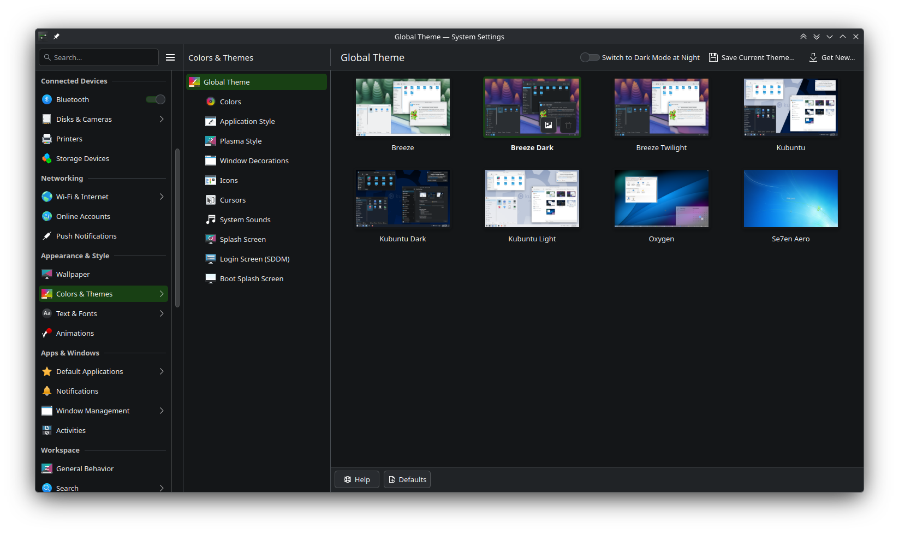

Here is where we'll be for most of this episode. As you can see, this menu lets you customize everything except for panels and desktop wallpaper. You may notice that immediately you can select a preset and save your own here. Get here by going to `System Settings`→`Colors and Themes`.
### Pre-made customizations
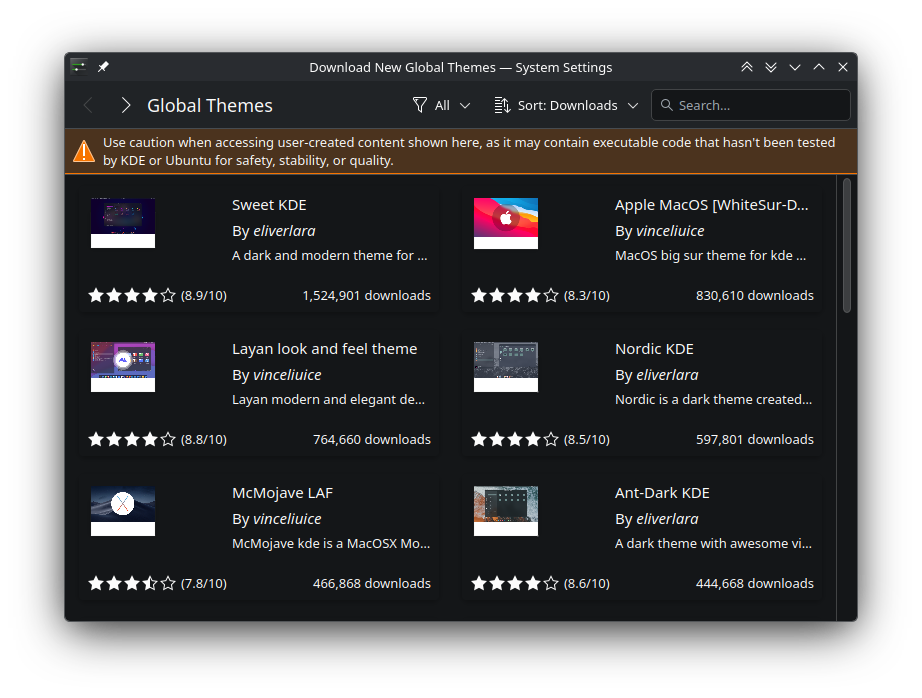

Another thing you may have noticed is the `Get New` button. From here, you have access to a marketplace of pre-made customizations. Each individual page has its own version of this tool, so you can mix and match as needed.

To install from here, you can hover over the card with what you're looking for, and click the `Install` button that shows up. If you want more info and screenshots, you can click on it and install from there. You may be asked to type your password. This is normal, as the item also includes a custom login screen (through `sddm`) and needs root priviliges to install this new login screen system-wide.

>[!note]
>Some themes may fail to install when obtained from this store. If you cannot install a customization package, try looking at its description, and following its install instructions. The items listed are sourced from store.kde.org, and you can manually download each pack from the website. 

>[!Caution]
>These customizations aren't tested for stability or quality, either by KDE or your distro's provider. Your system may not reliably work under these customizations. Additionally, global themes may contain malware or other executables, so be careful when trying these themes.
#### Messing with installed themes
Once we've installed our theme it will show up on the list of available themes. Click on it, and it will ask you how you want the theme to be applied. In this example, I chose one that makes my system look like MacOS Big Sur. To get the full effect, check off `Desktop & Window Layout` and click `Apply`. Note that in the following sccreenshot, I showed my full desktop to demonstrate the change.

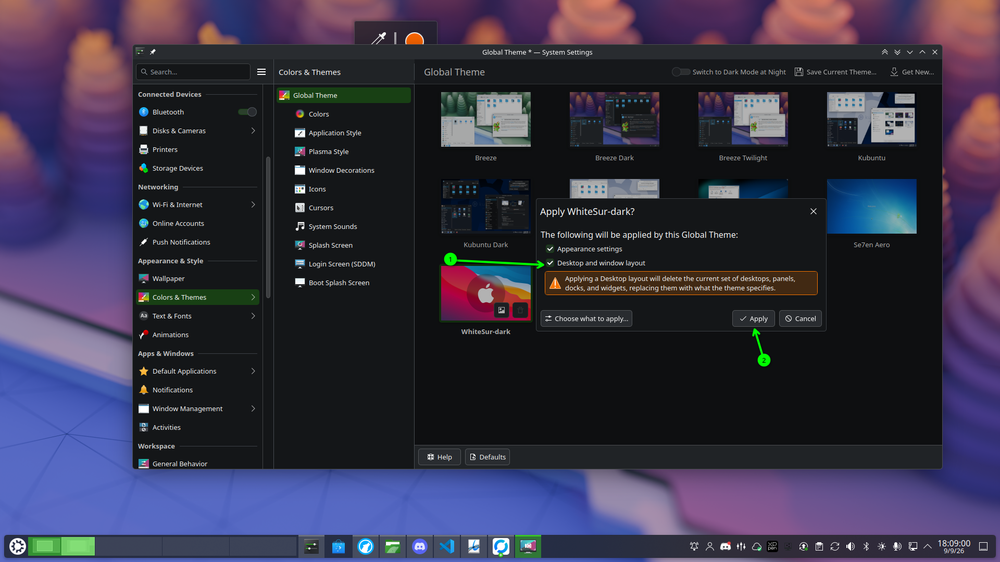

>[!warning]
>As the dialog says, this will overwrite your existing configuration. If you made modifications to your previous configuration, you should exit out and click `Save Current Theme…` to save what you have. Name it, add a preview image or click `Take a screenshot…` and click `Confirm` to save. You also can pick and choose what elements of the new theme will make it to your desktop.

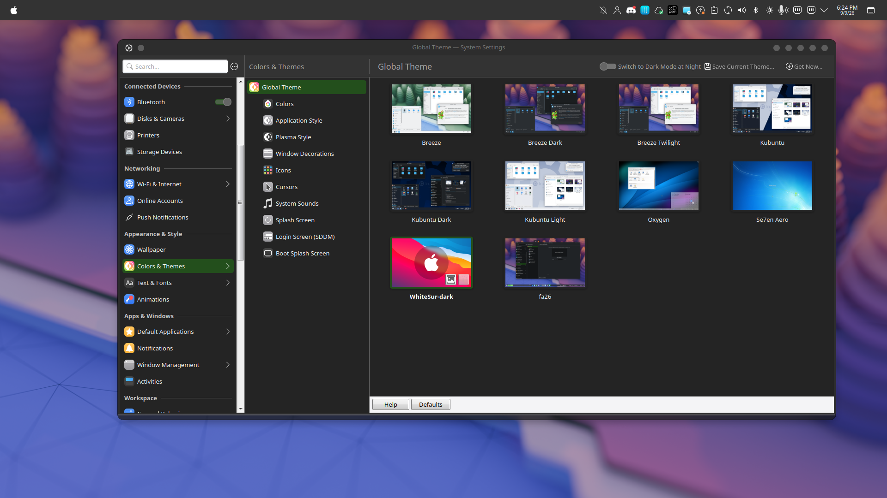

Now we look vaguely like MacOS! It's not the most convincing, and I had to add the top panel onto my other monitor in order to get the above screenshot.
### Custom customizations
If none of the pre-made ones aren't to your liking or just needed a little bit of tweaking, you can make things work to your liking. Here are a few examples of tweaks you can make to make your desktop work for you.
#### Editing window decorations
On KDE, you have the ability to change what your window borders do and what the look like. Here, for example, you can see that I have two extra window buttons, which keep the window above others or keep it below others respectively.

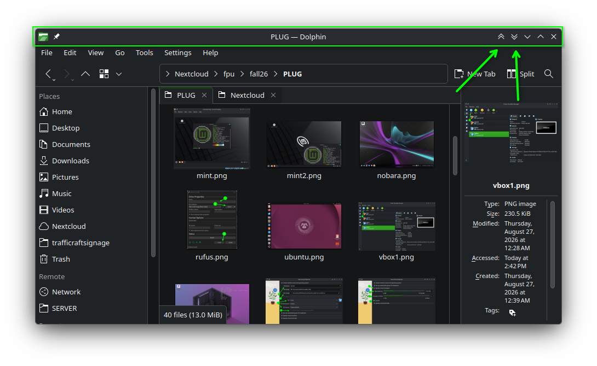

To achieve this, you can go to `Colors & Themes`→`Window Decorations` and click on `Configure Titlebar Buttons…`. This gives you the ability to drag and drop new titlebar buttons or remove certain elements as needed.

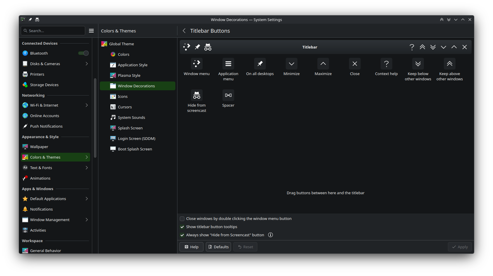

Once you're done, you can click `Apply` and it will be added.

>[!NOTE]
>This doesn't work for all apps. Namely, it doesnt work on apps that use their own window borders such as those designed for Gnome. This is part of a slight topic of debate for those involved in the design of Linux desktops. 
#### Changing colors
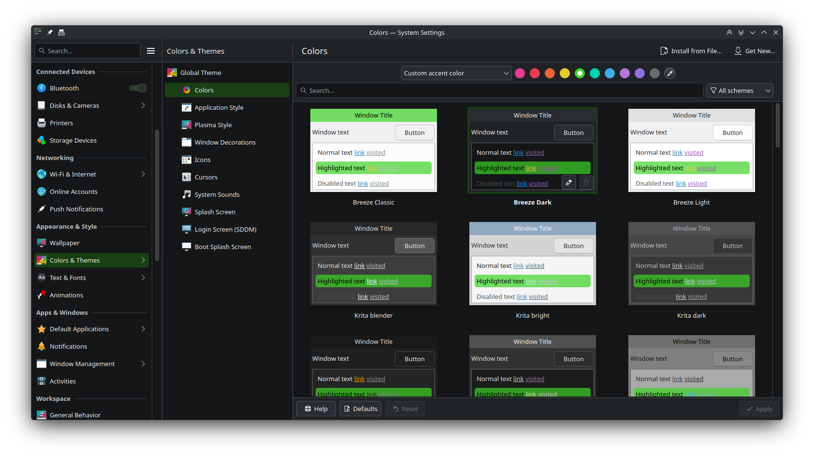

You can also change the color scheme of your distro using the Colors menu. You can choose simple things like the Accent color or you can customize your exiting scheme using the pencil icon in its preview card. Or you can install premade color palletes, like we'll do here.

In this example, we will install the [Catpuccin](https://catppuccin.com/palette/) color pallete. Now you *could* choose your favorite variant off the website and manually replace each color, but we don't have all day for this. Instead, we'll install it! Luckily, all four variants can be obtained using the `Get New…` button. Mocha goes best with a dark theme, so I'll search for and install that one.

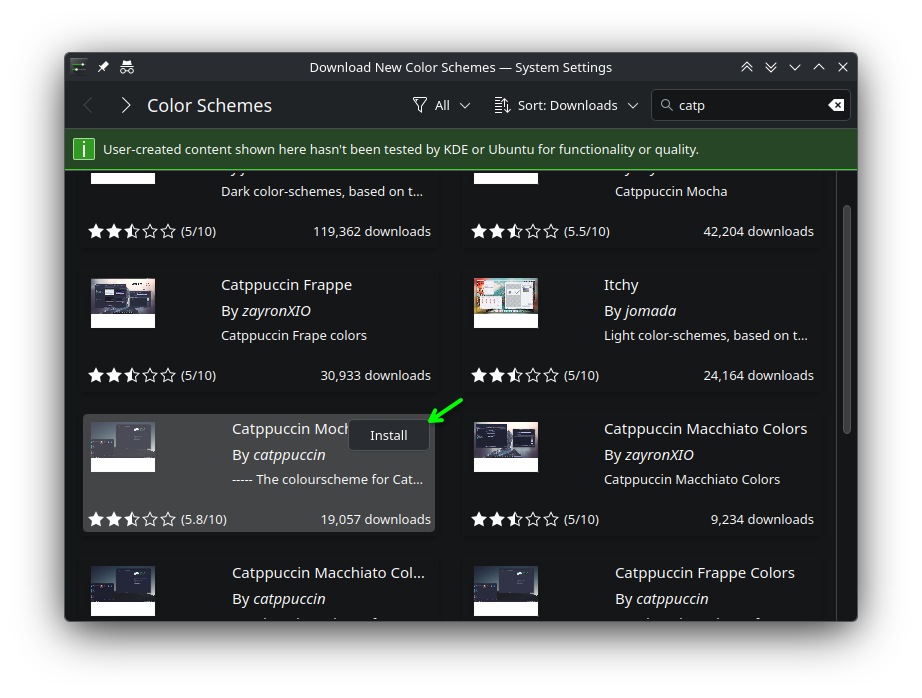

I'll select the new color scheme, changing this:

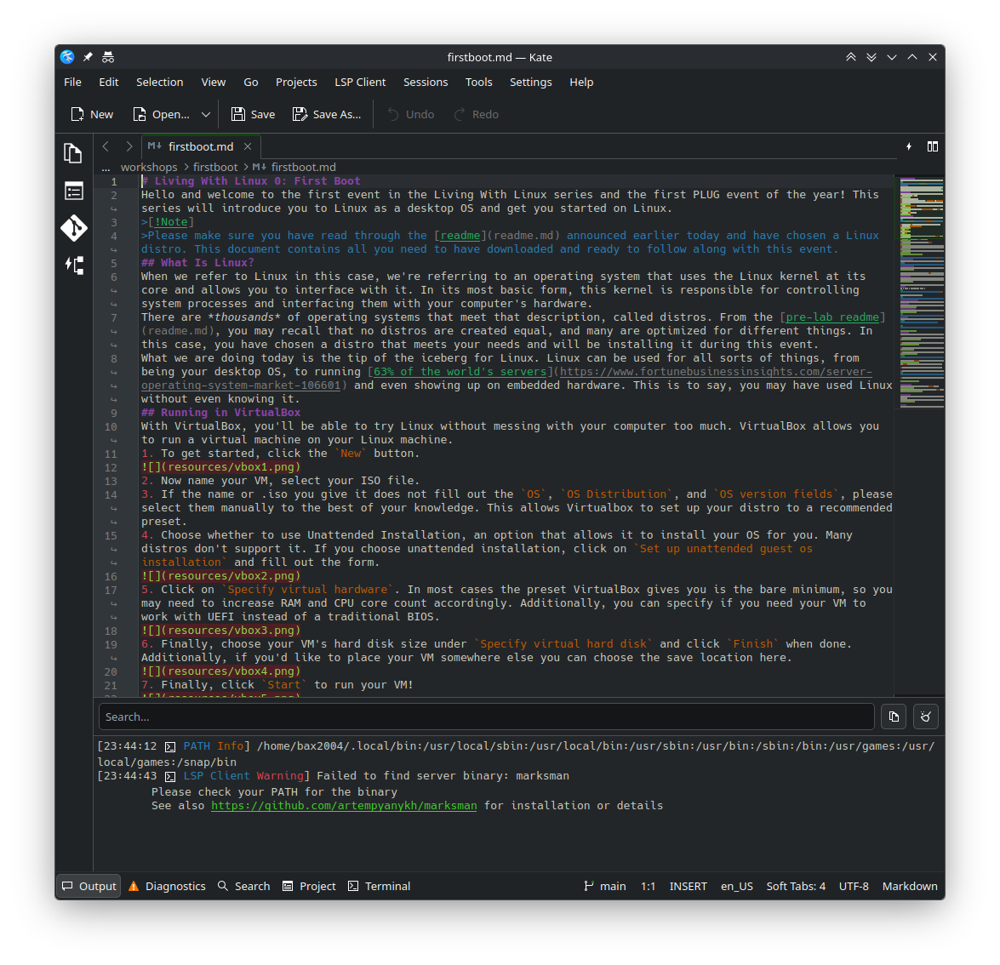

to this:

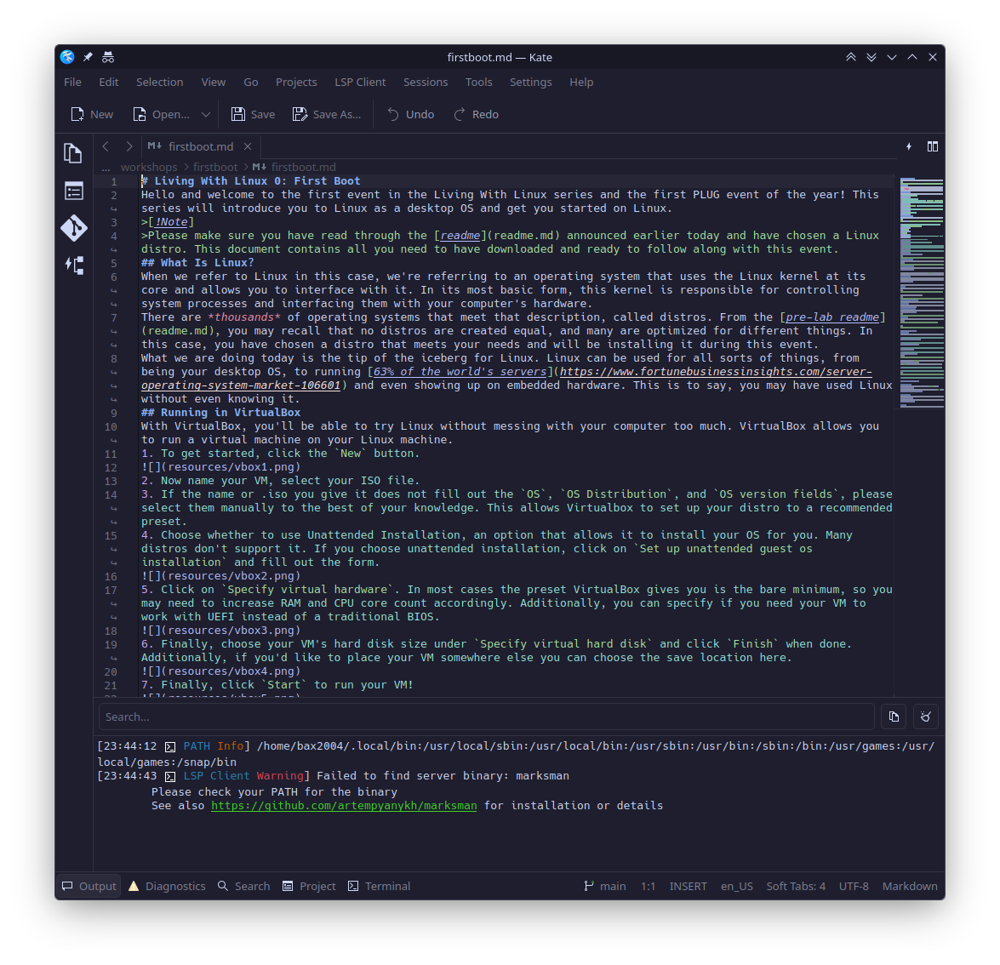

### Edit Mode
Now that we've changed the general look of our desktop, you may find it benficial to make some changes to items on the desktop. This is where Edit mode comes in. Edit mode allows you to add, remove, and edit the contents of panels as well as add widgets to the desktop and panels.
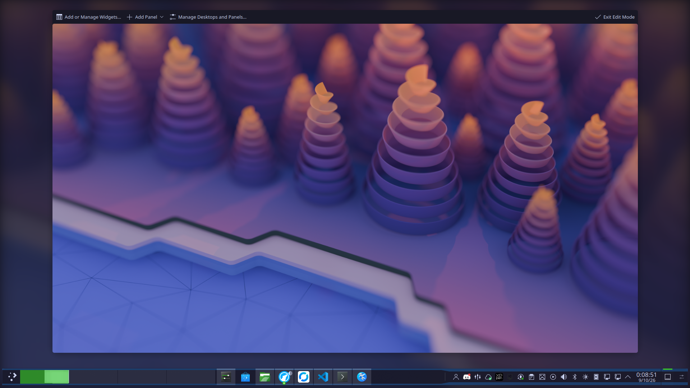

To enter Edit mode, right click on your desktop and select `Enter Edit Mode`. All of your windows will be minimized and you now can make edits to your desktop.
#### Widgets
Like other operating systems (MacOS and Windows Vista/Windows 7), KDE supports widgets. You can add these in from Edit mode by clicking on `Add or Manage Widgets` then dragging something you want and dropping it where you want it. When placing or selecting, you also get resize handles, and options on a side menu.
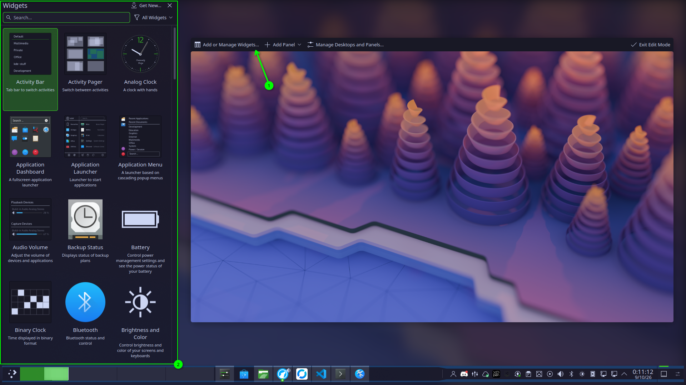

Some widgets have many variants, and if you want to change it out, you have the ability to replace it with an alternative version. To do this, right click a widget and select `Show Alternatives`. You don't even need to be in Edit mode to change it. You'll then see a menu providing you options. Choose one and it will replace what you have put down.
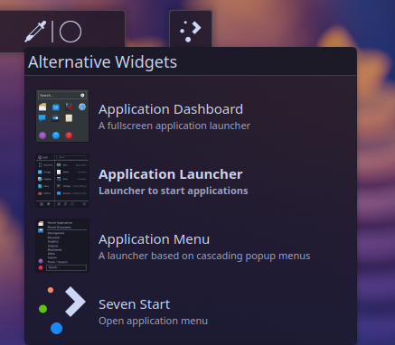

#### Panels
If you just switched to Linux from Windows or MacOS, you may be familiar with having a taskbar or dock that you can only change which side of the screen it appears on. On KDE, however, the concept is expanded. Instead, you can have as many as you need and they can be made of any widgets you need. These can be put on any edge of your screen. To create one, go into Edit mode, and click on `Add Panel`. It will give you a menu with presets to choose from. Select one, and it will place it on your screen. To change position and other things, click on the settings button. It will give you several options to get it how you like it.
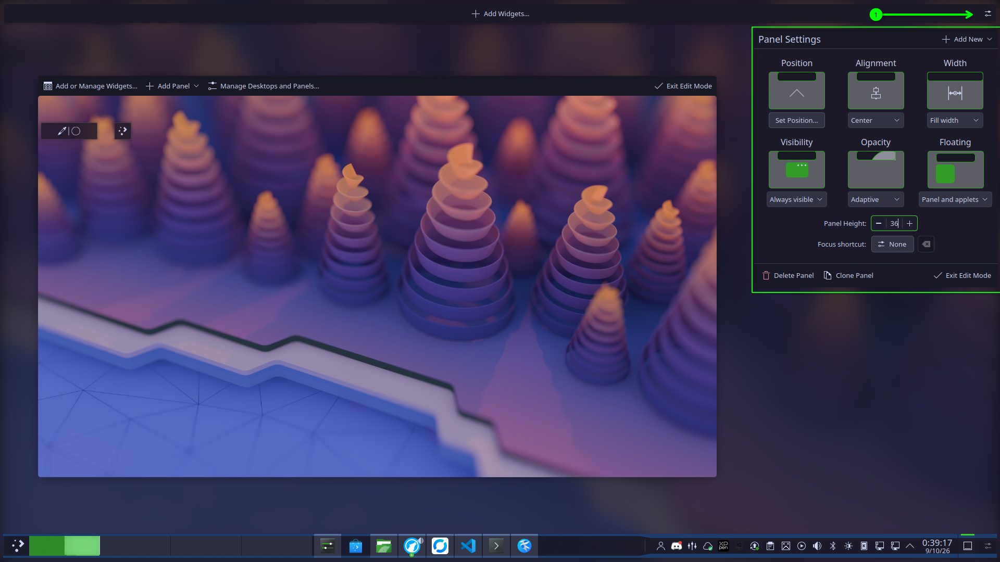

Since these panels are made entirely out of regular widgets, clicking `Add widgets` will bring up the Widgets menu from earlier. Instead of dragging, it will work just by clicking. Dragging can be used to re-arrange items. Here, I added a global menu bar to my panel.
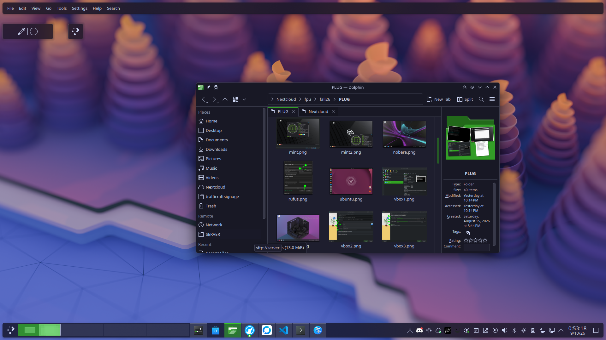
### Wallpapers
To change a desktop wallpaper, all you need to do is right click the screen you want to change the wallpaper of and select `Desktop and Wallpaper`. You'll then get a Settings menu that lets you set your wallpaper and make changes to the way it's presented. Plugins can also be installed to allow for live wallpapers.
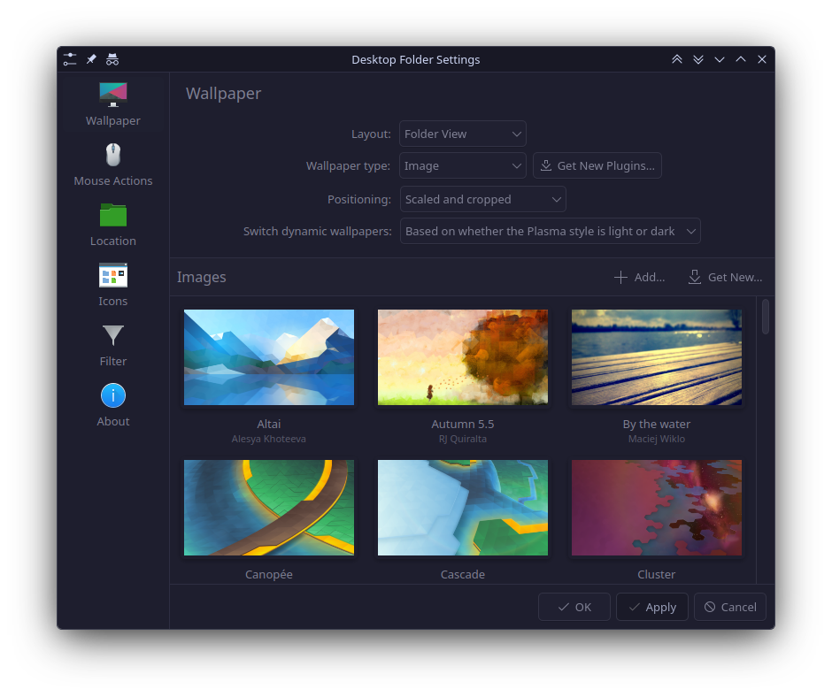
### Changing UI elements with Kvantum
Kvantum is a program you can install which allows you to change the look of UI elements. KDE's ability to set the exact look of UI elements on the fly is limited, so Kvantum can be used to fix this. See the [Kvantum install instructions](https://github.com/tsujan/Kvantum/blob/master/Kvantum/INSTALL.md) to get it for your desktop.
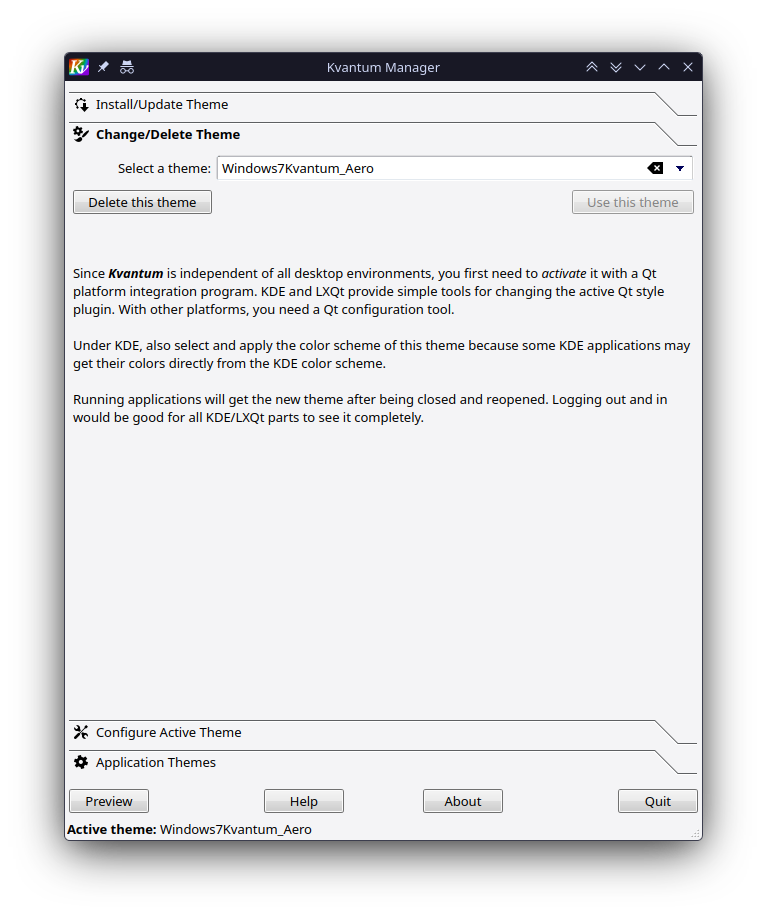

You can obtain Kvantum themes [here](https://store.kde.org/browse?cat=123&ord=latest)

Here, I've combined a Windows 7 Kvantum theme with a Windows 7 desktop theme to create the authentic Windows 7 experience without having to leave Linux.
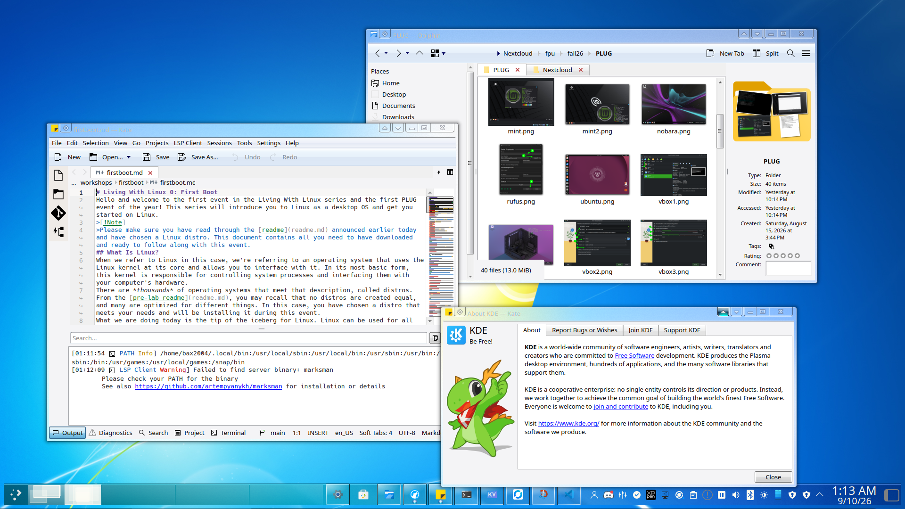
## Ricing on Gnome
On Gnome, your options are more limited. Unlike KDE, Gnome takes a more basic approach to customization
### What's different?
Out of box on Gnome (specifically on Ubuntu), you are able to change a couple of things. Namely, you can choose accent colors, light and dark mode, wallpapers, and positions of the default dock. This can all be done in the Settings app under the `Appearance` and `Desktops` tabs.
### GNOME Shell extensions
To improve this, Gnome Shell extensions allows you to customize Gnome by giving you access to a repository of modifications for Gnome.
#### Installation
To get Gnome Shell Extensions, you need two things:
- a web browser extension called `Gnome Shell Integration`, available for both Chrome, Firefox and related browsers
    - Download it on Firefox [here](https://addons.mozilla.org/en-US/firefox/addon/gnome-shell-integration/)
    - Download it for Chrome/Chromium [here](https://chromewebstore.google.com/detail/gnome-shell-integration/gphhapmejobijbbhgpjhcjognlahblep)
- a package known as `gnome-browser-connector` as well as some other packages to manage themes, available for most distros.
    -  Install on Ubuntu and Debian by running `sudo apt install gnome-shell-connector gnome-shell-extension-manager gnome-shell-extension-user-theme` in a terminal.
    - Install on Fedora and Red Hat by running `sudo dnf install gnome-browser-connector gnome-extensions-app gnome-shell-extension-user-theme`
    - Other distros can see [this guide](https://gnome.pages.gitlab.gnome.org/gnome-browser-integration/pages/installation-guide.html#fedora_linux) for more details to install Gnome Shell Extensions.

After installation, you can click on the browser extension and it will take you straight to extensions.gnome.org, a website with every Gnome shell extension available. You can use this website to find and install your shell extensions.
### Gnome Tweaks
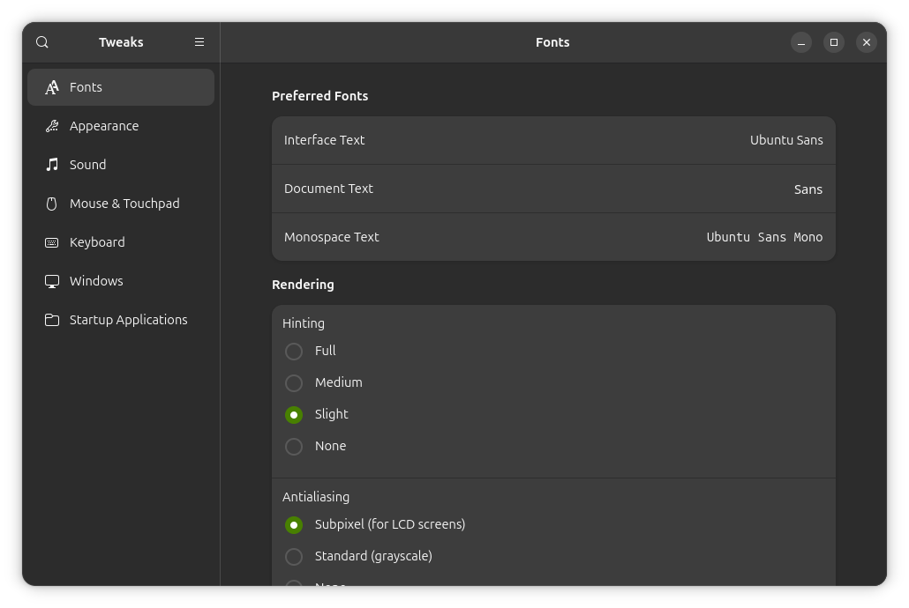

With Gnome Tweaks, you can get more customization options than with regular settings. Additionally, Tweaks is a prerequisite for most of the premade customizations on Gnome.

#### Installation
To install Gnome Tweaks, find it in your distro’s package manager or run the following in the terminal:
On Ubuntu or Debian, run:
```bash
$ sudo apt install gnome-tweaks
```
On Fedora and RedHat, run:
```bash
$ sudo dnf install gnome-tweaks
```

### Pre-made customizations
Gnome also has a website you can use to download themes with, gnome-look.org. This website has customization packs similar to that of KDE's `Get New` packages. You can install themes using your chosen theme's install instructions or by doing the folllowing:
- Create a folder in your home directory called `.themes`.
- Unzip your theme into this newly created folder (as a subfolder, so you can easily select themes)
- In Gnome Tweaks→ `Appearance`, you should be able to select your theme.
## Ricing on Cinnamon
Cinnamon, the desktop of Linux Mint, is the best of both worlds. Like KDE, you can access a repository of themes and extensions. Unlike Gnome, however, you can actually customize everything out of the box.
### The Themes setting: advanced mode
In Themes, you'll see that you dont initially get much in the way of customization. By pressing the `Advanced Settings…` button, you can unleash the full potential of Cinnamon customization. You'll unlock a tabbed interface that allows you to choose cursors, UI elements, icons and the look of your desktop. The `Add/Remove` tab is similar to the KDE `Get New` button, and the remaining tab, `Settings` is just miscellaneous settings, like dark mode.
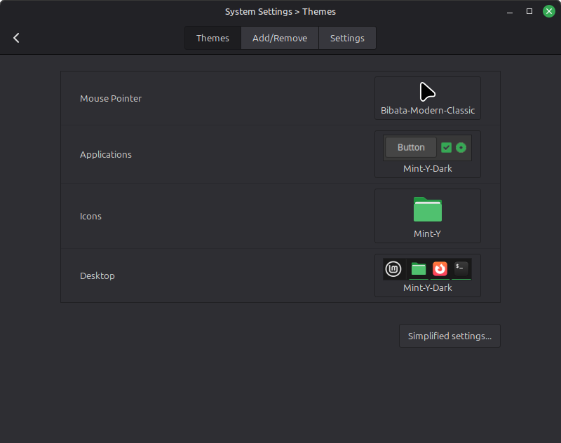

### Pre-made customizations
Using the `Add/Remove` tab, we can download new themes. 

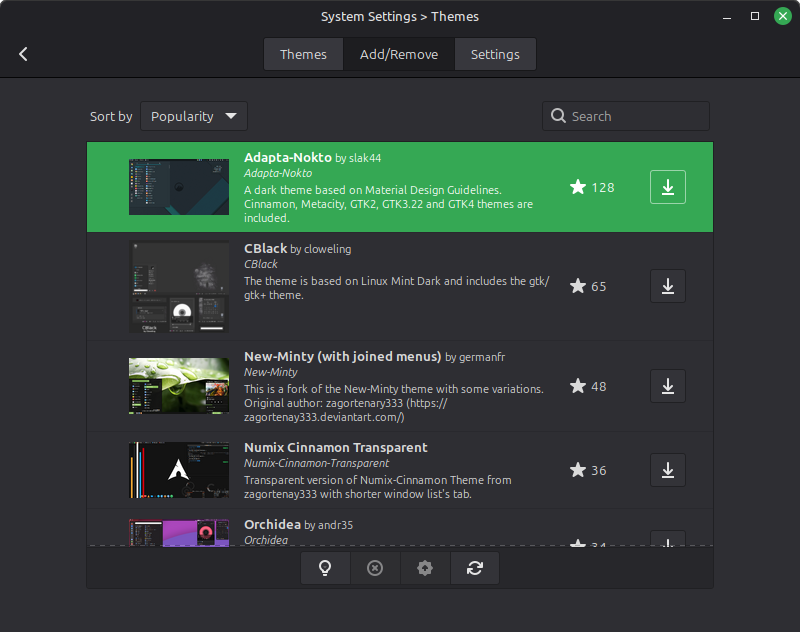

>[!TIP]
>Clicking on an item and clicking the lightbulb icon will take you to the [Cinnamon spices](cinnamon-spices.linuxmint.com) page for your selected item, to give you more information and previews. This is where the items are sourced from.
## Customizing GRUB
We've customized literally everything at this point, but we're still missing something. Recall from the first event this:
> Your distro comes with a boot menu, powered by GNU GRUB. If you're dual booting, expect to see this menu everytime you start your computer, as it will be used to switch you between Linux and Windows. You can interact with this menu using the arrow keys and `Enter` key. It will automatically skip and choose the default option if you do nothing in 5-10 seconds.
> 

GRUB is also something you can customize to your liking. You can change the font, the colors, the resolution it runs at, and even the background image!
### Installing themes
Much like everything else, you can get GRUB themes on the internet and install them. [Gnome-look has a whole section dedicated to GRUB themes](https://www.gnome-look.org/browse?cat=109&ord=latest), and we'll start here to install our new theme. We'll go with [this theme](https://www.gnome-look.org/p/2272739) in this example, installing it on my Mint VM. I'm going to choose the Window variant.

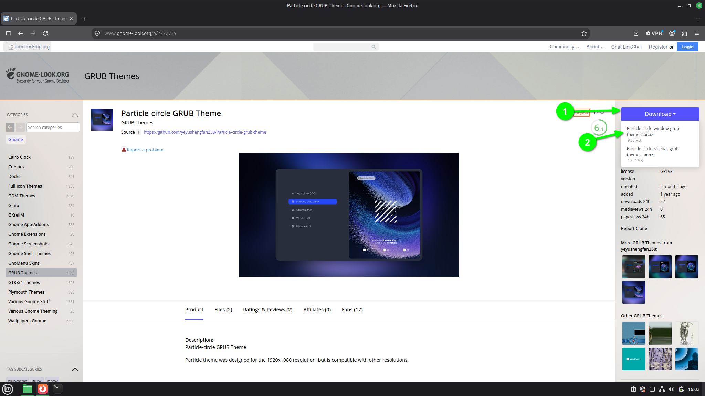

We'll unzip this theme. This theme has an install script, which will make it way easier to install your theme.
Commands may vary by theme pack, but the following command should work:
```bash
sudo ./install.sh
```
Now, we can reboot and see what happened!
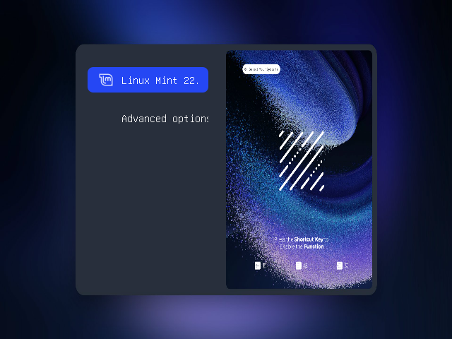

Unfortunately, it looks like our VM shrunk it down to 640X480, but the point still stands, and we successfully installed a GRUB theme!
>[!TIP]
>If your GRUB menu doesn't show up, try pressing `esc` once you get past your BIOS. GRUB doesn't typically show up if you only have one OS installed. If that doesn't work, we can make it show up every time, by editing `/etc/default/grub` adding or editing the following lines:
> ```conf
> GRUB_TIMEOUT_STYLE=menu
> GRUB_TIMEOUT=5
> ```
>For best results, edit this from a terminal with `nano`.
>Afterwards, save and run the following:
>```bash
>$ sudo update-grub
>```
>then reboot.
#### Installing themes without install scripts
If our theme doesn't have an install script, well need to do things manually. Create a folder using the terminal by running the following command:
```bash
$ sudo mkdir -p /boot/grub/themes
```

This gives us a place to put the theme where GRUB can find it. Now, we copy our theme to this directory:

```bash
$ sudo cp -r </path/to/your/theme> /boot/grub/themes/
```

Now, we have to tell our GRUB install what theme we want. To do this, we have to edit a config file. Run the following command to open the file:
```bash
$ sudo nano /etc/default/grub
```

We'll add/edit the following line to point to our theme:

```conf
GRUB_THEME="/boot/grub/themes/<your_theme_name>/theme.txt"
```
Then, we'll update GRUB by running this command:
```bash
$ sudo update-grub
```
Finally, to see our work, we'll reboot. If all went well, your new theme should appear.
### Using GRUB Customizer
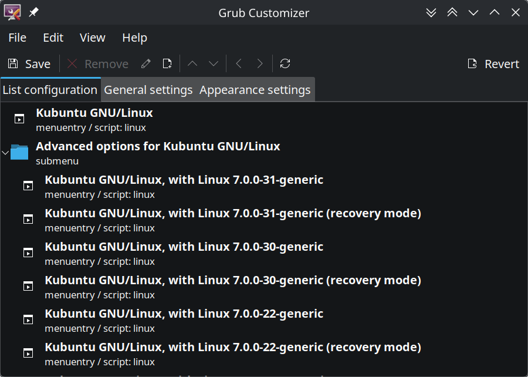

Not only can we install themes, but we can make our own! In GRUB Customizer, you can control everything about your GRUB setup. Here, you can:
- change the order you OS list appears in 
- select how your GRUB menu shows up
- select your background and colors
- edit `/etc/default/grub/` without going into a text editor.

Here, for example is the GRUB menu on my laptop, that I built using this editor:

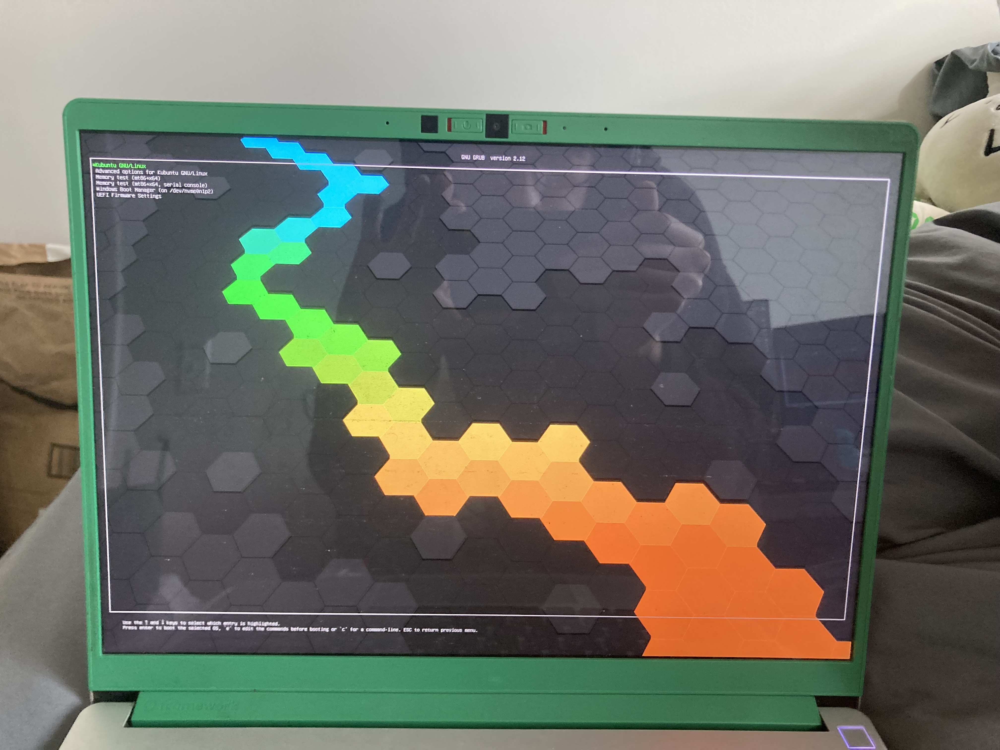

Unfortunately, I couldn't get a screenshot, my capture card disagrees with GRUB somehow.

See [this guide](https://linuxconfig.org/how-to-install-grub-customizer-on-linux-all-major-distros) to install GRUB Customizer.
## Conclusion
Now that we have transformed your boring, stock distro into something that looks and acts the way you want, you can now enjoy Linux the way you like it. In the following episodes, we'll go over the tools for Linux that may make Linux worth your while for gaming and productivity, and might even get you to switch over completely.