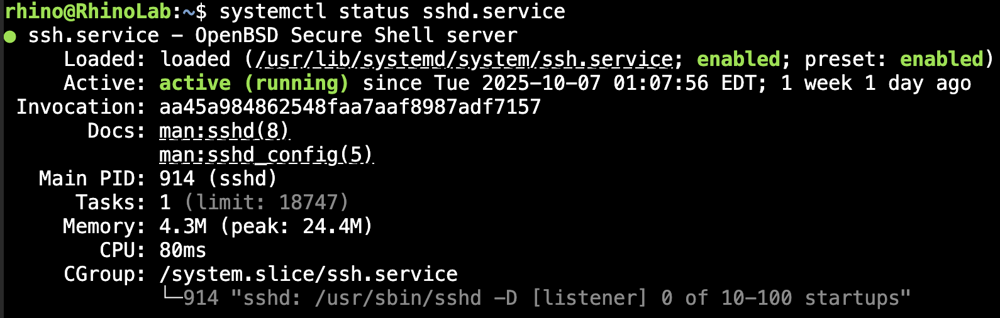
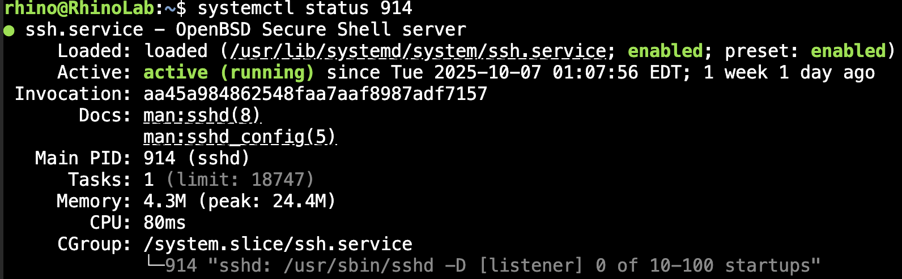
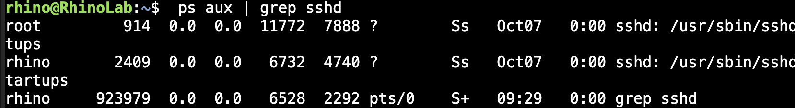

SystemD and you

## What is SystemD?
From SystemD.io
>systemd is a suite of basic building blocks for a Linux system. It provides a system and service manager that runs as PID 1 and starts the rest of the system.

>systemd provides aggressive parallelization capabilities, uses socket and D-Bus activation for starting services, offers on-demand starting of daemons, keeps track of processes using Linux control groups, maintains mount and automount points, and implements an elaborate transactional dependency-based service control logic. systemd supports SysV and LSB init scripts and works as a replacement for sysvinit.

>Other parts include a logging daemon, utilities to control basic system configuration like the hostname, date, locale, maintain a list of logged-in users and running containers and virtual machines, system accounts, runtime directories and settings, and daemons to manage simple network configuration, network time synchronization, log forwarding, and name resolution.

### The init system
SystemD is primarily used for its Init system. SystemD runs as PID1, which, after the kernel, is the first thing to be run on the system. It is responsable for coordinating services, creating user sessions, and more.

SystemD is used as the init system for many common distros, including but not limited to: 

- Arch (and most derivatves)
- Debian
- Fedora
- Ubuntu
- Mint

Distros without SystemD preinstalled include Gentoo and Void Linux
In the case of Gentoo, it can be installed and used, but is generally unsupported.

Arch Linux can also leverage other init systems, however, it is recommended to use SystemD, and usage without systemD is unsupported

## Units
SystemD manages a number of entities called Units. These units are often configured manually via configuration files, but can be configured automatically, generated by the system, and installed with packages. We'll get into configuring basic service, timer, and path units later in the README
```
Service   | Manage System and User services
Socket    | Activates services based on a socket connection
Target    | Groups services together and provides anchor-points for boot milestones
Timer     | starts a service at configurable times
Device    | expose kernel devices to systemD, can be used for device based activation
Mount     | control mount points
AutoMount | allow for automounting filesystems
Swap      | like mount but for system swap
Path      | activates services when file sytem objects are modified
Slice     | group other units into trees for resource management
Scope     | manage services not started by systemd
```

## Leveraging SystemD
SystemD can be interacted with using a command called systemctl,  this command is used for diagnostics, starting and stopping services, as well as 'enabling' services

use `man systemctl` on most systems to get a rundown of everything this command can do. We are going to focus on operations related to services, as this is the most common use case for interacting with SystemD manually, as well as a few more commands that are useful.

### systemctl status

`systemctl status [PATTERN ... | PID ...]]`

is used to display the status of the system or processes

Running this command with a service name, such as
`sytemctl status sshd.service`
will display the status of the running service.



it can also display the status of processes controlled by services by PID you can find the PID of a process using `ps aux` or `top` but for now, we can use the PID returned by `systemctl status sshd.service` in my case, 914



notice how it retuned the status of the service that the process belongs to. this can be useful to check if a process was started by a user or which service is managing the process.

### start, stop, enable, disable, and restart

`systemctl start PATTERN...` will  start a service managed by systemd passing the `--user` flag will start a useer service.

`systemctl stop PATTERN...`
will stop a service managed by systemd passing the `--user` flag will stop a user service.

`systemctl enable PATTERN...`
will enable the service to run automaticall when conditions are met, these conditions are specified in their Unit configurations. Often, this is used to start a service when a user session is started by passing the `--user` flag or on boot.

`systemctl disable PATTERN...`
Disables services, inverse of enable.

`systemctl restart PATTERN...`
will terminate and restart a service. if `--user` flag is passed, will restart a user service

### cat
`systemctl cat PATTERN...`
Will return the configuation of the specified service 

## daemon-relaod
SystemD does not automatically pick up modifications and new configuration files

`sudo systemctl daemon-reload` must be used to reload the system daemon to apply changes
`systemctl --user daemon-reload` to reload user unit configs

this command must be run every time a unit is modified.

## Creating Services

System services run as PID 0, which means they run privalaged unless otherwise specified. You can verify this by using the command `ps aux | grep sshd`



Notice how the user that owns sshd process is root. the sshd process can do anything that the root user can.

Before creating your service, does this service have to run as root? if not, you might consider running it as a user service instead. The process is the same, but the locations of the configuration files are different. there are also Unit options to specify an under privilaged user.
### Unit syntax

Systemd unit files share similar syntax to .ini files. they are key value pairs grouped into sections.
the specific sections used depend on the type of unit, but all units must have a `[Unit]` section.

use `man systemd.unit` for information regarding the availibale options

### The `[Unit]` Section
The unit section holds information about the unit. most often its decritopn and relationships to other units

`Description=` provides a user frendly descriton of the unit, unit names are dependant on their file name

`Wants=` provides a comma separated list of soft requirements, the listed units will be started, but this service will not fail if the others do.

`Requires=` provides a list of hard requirements, the service will fail if these reqirements fail and an `After=` dependecy on the failed service is set. it is reccomended to use `wants` for most circumstances by systemd documentation for a more robust system.

`Requsite=` similar to requires, but will not automatically start the required services and will iinstead fails itself.

`Before=` helps ensure this unit is started before the units listed

`After=` the same as `Before=` but the unit is started after the units listed

using `Before=` and `After=` is important when one service requires another to be running before it is started. such in the case of a `Requisiste=` dependancy 
### The `[Install]` section
you'll see in the examples, that many of the services i use have an "install" section

this section tells systemd what to do when the unit is enabled, usually to just symlink it into a target.

the most common setting here is `WantedBy=`, when ccompined with a target, tells systemd to start enabled services when the target is started

here are commonly used targets:
```
default.target 
```

### Service Units

Service units are files ending in `.service`

here's an example service I use in my server.
```
# /home/rhino/.config/systemd/user/DynDNS.service
[Unit]
Description=Bash Script to Keep DNS up to Date
After=network-online.target

[Service]
Type=exec
ExecStart=/bin/bash /home/rhino/Scripts/DynDNS/dyndns.sh
EnvironmentFile=/home/rhino/Scripts/DynDNS/.env
```

This is a simple user service, there is no difference between Units used for user services and Units used for system services. This service in particular is placed in the `$HOME/.config/systemd/user/` directory, which is a directory systemd looks in for user services. services placed in `/etc/systemd/system/` will be categorzed as system services.

Warning: User services, even if enabled, will only start running when the specified user logs in. as a workaround
place services that need to run on boot in the system directory and use `User=` and `Group=` settings to run the service underprivileged. you can also use `loginctl enable-linger <user>` to create the user context on boot, and subsiquently start user services when the system boots.

Lets make a service that echos "Good Morning" into the system logs. you will need root to copy the service file into the `/etc/systemd/system` directory

```
# /etc/systemd/system/goodmorning.service
[Unit]
Description=Echo Good Morning into system logs

[Service]
Type=oneshot
ExecStart=/bin/bash -c "echo Good Morning"
```

run the service with `sudo systemctl start goodmorning`

and the check the status with `sudo systemctl status goodmorning`

the status should be "exited" this is normal because we only ran echo, but in status, you can see goodmorning echoed tothe logs

so why `Type=oneshot`?, service types are used to decide the behavior of the service manager, the most commonly used are `exec` and `oneshot` which differ slightly. use `man systemd.services` for more information. ususally exec is what you want.

another powerful tool: template units. lets add another service `goodmorning@.service`
```
# /etc/systemd/system/goodmorning@.service
[Unit]
Description=Echo %i into system logs

[Service]
Type=oneshot
ExecStart=/bin/bash -c "echo %i"
```

it looks very simmilar but this uses a template syntax.

run the service with `sudo systemctl start goodmorning@goodnight`
and the check the status with `sudo systemctl status goodmorning@goodnight`

it now echos goodnight to the logs.

### timers

Timer units are used to activate services on timers. a simple unit looks like
```
# /home/rhino/.config/systemd/user/DynDNS.timer
[Unit]
Description=Update DNS Entries Every 30 Minutes
After=network-online.target

[Timer]
OnStartupSec=30
OnUnitActiveSec=30min

[Install]
WantedBy=default.target
```

`OnStartupSec=` runs the service after boot and
`OnUnitActiveSec=` runs the service after the unit the timer unit activates is activated

other options include:

```
OnActiveSec=      | runs the service after the timer unit is activated
OnBootupSec=      | runs the service after boot
OnUnitnActiveSec= | runs the unit after the unit the timer starts is deactivated

OnCalendar=       | runs the service on a calendar date
```

but which service does the timer start?
timers start the service with the same name, if you have `abc.timer` it will start `abc.service` unless...
the `Unit=` setting decides what unit the timer activates

lets create a timer
```
# /etc/systemd/system/goodmorning@.timer
[Unit]
Description=Echo %i into system logs

[Timer]
OnActiveSec=1
OnUnitActiveSec=5
Unit=goodmorning@%i.service
```

you can start the timer using `sudo systemctl start goodmorning@goodmorning.timer`
use `sudo systemctl status goodmorning@goodmorning.timer` to see the timer status.

using a new command `journalctl -f --unit goodmorning@goodmorning.timer` we can follow the service logs and watch it go! (every 5 seconds)

### Paths

Path units are used whenever you want to watch a directory or file for changes.

I dont have an example of one like i do the other two, however i can list some of the options:

```
PathExists=  | Checks for the existinance of a path, if so, actvate the unit
PathChanged= | Checks for changes to the path, does not activate on every change, but dows when a file is completed being written to
PathModified= | Like PathChanged= but activates on every write
```

likely, `PathChanged` is the one to use, we'll use it in our example

```
# /etc/systemd/system/catmorning@.service
[Unit]
Description=Cat a file to the service logs

[Service]
Type=oneshot
ExecStart=/bin/bash -c "cat /home/%i/catmorning.txt"
```

this is the service out path will activate, we will use the template to generalize to more user directories
here's the path unit

```
# /etc/systemd/system/catmorning@.path
[Unit]
Description=Cat on catmorning file changed

[Path]
PathChanged=/home/%i/catmorning.txt
Unit=catmorning@%i.service
```

lets create the catmorning.txt file

`touch ~/catmorning.txt`

and activate the path unit

`sudo systemctl start catmorning@$USER.path`
Note: $USER is used as the argument here, this allows us to fill in the user's name automatically

use `sudo systemctl status catmorning@$USER.path` to verify the unit is running

now lets write to the file

`echo Hello from catmorning.txt > ~/catmorning.txt`

and then check the status of the catmorning service
`sudo systemctl status catmorning@$USER.service`

if all went well, the service should have activated and you should see `Hello from catmorning.txt` in the logs

## Cleaning Up
We created a lot of files in the system directories today, its a good idea to clean them up

### Remove Services
```
sudo rm /etc/systemd/system/goodmorning.service
sudo rm /etc/systemd/system/goodmorning@.service
sudo rm /etc/systemd/system/catmorning@.service
```
### remove timer
`sudo rm /etc/systemd/system/goodmorning@.timer`

### remove path
`sudo rm /etc/systemd/system/catmorning.path`

### reload systemd
`sudo systemctl daemon-reload`

### remove catmorning.txt
`rm ~/catmorning.txt`

