# Living With Linux III: Using Wine to run Windows apps
A common issue many have when switching to Linux is the lack of support for their favorite apps. Thankfully, we have tools to help ease the pain. In this lab, we will be setting up `Wine` along with other tools, which lets you run many Windows apps under Linux. We will also demonstrate many apps taht work under Wine.
## What Is Wine?
Wine is a program that allows Windows apps to run on Linux. It used to be an acronym for "Wine Is Not an Emulator", and was introduced in 1993 to make Windows 3.1 software compatible with Linux. It isn't considered an emulator, because instead of running a copy of Windows in a VM, it translates the Windows API calls needed by the progams into Linux API calls. This does limit the kinds of apps it can run and how well they run, but the support gets better every update. 

Wine has become the basis of many other compatibility layers, which include improvements designed for specific needs, such as gaming. If you recall from the Gaming workshop, Valve's Proton (included with Linux builds of Steam), is built entirely on Wine. While these forks can be used for regular, everyday tasks, just like Wine (and sometimes may run even better), 
## Installation
>[!WARNING]
>Many distros vary which version of Wine they carry on their package repositories. An app that may be compatible with one build of Wine can be completely broken on another. Later on, we will introduce Bottles, which can allow you to select versions easily without shopping around.

Wine is pretty straightforward to set up, you can find it in your favorite package manager and install it from there, however it may be missing some features, or be an older version, but still work just fine. If you wish to be on the bleeding edge of Wine support, or want greater compatibility, instructions for installing in a terminal are found below.
### Debian, Ubuntu, Mint and related distros
This installation method has you add WineHQ's official package repository. This usually gives you access to the latest versions of Wine as soon as it releases.
First find your OSes codename, which will be used for identifying which repository to add:
```bash
$ cat /etc/os-release
```
This should result in an output that looks something like this:
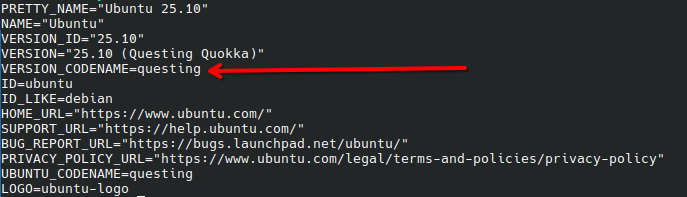

Find and copy the rest of the `VERSION_CODENAME=` line into your terminal. We will be using this info shortly.

Now that we have our OS's codename, we now need to grab a copy of WineHQ's keyring, so that our computer will trust the new repository. To do this, run these two commands:

```bash
$ sudo mkdir -pm755 /etc/apt/keyrings
$ wget -O - https://dl.winehq.org/wine-builds/winehq.key | sudo gpg --dearmor -o /etc/apt/keyrings/winehq-archive.key -
```
If you are running Ubuntu 25.04 (Plucky Puffin) or older or Debian Trixie (version 13) or older, you are going to need to add 32-bit support. To accmplish this, run:

```bash
$ sudo dpkg --add-architecture i386
```

Now we can finally add the repository. Run the command below that fits which distro you're using, but replace anything with `<codename>` with your distro's codename:

```bash
## For Ubuntu
$ sudo wget -NP /etc/apt/sources.list.d/ https://dl.winehq.org/wine-builds/ubuntu/dists/<codename>/winehq-<codename>.sources

## For Debian
$ sudo wget -NP /etc/apt/sources.list.d/ https://dl.winehq.org/wine-builds/debian/dists/<codename>/winehq-<codename>.sources
```

Then, update your package cache, so your computer can take in the changes that just occurred. You can simply run:

```bash
$ sudo apt update
```

Finally, we can actually install Wine, by running the following command in the terminal:

```bash
$ sudo apt install --install-recommends winehq-stable
```

>[!NOTE]
>If you're feeling a little adventurous, you can substitute the word `stable` in the previous terminal command, with either `devel` (development branch) or `staging` (staging branch). These are beta and development builds and can be unstable, so it's not exactly recommended unless you need it.

APT will then list the amount of storage space needed and how much you have available, as well as a summary of what's being installed. If you're fine with it, press `Enter`. If not, type `N` and press `Enter`. Afterwards, it should install, and you will be good to go!

### Fedora, Bazzite and related distros
Thankfully, Fedora is a whole lot simpler to install, start by adding the repository for your version by running the following command, replacing `<version-number>` with your version.
```bash
$ sudo dnf config-manager addrepo --from-repofile=https://dl.winehq.org/wine-builds/fedora/<version-number>/winehq.repo
```

Then install Wine. Run the following command:

```bash
$ sudo dnf install winehq-stable
```

>[!NOTE]
>If you are looking to test out the `staging` and `devel` branches, similar to Ubuntu/Debian, you'll be pleased to see that the exact same options are available to you. Follow the same instructions as the note in the Ubuntu Install section, and you should be good to go!

### Other distros
Refer to either your package manager, or, better yet, refer to [WineHQ's official documentation](https://gitlab.winehq.org/wine/wine/-/wikis/Download).

## Finding compatibility
Now that Wine has installed, we now need to go over how we can find apps that are compatible with Wine. To do this, we need to consult a website. In this case, the folks behind Wine came up with an app database that features user reports of app compatiblity, and anything that had to be done to make it work. This is available [here](https://appdb.winehq.org/?ref=unregblog). You can search for your app, or browse thorugh the listings for all the apps they have.


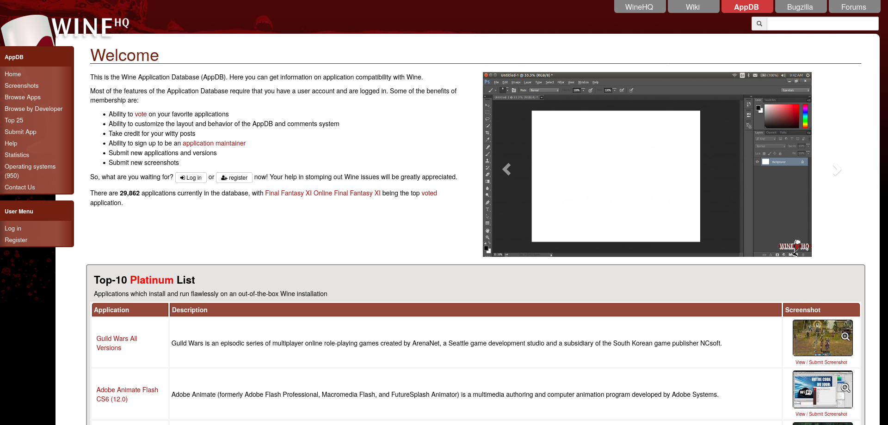
Apps are rated with the following categories:

|Rating |Meaning|
|-------|-------|
|Platinum|Runs perfectly, with no need to modify your copy of Wine|
|Gold|Will run perfectly, but some configuration work needs to happen before it will|
|Silver|Will run, with small issues that might not affect regular use|
|Bronze|It will run, but with issues that ruin it for regular use|
|Garbage|Does not run at all|

## Adding a Windows app (Example 1: LTspice)
Now that we know how we can find apps, let's install one. As an example, I'm going to install LTspice, a free-to-use circuit simulator which consistently earns Gold and Platinum ratings on the AppDB. If configured correctly, installation should play out similar to Windows. That being said, go to your app's download page (For those who want to follow my example, [use this link](https://www.analog.com/en/resources/design-tools-and-calculators/ltspice-simulator.html)). We're going to select the Windows build. 

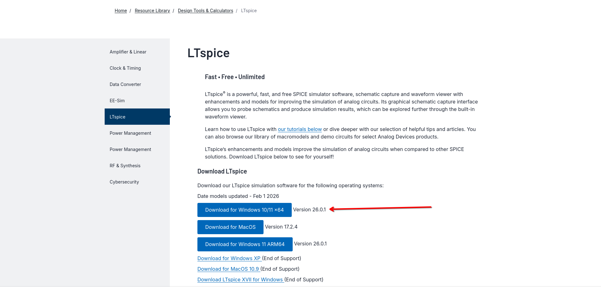

Once the download completes, we're going to open it like we do on Windows. Since this is likely the first app your wine configuration is using, loading may take a while. During this time, you may see a window that looks like this:

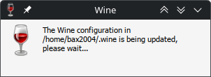

This window is setting up our build of Wine for first time use. It's creating a prefix, which is a folder in your home directory that stores a minimal replica of the Windows file structure. You can create as many of these as you would like, and some people crate them on a per-app basis. We will show you how to easily do this later.

Anyways, once it's done creating your prefix, we simply go thorugh the installation as per usual. Follow the installation instructions, like you would on Windows. 

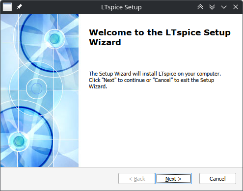

On many desktops, Wine will also automatically add desktop icons and app launcher listings (stored under the Wine category) for convenience. Now that it has installed, we can test it out and see how our app runs!

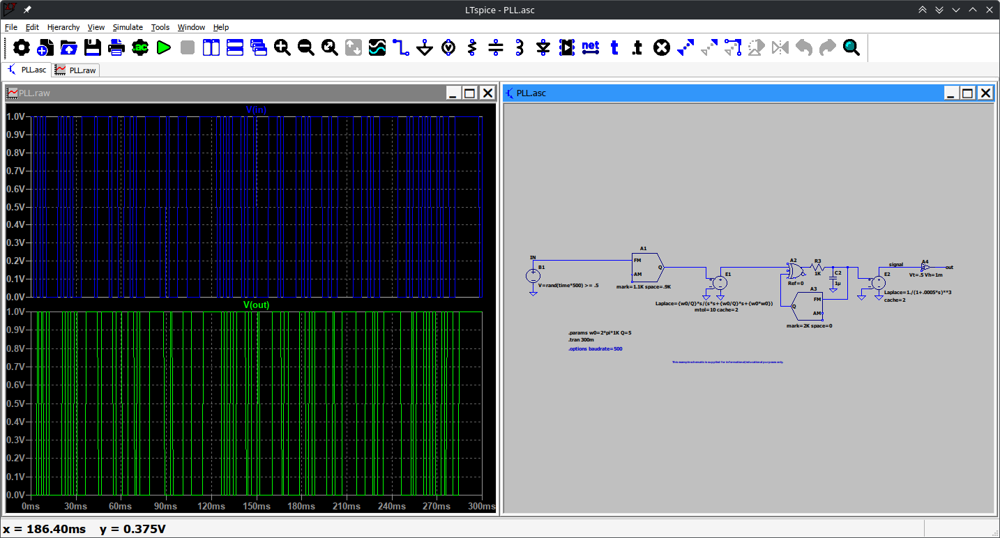

This is an example of a successful app installation. Most apps that are Gold and Platinum-rated should run like this.

## Bottles
As previouly noted, Wine allows you to create multiple prefixes. Bottles allows you to easily take it to the extreme, and even gives you the option to choose different versions of Wine.

### Installation
Bottles is only available via Flatpak. If your system doesn't have Flatpak set up, we have instructions to set it up in our [Gaming](https://github.com/PhoenixLinuxUserGroup/PLUG-Resources/blob/main/workshops/linuxgaming/linuxgaming.md#flatpak) workshop. To install, find Bottles in your package manager or get it from the terminal by running the following, and following its instructions:
```bash
$ flatpak install bottles
```
### Adding apps in Bottles (Example 2: FL Studio)
To add a progam to Bottles, click either the "create new" button or the + button in the top left corner.
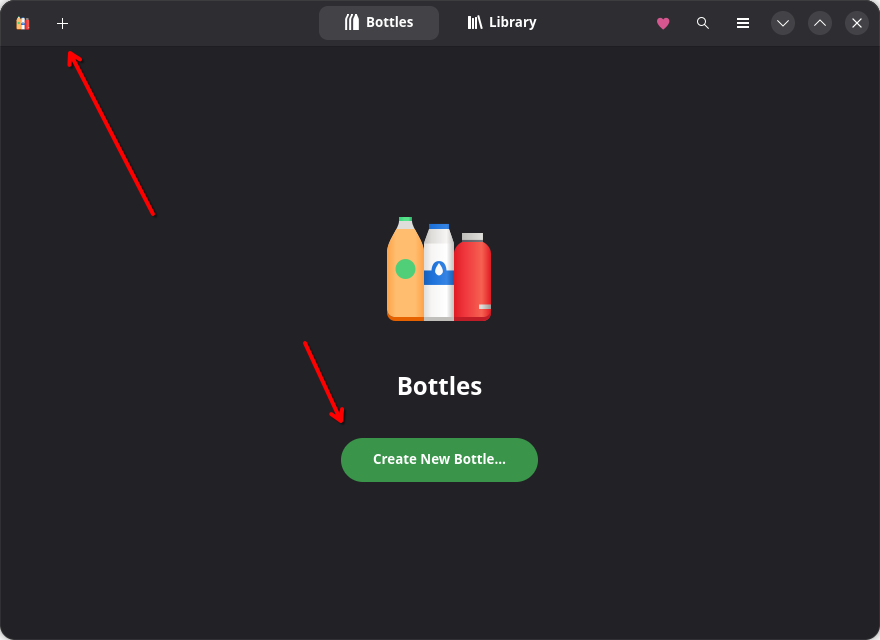

Name it and choose your use-case. Here you can also choose which build of Wine it will use, as well as where it will go. Click Create when ready.
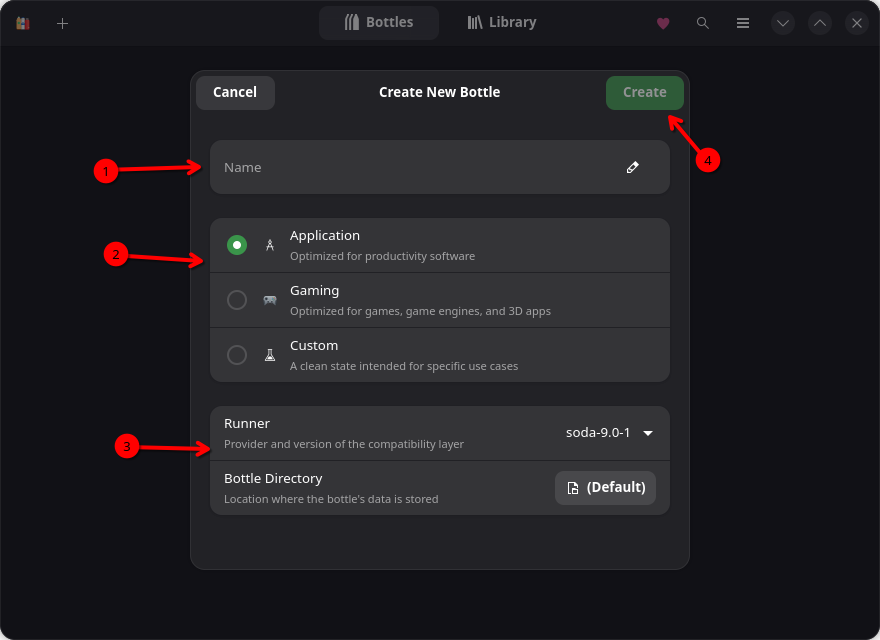

It will then take some time to create the bottle

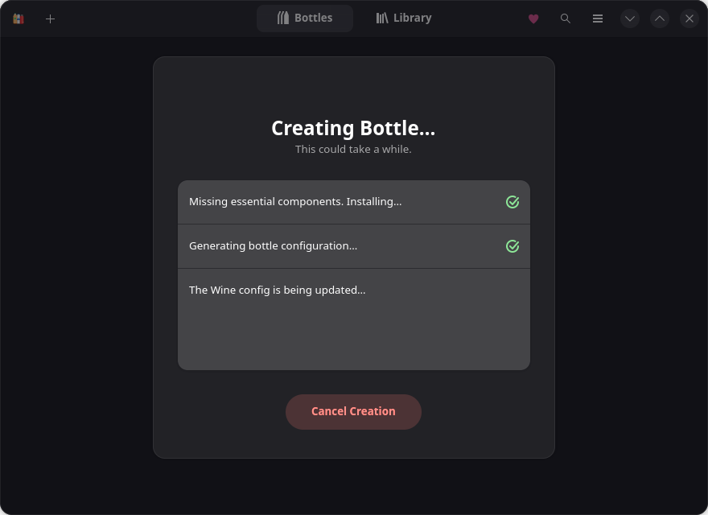

Once done, you can click the "Close" button on the "Bottle was created successfully" screen. Choose your new bottle to configure it. Here, I created a bottle for FL Studio, since it runs pretty well on Wine, and also has an installer with Bottles.

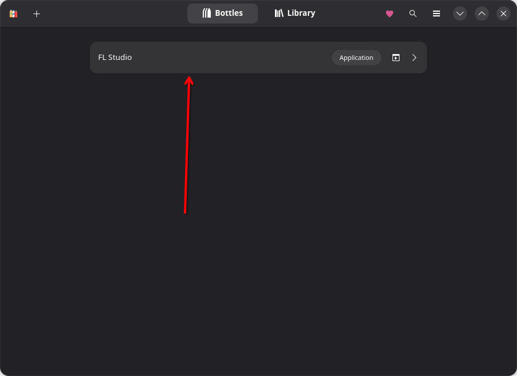

Now select Install Programs, or if it isn't on the list, go to "Run Executable", and open your programs installer.

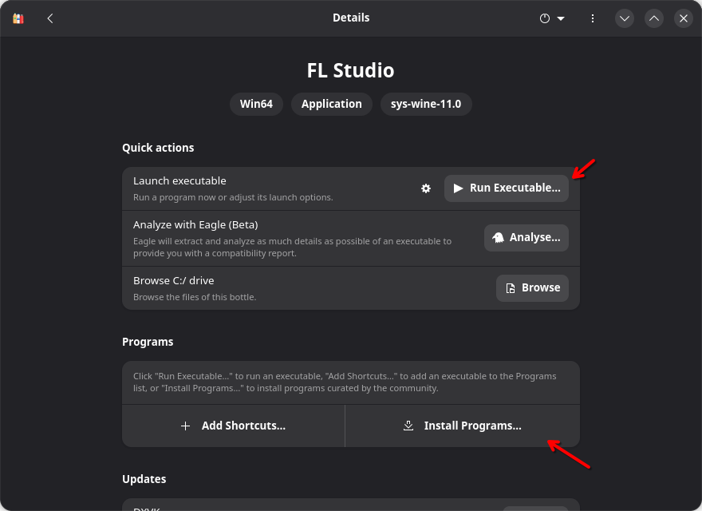
 
If you're installing it from the "Install Programs" list, choose your app and click "Start Installation". Follow the instructions they give. You may need to have a copy of the installer for some apps.

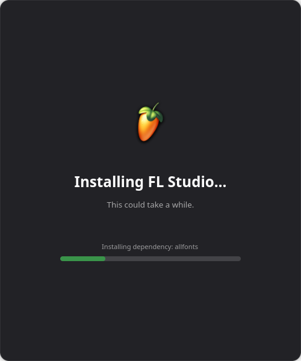

To launch your new app, simply click its play button.

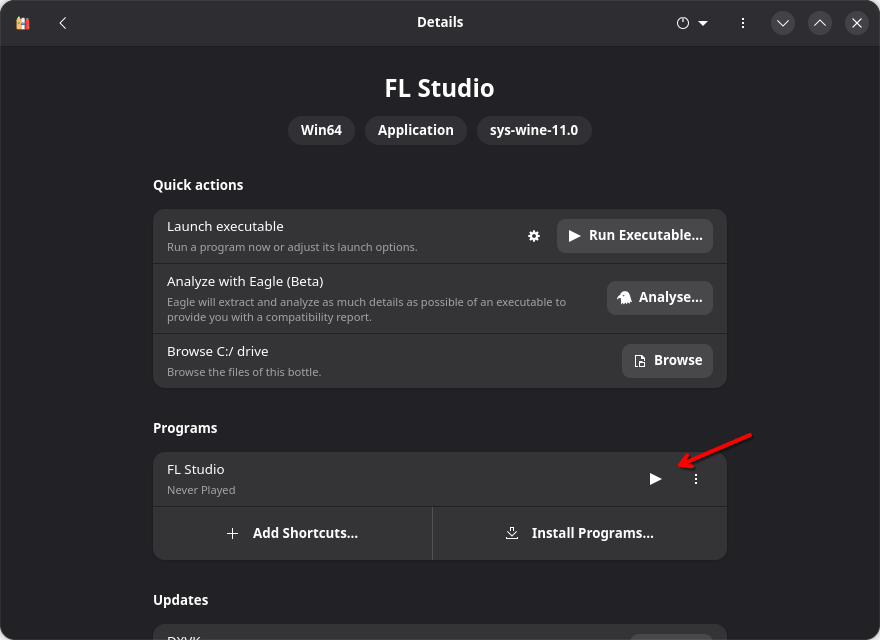

## Winetricks
Sometimes, things don't install correctly or may not run. To solve this problem, we need Winetricks. You may recall from our Gaming workshop, Protontricks, which did the same thing for Steam Proton. Protontricks was actually built on top of Winetricks. Winetricks gives you the ability to modify your Wine prefixes, and help install things.

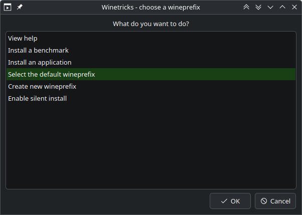

### Installation
You can install Winetricks from your favorite package manager or via the terminal commands below:

#### Debian, Ubuntu, Mint and related distros
```bash
$ sudo apt install winetricks
```
#### Fedora, Bazzite and related distros
```bash
$ sudo dnf install winetricks
```
### Some Things You Can Do With Winetricks
Here are three examples are some things Winetricks can do that can be very useful.
#### Create Wineprefixes
New wineprefixes can be created in Winetricks by selecting "Create Wineprefixes".

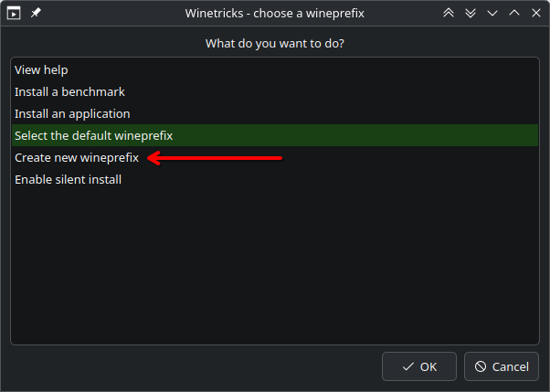

It will then ask you to select whether you are making a 32 or 64 bit build, and then to name it (For compatibility, we recommend using 64-bit). It will then create it for you. It will then present you with a series of things that seem like error messages, but actually aren't; it's simply reporting progress through these messages. Simply press OK to get through them.

Wine may ask to install Mono. You can choose to have it, and it's nice to have when installing apps that are known to need Mono and Microsoft .NET support.

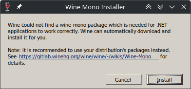

When it's done, it will be automatically selected.


#### Install Prerequisites
To install stuff, select the prefix you want to work with. In this example, we only have the default prefix, so we are selecting the default prefix. Had I created a prefix, "select \<prefix name\>" would show up below the "create wineprefix option".

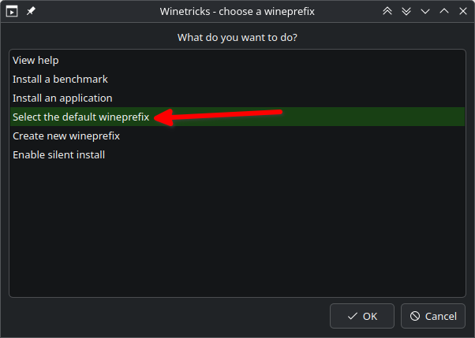

Then, select "Install Windows DLL or component"

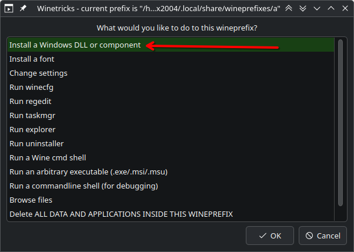

Finally, find what tools you need. You can click multiple selections from the list. When you're done, click "OK". It will automatically run everything and bring you back to the "What would you like to do" menu.

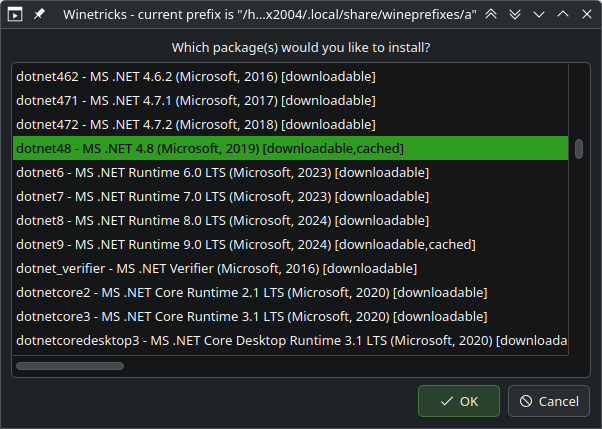

#### Winecfg
Once you have selected your wineprefix, you can choose "Run winecfg" and click OK.
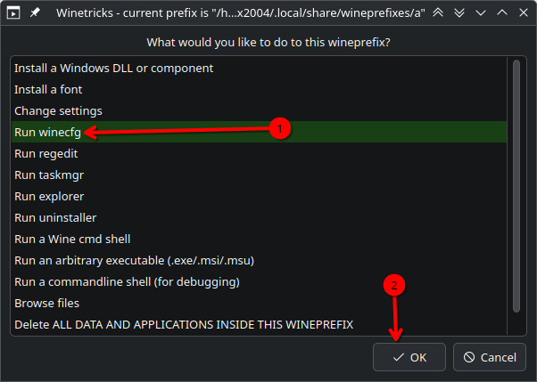

This will open the utility, which lets you do some customization to your Wine build. Exiting will bring you back to winetricks.

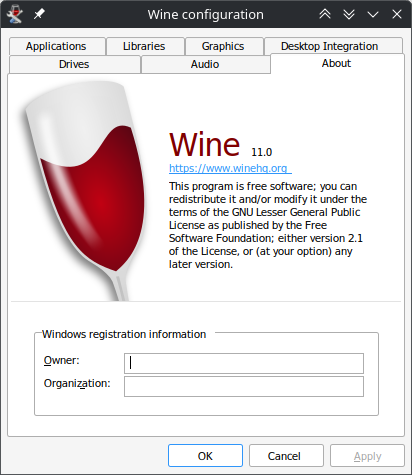

>[!TIP]
>Winecfg can be run from the terminal. Simply type `winecfg` into the terminal to run it.

## Installations with Extra Steps (Example 3: PTC Mathcad)
To demonstrate what Winetricks can really do, let's install an app that needs a lot of tweaking in order to run: Mathcad. Mathcad is a program that allows you to write math equations on a virtual piece of paper, and have your computer automatically evaluate them. Unfortunately for this example, the installer file is only available if you request the demo, which needs you to give them an email address. In the case of this example, we will assume we already have the installer. That is to say, this is not an example worth following, unless you also have the installer

We will start in Winetricks, and we will follow our Install Prerequisites instructions. Mathcad needs .NET 4.8, so we will select that.


Then we will run the installer. Follow its instructions.

After the installer is done, we need to modify the software in Winecfg to make it run in compatiblity for Windows 7. Click on add application, find where the application installed to, and select Windows 7 under "Run in compatiblity for". At the end it should look like this:

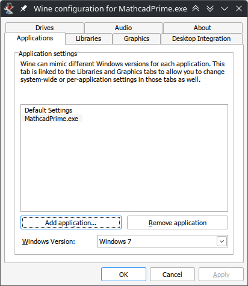


Once this is done we can run Mathcad.
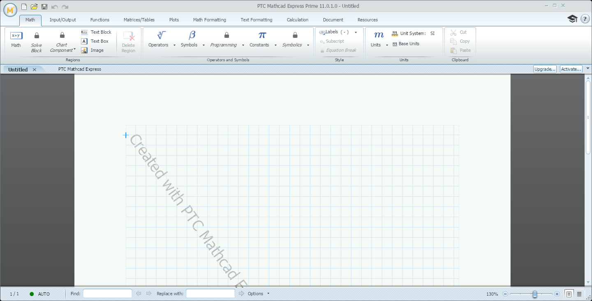
